# 📖 Prompt book

Library to supercharge your use of large language models

<!--Badges-->
<!--⚠️WARNING: This section was generated by https://github.com/hejny/batch-project-editor/blob/main/src/workflows/800-badges/badges.ts so every manual change will be overwritten.-->

[](https://github.com/webgptorg/promptbook/blob/main/LICENSE)
[](https://snyk.io/test/github/webgptorg/promptbook)
[](https://github.com/webgptorg/promptbook/issues)

<!--/Badges-->

> ⚠ Warning: This library is still in early development.


## 🤍 Whitepaper

When you have a simple, single prompt for ChatGPT, GPT-4, Anthropic Claude, Google Gemini, Llama 2, or whatever, it doesn't matter how it is integrated. Whether it's the direct calling of a REST API, using the SDK, hardcoding the prompt in the source code, or importing a text file, the process remains the same.

If you need something more advanced or want to extend the capabilities of LLMs, you generally have three ways to proceed:

1. **Fine-tune** the model to your specifications or even train your own.
2. **Prompt-engineer** the prompt to the best shape you can achieve.
3. Use **multiple prompts** in a pipeline to get the best result.

In any of these situations, but especially in (3), the Promptbook library can make your life easier.

-   **Separation of concerns** between prompt engineer and programmer; between code files and prompt files; and between prompts, templates, templating pipelines, and their execution logic.
-   Set up a **common format** for prompts that is interchangeable between projects and language/technology stacks.
-   **Preprocessing** and cleaning the input data from the user.
-   Use default values - **Jokers** to bypass some parts of the pipeline.
-   **Expect** some specific output from the model.
-   **Retry** mismatched outputs.
-   **Combine** multiple models together.
-   Interactive **User interaction** with the model and the user.
-   Leverage **external** sources (like ChatGPT plugins or OpenAI's GPTs).
-   Simplify your code to be **DRY** and not repeat all the boilerplate code for each prompt.
-   **Versioning** of prompt template pipelines.
-   **Reuse** parts of prompt template pipelines in/between projects.
-   Run the LLM **optimally** in parallel, with the best _cost/quality_ ratio or _speed/quality_ ratio.
-   **Execution report** to see what happened during the execution.
-   **Logging** the results of the prompt template pipelines.
-   _(Not ready yet)_ **Caching** calls to LLMs to save money and time.
-   _(Not ready yet)_ Extend one prompt book from another one.
-   _(Not ready yet)_ Leverage the **streaming** to make super cool UI/UX.
-   _(Not ready yet)_ **A/B testing** to determine which prompt works best for the job.


## 🧔 Prompt template pipelines _(for prompt-engeneers)_

**P**romp**t** **b**oo**k** markdown file (**PTBK** for short, or `.ptbk.md`) is document that describes a series of prompts that are chained together to form somewhat reciepe for transforming natural language input. Inside a PTBK you can use chat prompts, completion prompts, scripting or trigger interaction with user to ask for additional information.

-   Multiple PTBKs forms a library which will become a **part of your application codebase**.
-   Theese pipelines are designed such as they **can be written by non-programmers**.

<!-- TODO: [🧠] Make some more clear escaping -->

### Sample:

File `write-website-content.ptbk.md`:

<!------------------------[ Sample: ]------------------------>

> # 🌍 Create website content
>
> Instructions for creating web page content.
>
> -   PTBK URL https://ptbk.webgpt.com/en/write-website-content.ptbk.md@v0.1.0
> -   PTBK VERSION 0.0.1
> -   INPUT  PARAM `{rawTitle}` Automatically suggested a site name or empty text
> -   INPUT  PARAM `{rawAssigment}` Automatically generated site entry from image recognition
> -   OUTPUT PARAM `{content}` Web content
>
> ## 👤 Specifying the assigment
>
> What is your web about?
>
> -   PROMPT DIALOG
>
> ```
> {rawAssigment}
> ```
>
> `-> {assigment}` Website assignment and specification
>
> ## ✨ Improving the title
>
> -   POSTPROCESSING `unwrapResult`
>
> ```
> As an experienced marketing specialist, you have been entrusted with improving the name of your client's business.
>
> A suggested name from a client:
> "{rawTitle}"
>
> Assignment from customer:
>
> > {assigment}
>
> ## Instructions:
>
> -   Write only one name suggestion
> -   The name will be used on the website, business cards, visuals, etc.
> ```
>
> `-> {enhancedTitle}` Enhanced title
>
> ## 👤 Website title approval
>
> Is the title for your website okay?
>
> -   PROMPT DIALOG
>
> ```
> {enhancedTitle}
> ```
>
> `-> {title}` Title for the website
>
> ## � Cunning subtitle
>
> -   POSTPROCESSING `unwrapResult`
>
> ```
> As an experienced copywriter, you have been entrusted with creating a claim for the "{title}" web page.
>
> A website assignment from a customer:
>
> > {assigment}
>
> ## Instructions:
>
> -   Write only one name suggestion
> -   Claim will be used on website, business cards, visuals, etc.
> -   Claim should be punchy, funny, original
> ```
>
> `-> {claim}` Claim for the web
>
> ## � Keyword analysis
>
> ```
> As an experienced SEO specialist, you have been entrusted with creating keywords for the website "{title}".
>
> Website assignment from the customer:
>
> > {assigment}
>
> ## Instructions:
>
> -   Write a list of keywords
> -   Keywords are in basic form
>
> ## Example:
>
> -   Ice cream
> -   Olomouc
> -   Quality
> -   Family
> -   Tradition
> -   Italy
> -   Craft
>
> ```
>
> `-> {keywords}` Keywords
>
> ## 🔗 Combine the beginning
>
> -   SIMPLE TEMPLATE
>
> ```
>
> # {title}
>
> > {claim}
>
> ```
>
> `-> {contentBeginning}` Beginning of web content
>
> ## 🖋 Write the content
>
> -   MODEL VARIANT COMPLETION
> -   MODEL NAME `gpt-3.5-turbo-instruct`
>
> ```
> As an experienced copywriter and web designer, you have been entrusted with creating text for a new website {title}.
>
> A website assignment from a customer:
>
> > {assigment}
>
> ## Instructions:
>
> -   Text formatting is in Markdown
> -   Be concise and to the point
> -   Use keywords, but they should be naturally in the text
> -   This is the complete content of the page, so don't forget all the important information and elements the page should contain
> -   Use headings, bullets, text formatting
>
> ## Keywords:
>
> {keywords}
>
> ## Web Content:
>
> {contentBeginning}
> ```
>
> `-> {contentBody}` Middle of the web content
>
> ## 🔗 Combine the content
>
> -   SIMPLE TEMPLATE
>
> ```markdown
> {contentBeginning}
>
> {contentBody}
> ```
>
> `-> {content}`

<!------------------------[ /Sample ]------------------------>

Following is the scheme how the promptbook above is executed:

```mermaid
%% 🔮 Tip: Open this on GitHub or in the VSCode website to see the Mermaid graph visually

flowchart LR
  subgraph "🌍 Create website content"

      direction TB

      input((Input)):::input
      templateSpecifyingTheAssigment(👤 Specifying the assigment)
      input--"{rawAssigment}"-->templateSpecifyingTheAssigment
      templateImprovementOfTheWebTitle(✨ Improving the title)
      input--"{rawTitle}"-->templateImprovementOfTheWebTitle
      templateSpecifyingTheAssigment--"{assigment}"-->templateImprovementOfTheWebTitle
      templateWebsiteTitleApproval(👤 Website title approval)
      templateImprovementOfTheWebTitle--"{enhancedTitle}"-->templateWebsiteTitleApproval
      templateCunningSubtitle(� Cunning subtitle)
      templateWebsiteTitleApproval--"{title}"-->templateCunningSubtitle
      templateSpecifyingTheAssigment--"{assigment}"-->templateCunningSubtitle
      templateKeywordAnalysis(� Keyword analysis)
      templateWebsiteTitleApproval--"{title}"-->templateKeywordAnalysis
      templateSpecifyingTheAssigment--"{assigment}"-->templateKeywordAnalysis
      templateCreatingTheBeginningOfTheWebsiteContent(🔗 Combine the beginning)
      templateWebsiteTitleApproval--"{title}"-->templateCreatingTheBeginningOfTheWebsiteContent
      templateCunningSubtitle--"{claim}"-->templateCreatingTheBeginningOfTheWebsiteContent
      templateWritingWebContent(🖋 Write the content)
      templateWebsiteTitleApproval--"{title}"-->templateWritingWebContent
      templateSpecifyingTheAssigment--"{assigment}"-->templateWritingWebContent
      templateKeywordAnalysis--"{keywords}"-->templateWritingWebContent
      templateCreatingTheBeginningOfTheWebsiteContent--"{contentBeginning}"-->templateWritingWebContent
      templateCombineContent(🔗 Combine the content)
      templateCreatingTheBeginningOfTheWebsiteContent--"{contentBeginning}"-->templateCombineContent
      templateWritingWebContent--"{contentBody}"-->templateCombineContent

      classDef input color: grey;

  end;
```



[More template samples](./samples/templates/)

_Note: We are using [postprocessing functions](#postprocessing-functions) like `unwrapResult` that can be used to postprocess the result._

## 📚 Dictionary

The following glossary is used to clarify certain basic concepts:

### Prompt

Prompt in a text along with model requirements, but without any execution or templating logic.

For example:

```json
{
    "request": "Which sound does a cat make?",
    "modelRequirements": {
        "variant": "CHAT"
    }
}
```

```json
{
    "request": "I am a cat.\nI like to eat fish.\nI like to sleep.\nI like to play with a ball.\nI l",
    "modelRequirements": {
        "variant": "COMPLETION"
    }
}
```

### Prompt Template

Similar concept to Prompt, but with templating logic.

For example:

```json
{
    "request": "Which sound does a {animalName} make?",
    "modelRequirements": {
        "variant": "CHAT"
    }
}
```

### Model Requirements

Abstract way to specify the LLM.
It does not specify the LLM with concrete version itself, only the requirements for the LLM.
_NOT chatgpt-3.5-turbo BUT CHAT variant of GPT-3.5._

For example:

```json
{
    "variant": "CHAT",
    "version": "GPT-3.5",
    "temperature": 0.7
}
```

### Execution type

Each block of prompt template pipeline can have a different execution type.
It is specified in list of requirements for the block.
By default, it is `Prompt template`

-   _(default)_ `Prompt template` The block is a prompt template and is executed by LLM (OpenAI, Azure,...)
-   `SIMPLE TEMPLATE` The block is a simple text template which is just filled with parameters
-   `Script` The block is a script that is executed by some script runtime, the runtime is determined by block type, currently only `javascript` is supported but we plan to add `python` and `typescript` in the future.
-   `PROMPT DIALOG` Ask user for input

### Parameters

Parameters that are placed in the prompt template and replaced to create the prompt.
It is a simple key-value object.

```json
{
    "animalName": "cat",
    "animalSound": "Meow!"
}
```

There are three types of template parameters, depending on how they are used in the prompt template pipeline:

-   **INPUT  PARAMETERs** are required to execute the prompt template pipeline.
-   **Intermediate parameters** are used internally in the prompt template pipeline.
-   **OUTPUT PARAMETERs** are not used internally in the prompt template pipeline, but are returned as the result of the prompt template pipeline execution.

### Prompt Template Pipeline

Prompt template pipeline is the **core concept of this library**.
It represents a series of prompt templates chained together to form a pipeline / one big prompt template with input and result parameters.

Internally it can have 3 formats:

-   **.ptbk.md file** in custom markdown format described above
-   _(internal)_ **JSON** format, parsed from the .ptbk.md file

### Prompt Template Pipeline **Library**

Library of prompt template pipelines that groups together prompt template pipelines for an application.
This is a very thin wrapper around the Array / Set of prompt template pipelines.

Prompt Template Pipeline library is a useful helper in execution, it can be shared between execution and consumer parts of the app and make common knowledge about prompt template pipelines.

It allows to create executor functions from prompt template pipelines in the library.

### Prompt Result

Prompt result is the simplest concept of execution.
It is the result of executing one prompt _(NOT a template)_.

For example:

```json
{
    "response": "Meow!",
    "model": "chatgpt-3.5-turbo"
}
```

### Execution Tools

`ExecutionTools` is an interface which contains all the tools needed to execute prompts (template pipelines).
It contais 3 subtools:

-   `NaturalExecutionTools`
-   `ScriptExecutionTools`
-   `UserInterfaceTools`

Which are described below:

#### Natural Execution Tools

`NaturalExecutionTools` is a container for all the tools needed to execute prompts to large language models like GPT-4.
On its interface it exposes common methods for prompt execution.
Internally it calls OpenAI, Azure, GPU, proxy, cache, logging,...

`NaturalExecutionTools` an abstract interface that is implemented by concrete execution tools:

-   `OpenAiExecutionTools`
-   _(Not implemented yet)_ `AzureOpenAiExecutionTools`
-   _(Not implemented yet)_ `BardExecutionTools`
-   _(Not implemented yet)_ `LamaExecutionTools`
-   _(Not implemented yet)_ `GpuExecutionTools`
-   And a special case are `RemoteNaturalExecutionTools` that connect to a remote server and run one of the above execution tools on that server.
-   The second special case is `MockedEchoNaturalExecutionTools` that is used for testing and mocking.
-   The third special case is `LogNaturalExecutionToolsWrapper` that is technically also an execution tools but it is more proxy wrapper around other execution tools that logs all calls to execution tools.

#### Script Execution Tools

`ScriptExecutionTools` is an abstract container that represents all the tools needed to EXECUTE SCRIPTs. It is implemented by concrete execution tools:

-   `JavascriptExecutionTools` is a wrapper around `vm2` module that executes javascript code in a sandbox.
-   `JavascriptEvalExecutionTools` is wrapper around `eval` function that executes javascript. It is used for testing and mocking **NOT intended to use in the production** due to its unsafe nature, use `JavascriptExecutionTools` instead.
-   _(Not implemented yet)_ `TypescriptExecutionTools` executes typescript code in a sandbox.
-   _(Not implemented yet)_ `PythonExecutionTools` executes python code in a sandbox.

There are [postprocessing functions](#postprocessing-functions) that can be used to postprocess the result.

#### User Interface Tools

`UserInterfaceTools` is an abstract container that represents all the tools needed to interact with the user. It is implemented by concrete execution tools:

-   _(Not implemented yet)_ `ConsoleInterfaceTools` is a wrapper around `readline` module that interacts with the user via console.
-   `SimplePromptInterfaceTools` is a wrapper around `window.prompt` synchronous function that interacts with the user via browser prompt. It is used for testing and mocking **NOT intended to use in the production** due to its synchronous nature.
-   `CallbackInterfaceTools` delagates the user interaction to a async callback function. You need to provide your own implementation of this callback function and its bind to UI. <!-- <- TODO: Provide here a way how to do it with some our plugin -->

### Executor

Executor is a simple async function that takes INPUT  PARAMETERs and returns OUTPUT PARAMETERs _(along with all intermediate parameters and INPUT  PARAMETERs = it extends input object)_.

Executor is made by combining execution tools and prompt template pipeline library.
It can be done in two ways:

-   From `PromptTemplatePipelineLibrary.getExecutor` method
-   `createPtpExecutor` utility function

### 🃏 Jokers

<!--
TODO: !!! Write:

JOKER {foo}
no postprocessing just expect
allow multiple jokers
require at least 1 min expectation to use jokers

If theese parameters meet the requirements, they are used instead of executing this prompt template
-->

### Postprocessing functions

You can define postprocessing functions when creating `JavascriptEvalExecutionTools`:

```

```

Additionally there are some usefull string-manipulation build-in functions, which are [listed here](src/execution/plugins/script-execution-tools/javascript/JavascriptEvalExecutionTools.ts).

### Expectations

`Expect` command describes the desired output of the prompt template (after post-processing)
It can set limits for the maximum/minimum length of the output, measured in characters, words, sentences, paragraphs,...

_Note: LLMs work with tokens, not characters, but in Promptbooks we want to use some human-recognisable and cross-model interoperable units._

```markdown
# ✨ Sample: Expectations

-   PTBK URL https://ptbk.example.com/samples/postprocessing-2.ptbk.md@v1
-   PTBK VERSION 1.0.0
-   INPUT  PARAMETER {yourName} Name of the hero

## 💬 Question

-   EXPECT MAX 30 CHARACTERS
-   EXPECT MIN 2 CHARACTERS
-   EXPECT MAX 3 WORDS
-   EXPECT EXACTLY 1 SENTENCE
-   EXPECT EXACTLY 1 LINE

...
```

There are two types of expectations which are not strictly symmetrical:

#### Minimal expectations

-   `EXPECT MIN 0 ...` is not valid minimal expectation. It makes no sense.
-   `EXPECT JSON` is both minimal and maximal expectation
-   When you are using `JOKER` in same prompt template, you need to have at least one minimal expectation

#### Maximal expectations

-   `EXPECT MAX 0 ...` is valid maximal expectation. For example, you can expect 0 pages and 2 sentences.
-   `EXPECT JSON` is both minimal and maximal expectation

Look at [expectations.ptbk.md](samples/templates/45-expectations.ptbk.md) and [expect-json.ptbk.md](samples/templates/45-expect-json.ptbk.md) samples for more.

### Execution report

Execution report is a simple object or markdown that contains information about the execution of the prompt template pipeline.

<!-- TODO: Write more -->

### Remote server

Remote server is a proxy server that uses its execution tools internally and exposes the executor interface externally.

You can simply use `RemoteExecutionTools` on client-side javascript and connect to your remote server.
This is useful to make all logic on browser side but not expose your API keys or no need to use customer's GPU.

## 👨‍💻 Usage and integration _(for developers)_

### 🧙‍♂️ Using wizzard

First you need to install this library:

```bash
npm install --save @promptbook/wizzard
```

> TODO: !!! Write the Wizzard sample

[Usage samples](./samples/usage/)

### 🔌 Advanced usage

Install all the components:

```bash
npm install --save @promptbook/core @promptbook/wizzard @promptbook/openai @promptbook/execute-javascript @promptbook/remote-client @promptbook/remote-server @promptbook/utils @promptbook/types
```

> TODO: !!! Write the remote sample

[Usage samples](./samples/usage/)

## ❔ FAQ

If you have a question [start a discussion](https://github.com/webgptorg/promptbook/discussions/), [open an issue](https://github.com/webgptorg/promptbook/issues) or [write me an email](https://www.pavolhejny.com/contact).

### Why not just use the OpenAI library?

Different levels of abstraction. OpenAI library is for direct use of OpenAI API. This library is for a higher level of abstraction. It is for creating prompt templates and prompt template pipelines that are independent of the underlying library, LLM model, or even LLM provider.

### How is it different from the Langchain library?

Langchain is primarily aimed at ML developers working in Python. This library is for developers working in javascript/typescript and creating applications for end users.

We are considering creating a bridge/converter between these two libraries.

### Promptbooks vsGPTs

> ...

<!--
Include:
- jde naprosto hlavně o python knihovnu a JavaScript je tam na druhém místě
- je zaměřený primárně na dělání templates ne na spojování templates do větších struktur
- na úrovni jazyka rozlišuje chat a completion, já potřebuji tyhle dvě věci mixovat do jedné template pipeline
- pro neprogramátora je docela těžké s takovou věcí pracovat a template psát- já bych měl mnohem radši systém který umožňuje psát šablony i pro netechnické lidi ( kterých je na trhu mnohem více než volných pythonistů)
- Focus mého projektu je primárně zaměřený na budování uživatelských aplikací, nepředgenerovávání, zpracování dat, tréning či autogpt.
-->

## ⌚ Changelog

See [CHANGELOG.md](./CHANGELOG.md)

## 🎯 TODOs

-   [ ] [🧠] Figure out the best name for this library - `Prompt Template Pipeline`, `Prompt Template Engine`, `Prompt Template Processor`, `Open Prompt Initiative`
-   [ ] Make from this folder a separate repository + npm package
-   [ ] Add tests
-   [ ] Annotate all entities
-   [ ] Make internal string aliases
-   [ ] Make branded types instead of pure `string` aliases
-   [ ] Remove all anys
-   [ ] Make promptbooks non-linear
-   [ ] Logging pipeline name, version, step,...
-   [ ] No circular dependencies
-   [ ][🧠] Wording: "param" vs "parameter" vs "variable" vs "argument"
-   [ ] All entities must have public / private / protected modifiers
-   [ ] Everything not needed should be private or not exported
-   [ ] Refactor circular dependencies
-   [ ] Importing subtemplates
-   [ ] Use spaceTrim more effectively
-   [ ] [🤹‍♂️] Allow chats to be continued with previous message
-   [ ] [🧠][🤹‍♂️] How to mark continued chat in .ptbk.md format?
-   [ ] Use newest version of socket.io for remote server
-   [ ] [🧠] Allow to use and define [function calling](https://platform.openai.com/docs/guides/gpt/function-calling)
-   [x] Register .ptbk file extension
-   [ ] Fix error `content.js:73 Uncaught (in promise) TypeError: object null is not iterable (cannot read property Symbol(Symbol.iterator))`
-   [ ] Aborting execution, maybe use native AbortController
-   [ ] Change `import {...} from '...';` to `import type {...} from '...';` when importing only types
-   [ ] Wrap OpenAI billing errors:
-   [ ] Integrate word stemmer https://github.com/maxpatiiuk/porter-stemming/blob/main/src/index.ts
-   [ ] Integrate faker to generate simple mocked data

    -   "Billing hard limit has been reached"
    -   "You exceeded your current quota, please check your plan and billing details."

<!--Contributing-->
<!--⚠️WARNING: This section was generated by https://github.com/hejny/batch-project-editor/blob/main/src/workflows/810-contributing/contributing.ts so every manual change will be overwritten.-->

## 🖋️ Contributing

I am open to pull requests, feedback, and suggestions. Or if you like this utility, you can [☕ buy me a coffee](https://www.buymeacoffee.com/hejny) or [donate via cryptocurrencies](https://github.com/hejny/hejny/blob/main/documents/crypto.md).

You can also ⭐ star the promptbook package, [follow me on GitHub](https://github.com/hejny) or [various other social networks](https://www.pavolhejny.com/contact/).

<!--/Contributing-->

<!--Custom Partners-->
<!--⚠️WARNING: This section was generated by https://github.com/hejny/batch-project-editor/blob/main/src/workflows/820-partners/partners.ts so every manual change will be overwritten.-->

## ✨ Partners

<a href="https://webgpt.cz/">
  
</a>
&nbsp;&nbsp;&nbsp;
<a href="https://collboard.com/">
  
</a>

<!--
TODO: Add here Ai*nautes
-->

[Become a partner](https://www.pavolhejny.com/contact/)

<!--/Custom Partners-->
