            <!--⚠️ WARNING: This code has been generated so that any manual changes will be overwritten-->

            # 📯 Pipeline

            - Author: [hejny](https://github.com/hejny)
            - Created at: 7/9/2024, 4:19:00 PM
            - Updated at: 10/24/2024, 1:19:31 PM
            - Category: Concepts
            - Discussion: #64

            Pipeline [*(or workflow, chain)*](https://github.com/webgptorg/promptbook/discussions/157) is the core concept of Promptbook project. It is a set of templates linked together. Promptbook package automatically creates execution tree and executes all templates in pipeline in optimal way.

            Each pipeline can have its unique URL if it is part of [collection](https://github.com/webgptorg/promptbook/discussions/65) it must have URL defined.

            Pipeline uses [templating system](https://github.com/webgptorg/promptbook/discussions/17).

            There are [4 types of templates](https://github.com/webgptorg/promptbook/discussions/88) inside a pipeline.

            Pipeline can be saved and edited as [`.ptbk.md` file](https://github.com/webgptorg/promptbook/discussions/85), [prepared](https://github.com/webgptorg/promptbook/discussions/78) to [`.ptbk.json` file](https://github.com/webgptorg/promptbook/discussions/86) and [executed](https://github.com/webgptorg/promptbook/discussions/84).

            Pipeline can have multiple formats:

            -   [`.ptbk.md file`](https://github.com/webgptorg/promptbook/discussions/85) in custom markdown format described [here](https://github.com/webgptorg/promptbook/discussions/categories/concepts?discussions_q=is%3Aopen+category%3AConcepts+label%3A%22%F0%9F%90%8A+Concept+working%22+label%3A.ptbk.md)
            -   [`.ptbk.json file`](https://github.com/webgptorg/promptbook/discussions/85), [prepared](https://github.com/webgptorg/promptbook/discussions/78) from the `.ptbk.md file`
            -   [`.ptbk` file](https://github.com/webgptorg/promptbook/discussions/94), custom extension

            ## Comments

### Comment by hejny on 7/10/2024, 2:07:28 PM

```mermaid
%% 🔮 Tip: Open this on GitHub or in the VSCode website to see the Mermaid graph visually

flowchart LR
  subgraph "🌍 Create website content"

      direction TB

      input((Input)):::input
      templateSpecifyingTheAssigment(👤 Specifying the assigment)
      input--"{rawAssigment}"-->templateSpecifyingTheAssigment
      templateImprovingTheTitle(✨ Improving the title)
      input--"{rawTitle}"-->templateImprovingTheTitle
      templateSpecifyingTheAssigment--"{assigment}"-->templateImprovingTheTitle
      templateWebsiteTitleApproval(👤 Website title approval)
      templateImprovingTheTitle--"{enhancedTitle}"-->templateWebsiteTitleApproval
      templateCunningSubtitle(🐰 Cunning subtitle)
      templateWebsiteTitleApproval--"{title}"-->templateCunningSubtitle
      templateSpecifyingTheAssigment--"{assigment}"-->templateCunningSubtitle
      templateKeywordAnalysis(🚦 Keyword analysis)
      templateWebsiteTitleApproval--"{title}"-->templateKeywordAnalysis
      templateSpecifyingTheAssigment--"{assigment}"-->templateKeywordAnalysis
      templateCombineTheBeginning(🔗 Combine the beginning)
      templateWebsiteTitleApproval--"{title}"-->templateCombineTheBeginning
      templateCunningSubtitle--"{claim}"-->templateCombineTheBeginning
      templateWriteTheContent(🖋 Write the content)
      templateWebsiteTitleApproval--"{title}"-->templateWriteTheContent
      templateSpecifyingTheAssigment--"{assigment}"-->templateWriteTheContent
      templateKeywordAnalysis--"{keywords}"-->templateWriteTheContent
      templateCombineTheBeginning--"{contentBeginning}"-->templateWriteTheContent
      templateCombineTheContent(🔗 Combine the content)
      templateCombineTheBeginning--"{contentBeginning}"-->templateCombineTheContent
      templateWriteTheContent--"{contentBody}"-->templateCombineTheContent

      templateCombineTheContent--"{content}"-->output
      output((Output)):::output

      classDef input color: grey;
      classDef output color: grey;

  end;

```

---

### Comment by hejny on 10/24/2024, 1:09:26 PM

Maybe rename the pipeline https://github.com/webgptorg/promptbook/discussions/157
