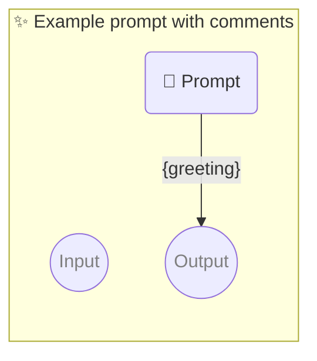

# ✨ Example prompt with comments

Show how to use a simple prompt with no parameters and comments that should be ignored.

-   PIPELINE URL https://promptbook.studio/examples/comments.ptbk.md
-   OUTPUT PARAMETER `{greeting}`

<!--Graph-->
<!-- ⚠️ WARNING: This code has been generated so that any manual changes will be overwritten -->



<!--/Graph-->

## 💬 Prompt

```text
Hello
```

<!-- With comment which should be removed + trimmed-->

`-> {greeting}`

<!--

## 💬 Commented Prompt

```text
Hello
```

`-> {greeting}`

-->
