# ✨ Example prompt with two consecutive prompts

Show how to use two consecutive prompts with one parameter each.

-   PIPELINE URL https://promptbook.studio/examples/two.book.md
-   INPUT  PARAMETER `{word}` Any single word
-   OUTPUT PARAMETER `{sentenceWithTwoSynonyms}`

```mermaid
%% 🔮 Tip: Open this on GitHub or in the VSCode website to see the Mermaid graph visually

flowchart LR
  subgraph "✨ Example prompt with two consecutive prompts"

      direction TB

      input((Input)):::input
      synonym-0("💬 Synonym")
      input--"{word}"-->synonym-0
      synonym-1("💬 Synonym")
      input--"{word}"-->synonym-1
      synonym-0--"{wordSynonym}"-->synonym-1

      synonym-1--"{sentenceWithTwoSynonyms}"-->output
      output((Output)):::output

      click synonym-0 href "#synonym-0" "💬 Synonym";
      click synonym-1 href "#synonym-1" "💬 Synonym";

      classDef input color: grey;
      classDef output color: grey;

  end;
```

<!--Graph-->
<!-- ⚠️ WARNING: This code has been generated so that any manual changes will be overwritten -->



<!--/Graph-->

## 💬 Synonym

Synonym for word

-   PERSONA Joe, a linguist

```text
Write synonym for "{word}"
```

`-> {wordSynonym}`

## 💬 Synonym

<!--
!!!!!!
Problem when task has same title
## 💬 Sentence
-->

Sentence with word and wordSynonym

-   PERSONA Joe

```text
Write sentence with "{word}" and "{wordSynonym}" in it
```

`-> {sentenceWithTwoSynonyms}`

### Simple sentence

-   EXAMPLE

```text
The quick brown fox jumps over the lazy dog
```

`-> {sentenceWithTwoSynonyms}`

### Dynamic sentence

-   EXAMPLE

```text
The brown {word} jumps over the lazy {word}
```

`-> {sentenceWithTwoSynonyms}`
