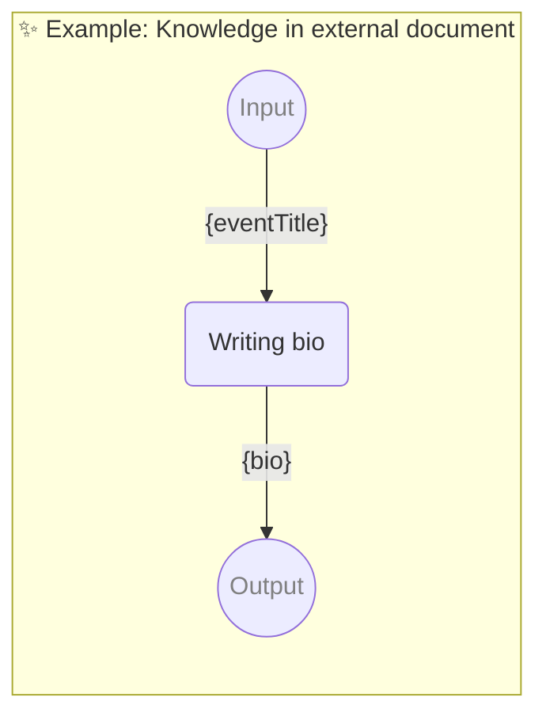

# ✨ Example: Knowledge in external document

Show how to use knowledge

-   PIPELINE URL https://promptbook.studio/examples/document-knowledge.book.md
-   INPUT  PARAMETER `{eventTitle}` The event name
-   OUTPUT PARAMETER `{bio}` Bio of Pavol Hejný - speaker at the event
-   KNOWLEDGE ./27-document-knowledge.docx <!-- <- TODO: Test also `./27-document-knowledge.pdf` -->
<!--            <- TODO: [😿] Allow ONLY files scoped in the (sub)directory NOT ../ -->

<!--Graph-->
<!-- ⚠️ WARNING: This code has been generated so that any manual changes will be overwritten -->



<!--/Graph-->

## Writing bio

-   PERSONA Jane, HR professional with prior experience in writing bios
-   EXPECT MIN 1 Sentence

```markdown
You are writing a bio for Pavol Hejný for the event {eventTitle}.

## Rules

-   Write just the bio, nothing else.
-   Write in the third person.
-   Bio is written in the present tense.
-   Bio should be written for event named "{eventTitle}".
-   Use markdown formatting.
```

`-> {bio}`
