# ✨ Example: Markdown knowledge with external links

Show how to use knowledge

-   PIPELINE URL https://promptbook.studio/examples/mixed-knowledge.book.md
-   INPUT  PARAMETER `{eventTitle}` The event name
-   OUTPUT PARAMETER `{bio}` Bio of Pavol Hejný - speaker at the event

```mermaid
%% 🔮 Tip: Open this on GitHub or in the VSCode website to see the Mermaid graph visually

flowchart LR
  subgraph "✨ Example: Markdown knowledge with external links"

      direction TB

      input((Input)):::input
      writing-bio("Writing bio")
      input--"{eventTitle}"-->writing-bio

      writing-bio--"{bio}"-->output
      output((Output)):::output

      click writing-bio href "#writing-bio" "Writing bio";

      classDef input color: grey;
      classDef output color: grey;

  end;
```

<!--Graph-->
<!-- ⚠️ WARNING: This code has been generated so that any manual changes will be overwritten -->



<!--/Graph-->

## Pavol Hejný

-   KNOWLEDGE

```markdown
I'm [Pavol](https://www.pavolhejny.com/), a developer who is passionate about using new tools and technologies.

I specialise in creating fully functional user applications using the latest artificial intelligence models.

I am a member of the [Ainautes](https://www.ainautes.com/) consulting group, which supports with the deployment of generative AI around the world.

I develop the [WebGPT](https://webgpt.cz/?partner=ph&utm_medium=referral&utm_source=personal%E2%80%93page&utm_content=pavolhejny.com&utm_campaign=partner%E2%80%93ph) web page generation service.

Before the massive emergence of generative AI, I have created the first Czech virtual whiteboard, [Collboard](https://collboard.com/), and electronic textbooks, [H-edu](https://h-edu.cz/), which were used by tens of thousands of children.

I have also worked on many scientific projects for the [Czech Ornithological Society](https://www.birdlife.cz/en/).
I regularly give lectures at conferences, sit on juries, and act as a mentor in many Czech and international competitions.
I have a special heart for this, and I love **open source** – you can find many of my things on my GitHub.

---

Also look at document ./27-document-knowledge.pdf

But be aware that [Pavol Hejný](https://www.pavolhejny.com/) is someone else than [Pavel Hejný](https://pavelhejny.com/)
```

## Writing bio

-   PERSONA Jane, HR professional with prior experience in writing bios
-   EXPECT MIN 1 Sentence

```markdown
You are writing a bio for Pavol Hejný for the event {eventTitle}.

## Rules

-   Write just the bio, nothing else.
-   Write in the third person.
-   Bio is written in the present tense.
-   Bio should be written for event named "{eventTitle}".
-   Use markdown formatting.
```

`-> {bio}`
