# ✨ Example: Postprocessing 1

Show how to use two consecutive prompts with one parameter each.

-   PIPELINE URL https://promptbook.studio/examples/postprocessing-1.ptbk.md
-   INPUT  PARAMETER `{word}` Any single word
-   OUTPUT PARAMETER `{sentence}` Resulting sentence with two synonyms

```mermaid
%% 🔮 Tip: Open this on GitHub or in the VSCode website to see the Mermaid graph visually

flowchart LR
  subgraph "✨ Example: Postprocessing 1"

      direction TB

      input((Input)):::input
      templateSynonym("💬 Synonym")
      input--"{word}"-->templateSynonym
      templateSentence("💬 Sentence")
      input--"{word}"-->templateSentence
      templateSynonym--"{wordSynonym}"-->templateSentence

      templateSentence--"{sentenceWithTwoSynonyms}"-->output
      output((Output)):::output

      click templateSynonym href "#synonym" "💬 Synonym";
      click templateSentence href "#sentence" "💬 Sentence";

      classDef input color: grey;
      classDef output color: grey;

  end;
```

<!--Graph-->
<!-- ⚠️ WARNING: This code has been generated so that any manual changes will be overwritten -->



<!--/Graph-->

### Example 1

-   EXAMPLE

```text
Happy
```

`-> {word}`

### Example 2

-   EXAMPLE

```text
Apple
```

`-> {word}`

## 💬 Synonym

Synonym for word

-   POSTPROCESSING `unwrapResult`

```text
Write synonym for "{word}"
```

`-> {wordSynonym}`

### Example 1

-   EXAMPLE

```text
Joyful
```

`-> {wordSynonym}`

### Example 2

-   EXAMPLE

```text
Fruit
```

`-> {wordSynonym}`

## 💬 Sentence

Sentence with word and wordSynonym

-   POSTPROCESSING `unwrapResult`
-   POSTPROCESSING `spaceTrim`

```text
Write sentence with "{word}" and "{wordSynonym}" in it
```

`-> {sentence}`

### Example 1

-   EXAMPLE

```text
I am very happy to see you and joyful to meet you.
```

`-> {sentence}`

### Example 2

-   EXAMPLE

```text
An apple or another fruit a day keeps the doctor away.
```

`-> {sentence}`
