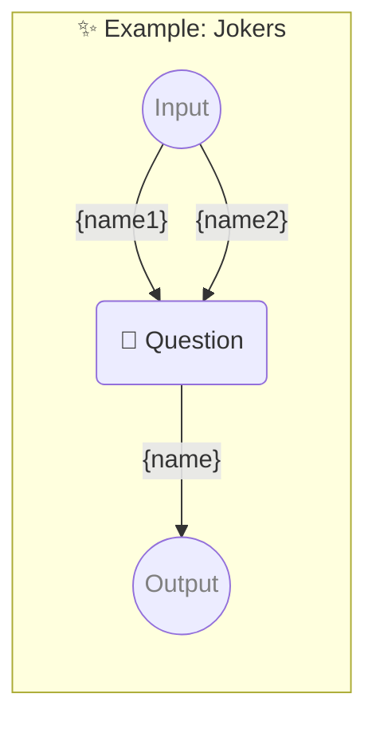

# ✨ Example: Jokers

-   PIPELINE URL https://promptbook.studio/examples/jokers.ptbk.md
-   INPUT  PARAMETER {name1} First name or nothing
-   INPUT  PARAMETER {name2} Second name or nothing
-   OUTPUT PARAMETER `{name}`

<!--Graph-->
<!-- ⚠️ WARNING: This code has been generated so that any manual changes will be overwritten -->



<!--/Graph-->

## 💬 Question

-   JOKER {name1}
-   JOKER {name2}
-   EXPECT MIN 2 WORDS

```markdown
Write some name for hero
```

`-> {name}`
