# ✨ Example: Postprocessing 2

-   PIPELINE URL https://promptbook.studio/examples/postprocessing-2.book.md
-   INPUT  PARAMETER {yourName} Name of the hero
-   OUTPUT PARAMETER `{greeting}`

```mermaid
%% 🔮 Tip: Open this on GitHub or in the VSCode website to see the Mermaid graph visually

flowchart LR
  subgraph "✨ Example: Postprocessing 2"

      direction TB

      input((Input)):::input
      templateQuestion("💬 Question")
      input--"{yourName}"-->templateQuestion

      templateQuestion--"{greeting}"-->output
      output((Output)):::output

      click templateQuestion href "#question" "💬 Question";

      classDef input color: grey;
      classDef output color: grey;

  end;
```

<!--Graph-->
<!-- ⚠️ WARNING: This code has been generated so that any manual changes will be overwritten -->



<!--/Graph-->

## 💬 Question

-   POSTPROCESSING reverse
-   POSTPROCESSING removeDiacritics
-   POSTPROCESSING normalizeTo_SCREAMING_CASE

```markdown
Hello {yourName}!
```

`-> {greeting}`

### Example 1

-   EXAMPLE

```text
NHOJ OLLEH
```

`-> {greeting}`

### Example 2

-   EXAMPLE

```text
HSOJ IH
```

`-> {greeting}`
