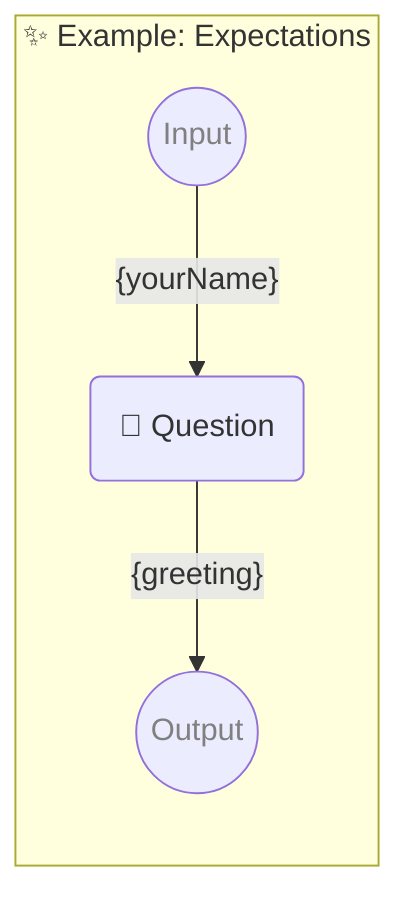

# ✨ Example: Expectations

-   PIPELINE URL https://promptbook.studio/examples/expectations.book.md
-   INPUT  PARAMETER {yourName} Name of the hero
-   OUTPUT PARAMETER `{greeting}`

<!--Graph-->
<!-- ⚠️ WARNING: This code has been generated so that any manual changes will be overwritten -->



<!--/Graph-->

## 💬 Question

-   MODEL VARIANT Chat
-   MODEL NAME `gpt-3.5-turbo`
-   EXPECT MAX 30 CHARACTERS
-   EXPECT MIN 2 CHARACTERS
-   EXPECT MAX 3 WORDS
-   EXPECT EXACTLY 1 SENTENCE
-   EXPECT EXACTLY 1 LINE

```markdown
Hello {yourName}!
```

`-> {greeting}`

### Example

Example must pass the expectations

-   EXAMPLE

```text
Hello John!
```

`-> {greeting}`
