# ⚠ Example of non-recommended syntax

Defining same persona twice is **not recommended** but it is not an error in case of personas are same.

-   OUTPUT PARAMETER `{answer}`

```mermaid
%% 🔮 Tip: Open this on GitHub or in the VSCode website to see the Mermaid graph visually

flowchart LR
  subgraph "⚠ Example of non-recommended syntax"

      direction TB

      input((Input)):::input
      taskPrompt("💬 Prompt")

      taskPrompt--"{answer}"-->output
      output((Output)):::output

      click taskPrompt href "#prompt" "💬 Prompt";

      classDef input color: grey;
      classDef output color: grey;

  end;
```

<!--Graph-->
<!-- ⚠️ WARNING: This code has been generated so that any manual changes will be overwritten -->



<!--/Graph-->

## 💬 Prompt

-   PERSONA John, a philosopher who is writing a book on the meaning of life
-   PERSONA John
-   PERSONA John

```
Hello,
What is the answer to the universe?
```

`-> {answer}`
