<!--Graph-->
<!-- ⚠️ WARNING: This code has been generated so that any manual changes will be overwritten -->

<!--/Graph-->

<!--

```mermaid
%% 🔮 Tip: Open this on GitHub or in the VSCode website to see the Mermaid graph visually

flowchart LR
  subgraph "Untitled"

      direction TB

      input((Input)):::input



      output((Output)):::output



      classDef input color: grey;
      classDef output color: grey;

  end;
```

Note: Empty pipeline makes no sense, but it is possible to create one.
      It is useful for mocking and keeping pipeline 100% valid throughout the development.
-->
