# ✨ Example of logic error

Example of using parameter in reverse order

_Note: This is not recommended but it should work_

-   PIPELINE URL https://promptbook.studio/examples/parameter-used-in-reverse-order.book.md
-   INPUT  PARAMETER `{word}` Any single word
-   OUTPUT PARAMETER `{sentenceWithTwoSynonyms}`

```mermaid
%% 🔮 Tip: Open this on GitHub or in the VSCode website to see the Mermaid graph visually

flowchart LR
  subgraph "✨ Example of logic error"

      direction TB

      input((Input)):::input
      taskSentence("Sentence")
      input--"{word}"-->taskSentence
      taskSynonym--"{wordSynonym}"-->taskSentence
      taskSynonym("Synonym")
      input--"{word}"-->taskSynonym

      taskSentence--"{sentenceWithTwoSynonyms}"-->output
      output((Output)):::output

      click taskSentence href "#sentence" "Sentence";
      click taskSynonym href "#synonym" "Synonym";

      classDef input color: grey;
      classDef output color: grey;

  end;
```

<!--Graph-->
<!-- ⚠️ WARNING: This code has been generated so that any manual changes will be overwritten -->



<!--/Graph-->

## Sentence

Sentence with word and wordSynonym

```text
Write sentence with "{word}" and "{wordSynonym}" in it
```

`-> {sentenceWithTwoSynonyms}`

## Synonym

Synonym for word

```text
Write synonym for "{word}"
```

`-> {wordSynonym}`
