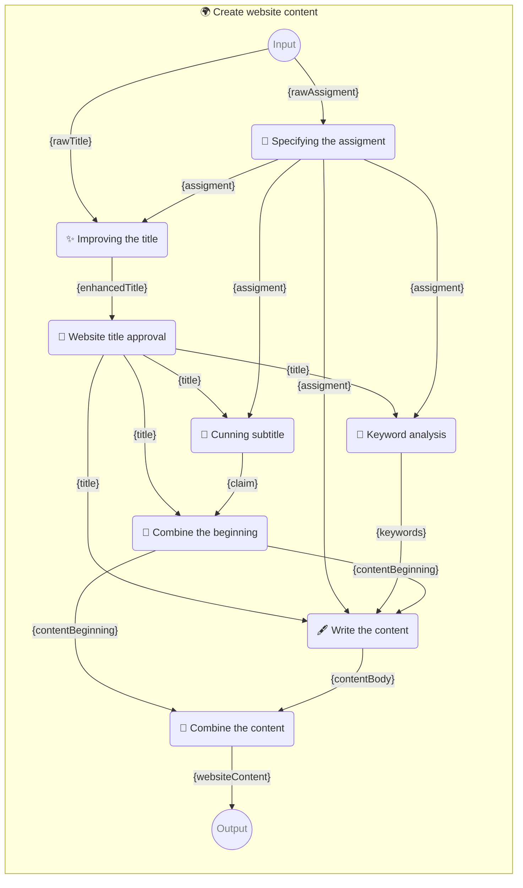

<!-- ⚠️ WARNING: This code has been generated so that any manual changes will be overwritten -->

#  Promptbook

Supercharge your use of large language models


[ Promptbook](https://badge.fury.io/js/promptbook.svg)](https://www.npmjs.com/package/promptbook)
[ Promptbook](https://packagequality.com/shield/promptbook.svg)](https://packagequality.com/#?package=promptbook)
[](https://snyk.io/test/github/webgptorg/promptbook)
[](https://github.com/webgptorg/promptbook/issues)


## 📦 Package `@promptbook/utils`

- Promptbooks are [divided into several](#-packages) packages, all are published from [single monorepo](https://github.com/webgptorg/promptbook).
- This package `@promptbook/utils` is one part of the promptbook ecosystem.

To install this package, run:

```bash
# Install entire promptbook ecosystem
npm i ptbk

# Install just this package to save space
npm i @promptbook/utils
```

Utility functions used in the library but also useful for individual use in preprocessing and postprocessing LLM inputs and outputs

Here is a overview of the functions which are exported from the `@promptbook/utils` package and can be used in your own projects:

## Postprocessing

Sometimes you need to postprocess the output of the LLM model, every postprocessing function that is available through `POSTPROCESS` command in promptbook is exported from `@promptbook/utils`. You can use:

-   `spaceTrim`
-   `extractAllBlocksFromMarkdown`, _<- Note: Exported from [`@promptbook/markdown-utils`](https://www.npmjs.com/package/@promptbook/markdown-utils)_
-   `extractAllListItemsFromMarkdown` _<- Note: Exported from [`@promptbook/markdown-utils`](https://www.npmjs.com/package/@promptbook/markdown-utils)_
-   `extractBlock`
-   `extractOneBlockFromMarkdown `_<- Note: Exported from [`@promptbook/markdown-utils`](https://www.npmjs.com/package/@promptbook/markdown-utils)_
-   `prettifyPipelineString`
-   `removeContentComments`
-   `removeEmojis`
-   `removeMarkdownFormatting` _<- Note: Exported from [`@promptbook/markdown-utils`](https://www.npmjs.com/package/@promptbook/markdown-utils)_
-   `removeQuotes`
-   `trimCodeBlock`
-   `trimEndOfCodeBlock`
-   `unwrapResult`

Very often you will use `unwrapResult`, which is used to extract the result you need from output with some additional information:

```typescript
import { unwrapResult } from '@promptbook/utils';

unwrapResult('Best greeting for the user is "Hi Pavol!"'); // 'Hi Pavol!'
```

## Templating

There is a function `replaceParameters` which is used to replace the parameters in given template optimized to LLM prompt templates.

```typescript
import { replaceParameters } from '@promptbook/utils';

replaceParameters('Hello, {name}!', { name: 'world' }); // 'Hello, world!'
```

And also multiline templates with blockquotes

```typescript
import { replaceParameters, spaceTrim } from '@promptbook/utils';

replaceParameters(
    spaceTrim(`
        Hello, {name}!

        > {answer}
    `),
    {
        name: 'world',
        answer: spaceTrim(`
            I'm fine,
            thank you!

            And you?
        `),
    },
);

// Hello, world!
//
// > I'm fine,
// > thank you!
// >
// > And you?
```

## Counting

Theese functions are usefull to count stats about the input/output in human-like terms not tokens and bytes, you can use
`countCharacters`, `countLines`, `countPages`, `countParagraphs`, `countSentences`, `countWords`

```typescript
import { countWords } from '@promptbook/utils';

console.log(countWords('Hello, world!')); // 2
```

## Splitting

Splitting functions are similar to counting but they return the splitted parts of the input/output, you can use
`splitIntoCharacters`, `splitIntoLines`, `splitIntoPages`, `splitIntoParagraphs`, `splitIntoSentences`, `splitIntoWords`

```typescript
import { splitIntoWords } from '@promptbook/utils';

console.log(splitIntoWords('Hello, world!')); // ['Hello', 'world']
```

## Normalization

Normalization functions are used to put the string into a normalized form, you can use
`kebab-case`
`PascalCase`
`SCREAMING_CASE`
`snake_case`
`kebab-case`

```typescript
import { normalizeTo } from '@promptbook/utils';

console.log(normalizeTo['kebab-case']('Hello, world!')); // 'hello-world'
```

-   There are more normalization functions like `capitalize`, `decapitalize`, `removeDiacritics`,...
-   Theese can be also used as postprocessing functions in the `POSTPROCESS` command in promptbook

## Misc

See also the documentation for all the functions in the `@promptbook/utils` package, every function is documented by jsdoc, typed by typescript and tested by jest.


`assertsExecutionSuccessful`,
`checkExpectations`,
`executionReportJsonToString`,
`isPassingExpectations`,
`isValidJsonString`,
`parseNumber` 


---

Rest of the documentation is common for **entire promptbook ecosystem**:

## 🤍 The Promptbook Whitepaper

When you have a simple, single prompt for ChatGPT, GPT-4, Anthropic Claude, Google Gemini, Llama 2, or whatever, it doesn't matter how it is integrated. Whether it's the direct calling of a REST API, using the SDK, hardcoding the prompt in the source code, or importing a text file, the process remains the same.

If you need something more advanced or want to extend the capabilities of LLMs, you generally have three ways to proceed:

1. **Fine-tune** the model to your specifications or even train your own.
2. **Prompt-engineer** the prompt to the best shape you can achieve.
3. Use **multiple prompts** in a pipeline to get the best result.

In any of these situations, but especially in (3), the Promptbook library can make your life easier and make **orchestraror for your prompts**.

-   **Separation of concerns** between prompt engineer and programmer; between code files and prompt files; and between prompts and their execution logic.
-   Set up a **common format** for prompts that is interchangeable between projects and language/technology stacks.
-   **Preprocessing** and cleaning the input data from the user.
-   Use default values - **Jokers** to bypass some parts of the pipeline.
-   **Expect** some specific output from the model.
-   **Retry** mismatched outputs.
-   **Combine** multiple models together.
-   Interactive **User interaction** with the model and the user.
-   Leverage **external** sources (like ChatGPT plugins or OpenAI's GPTs).
-   Simplify your code to be **DRY** and not repeat all the boilerplate code for each prompt.
-   **Versioning** of promptbooks
-   **Reuse** parts of promptbooks in/between projects.
-   Run the LLM **optimally** in parallel, with the best _cost/quality_ ratio or _speed/quality_ ratio.
-   **Execution report** to see what happened during the execution.
-   **Logging** the results of the promptbooks.
-   _(Not ready yet)_ **Caching** calls to LLMs to save money and time.
-   _(Not ready yet)_ Extend one prompt book from another one.
-   _(Not ready yet)_ Leverage the **streaming** to make super cool UI/UX.
-   _(Not ready yet)_ **A/B testing** to determine which prompt works best for the job.


## 🧔 Promptbook _(for prompt-engeneers)_

**P**romp**t** **b**oo**k** markdown file (or `.ptbk.md` file) is document that describes a **pipeline** - a series of prompts that are chained together to form somewhat reciepe for transforming natural language input.

-   Multiple pipelines forms a **collection** which will handle core **know-how of your LLM application**.
-   Theese pipelines are designed such as they **can be written by non-programmers**.


### Sample:

File `write-website-content.ptbk.md`:


> # 🌍 Create website content
>
> Instructions for creating web page content.
>
> -   PIPELINE URL https://promptbook.studio/webgpt/write-website-content.ptbk.md
> -   PROMPTBOOK VERSION 0.0.1
> -   INPUT  PARAM `{rawTitle}` Automatically suggested a site name or empty text
> -   INPUT  PARAM `{rawAssigment}` Automatically generated site entry from image recognition
> -   OUTPUT PARAM `{websiteContent}` Web content
> -   OUTPUT PARAM `{keywords}` Keywords
>
> ## 👤 Specifying the assigment
>
> What is your web about?
>
> -   PROMPT DIALOG
>
> ```
> {rawAssigment}
> ```
>
> `-> {assigment}` Website assignment and specification
>
> ## ✨ Improving the title
>
> -   MODEL VARIANT Chat
> -   MODEL NAME `gpt-4`
> -   POSTPROCESSING `unwrapResult`
>
> ```
> As an experienced marketing specialist, you have been entrusted with improving the name of your client's business.
>
> A suggested name from a client:
> "{rawTitle}"
>
> Assignment from customer:
>
> > {assigment}
>
> ## Instructions:
>
> -   Write only one name suggestion
> -   The name will be used on the website, business cards, visuals, etc.
> ```
>
> `-> {enhancedTitle}` Enhanced title
>
> ## 👤 Website title approval
>
> Is the title for your website okay?
>
> -   PROMPT DIALOG
>
> ```
> {enhancedTitle}
> ```
>
> `-> {title}` Title for the website
>
> ## 🐰 Cunning subtitle
>
> -   MODEL VARIANT Chat
> -   MODEL NAME `gpt-4`
> -   POSTPROCESSING `unwrapResult`
>
> ```
> As an experienced copywriter, you have been entrusted with creating a claim for the "{title}" web page.
>
> A website assignment from a customer:
>
> > {assigment}
>
> ## Instructions:
>
> -   Write only one name suggestion
> -   Claim will be used on website, business cards, visuals, etc.
> -   Claim should be punchy, funny, original
> ```
>
> `-> {claim}` Claim for the web
>
> ## 🚦 Keyword analysis
>
> -   MODEL VARIANT Chat
> -   MODEL NAME `gpt-4`
>
> ```
> As an experienced SEO specialist, you have been entrusted with creating keywords for the website "{title}".
>
> Website assignment from the customer:
>
> > {assigment}
>
> ## Instructions:
>
> -   Write a list of keywords
> -   Keywords are in basic form
>
> ## Example:
>
> -   Ice cream
> -   Olomouc
> -   Quality
> -   Family
> -   Tradition
> -   Italy
> -   Craft
>
> ```
>
> `-> {keywords}` Keywords
>
> ## 🔗 Combine the beginning
>
> -   SIMPLE TEMPLATE
>
> ```
>
> # {title}
>
> > {claim}
>
> ```
>
> `-> {contentBeginning}` Beginning of web content
>
> ## 🖋 Write the content
>
> -   MODEL VARIANT Completion
> -   MODEL NAME `gpt-3.5-turbo-instruct`
>
> ```
> As an experienced copywriter and web designer, you have been entrusted with creating text for a new website {title}.
>
> A website assignment from a customer:
>
> > {assigment}
>
> ## Instructions:
>
> -   Text formatting is in Markdown
> -   Be concise and to the point
> -   Use keywords, but they should be naturally in the text
> -   This is the complete content of the page, so don't forget all the important information and elements the page should contain
> -   Use headings, bullets, text formatting
>
> ## Keywords:
>
> {keywords}
>
> ## Web Content:
>
> {contentBeginning}
> ```
>
> `-> {contentBody}` Middle of the web content
>
> ## 🔗 Combine the content
>
> -   SIMPLE TEMPLATE
>
> ```markdown
> {contentBeginning}
>
> {contentBody}
> ```
>
> `-> {websiteContent}`


Following is the scheme how the promptbook above is executed:



-   [More template samples](./samples/templates/)
-   [Read more about `.ptbk.md` file format here](https://github.com/webgptorg/promptbook/discussions/categories/concepts?discussions_q=is%3Aopen+label%3A.ptbk.md+category%3AConcepts)

_Note: We are using [postprocessing functions](#postprocessing-functions) like `unwrapResult` that can be used to postprocess the result._

## 📦 Packages

This library is divided into several packages, all are published from [single monorepo](https://github.com/webgptorg/promptbook).
You can install all of them at once:

```bash
npm i ptbk
```

Or you can install them separately:

> ⭐ Marked packages are worth to try first

-   ⭐ **[ptbk](https://www.npmjs.com/package/ptbk)** - Bundle of all packages, when you want to install everything and you don't care about the size
-   **[promptbook](https://www.npmjs.com/package/promptbook)** - Same as `ptbk`
-   **[@promptbook/core](https://www.npmjs.com/package/@promptbook/core)** - Core of the library, it contains the main logic for promptbooks
-   **[@promptbook/node](https://www.npmjs.com/package/@promptbook/node)** - Core of the library for Node.js environment
-   **[@promptbook/browser](https://www.npmjs.com/package/@promptbook/browser)** - Core of the library for browser environment
-   ⭐ **[@promptbook/utils](https://www.npmjs.com/package/@promptbook/utils)** - Utility functions used in the library but also useful for individual use in preprocessing and postprocessing LLM inputs and outputs
-   **[@promptbook/markdown-utils](https://www.npmjs.com/package/@promptbook/markdown-utils)** - Utility functions used for processing markdown
-   _(Not finished)_ **[@promptbook/wizzard](https://www.npmjs.com/package/@promptbook/wizzard)** - Wizard for creating+running promptbooks in single line
-   **[@promptbook/execute-javascript](https://www.npmjs.com/package/@promptbook/execute-javascript)** - Execution tools for javascript inside promptbooks
-   **[@promptbook/openai](https://www.npmjs.com/package/@promptbook/openai)** - Execution tools for OpenAI API, wrapper around OpenAI SDK
-   **[@promptbook/anthropic-claude](https://www.npmjs.com/package/@promptbook/anthropic-claude)** - Execution tools for Anthropic Claude API, wrapper around Anthropic Claude SDK 
-   **[@promptbook/azure-openai](https://www.npmjs.com/package/@promptbook/azure-openai)** - Execution tools for Azure OpenAI API
-   **[@promptbook/langtail](https://www.npmjs.com/package/@promptbook/langtail)** - Execution tools for Langtail API, wrapper around Langtail SDK
-   **[@promptbook/fake-llm](https://www.npmjs.com/package/@promptbook/fake-llm)** - Mocked execution tools for testing the library and saving the tokens
-   **[@promptbook/remote-client](https://www.npmjs.com/package/@promptbook/remote-client)** - Remote client for remote execution of promptbooks
-   **[@promptbook/remote-server](https://www.npmjs.com/package/@promptbook/remote-server)** - Remote server for remote execution of promptbooks
-   **[@promptbook/types](https://www.npmjs.com/package/@promptbook/types)** - Just typescript types used in the library
-   **[@promptbook/cli](https://www.npmjs.com/package/@promptbook/cli)** - Command line interface utilities for promptbooks


## 📚 Dictionary

The following glossary is used to clarify certain concepts:


### Core concepts

-   [📚 Collection of pipelines](https://github.com/webgptorg/promptbook/discussions/65)
-   [📯 Pipeline](https://github.com/webgptorg/promptbook/discussions/64)
-   [🎺 Pipeline templates](https://github.com/webgptorg/promptbook/discussions/88)
-   [🤼 Personas](https://github.com/webgptorg/promptbook/discussions/22)
-   [⭕ Parameters](https://github.com/webgptorg/promptbook/discussions/83)
-   [🚀 Pipeline execution](https://github.com/webgptorg/promptbook/discussions/84)
-   [🧪 Expectations](https://github.com/webgptorg/promptbook/discussions/30)
-   [✂️ Postprocessing](https://github.com/webgptorg/promptbook/discussions/31)
-   [🔣 Words not tokens](https://github.com/webgptorg/promptbook/discussions/29)
-   [☯ Separation of concerns](https://github.com/webgptorg/promptbook/discussions/32)

### Advanced concepts

-   [📚 Knowledge (Retrieval-augmented generation)](https://github.com/webgptorg/promptbook/discussions/41)
-   [🌏 Remote server](https://github.com/webgptorg/promptbook/discussions/89)
-   [🃏 Jokers (conditions)](https://github.com/webgptorg/promptbook/discussions/66)
-   [🔳 Metaprompting](https://github.com/webgptorg/promptbook/discussions/35)
-   [🌏 Linguistically typed languages](https://github.com/webgptorg/promptbook/discussions/53)
-   [🌍 Auto-Translations](https://github.com/webgptorg/promptbook/discussions/42)
-   [📽 Images, audio, video, spreadsheets](https://github.com/webgptorg/promptbook/discussions/54)
-   [🔙 Expectation-aware generation](https://github.com/webgptorg/promptbook/discussions/37)
-   [⏳ Just-in-time fine-tuning](https://github.com/webgptorg/promptbook/discussions/33)
-   [🔴 Anomaly detection](https://github.com/webgptorg/promptbook/discussions/40)
-   [👮 Agent adversary expectations](https://github.com/webgptorg/promptbook/discussions/39)
-   [view more](https://github.com/webgptorg/promptbook/discussions/categories/concepts)

## 🔌 Usage in Typescript / Javascript

-   [Simple usage](./samples/usage/simple-script)
-   [Usage with client and remote server](./samples/usage/remote)

## ➕➖ When to use Promptbook?

### ➕ When to use

-   When you are writing app that generates complex things via LLM - like **websites, articles, presentations, code, stories, songs**,...
-   When you want to **separate code from text prompts**
-   When you want to describe **complex prompt pipelines** and don't want to do it in the code
-   When you want to **orchestrate multiple prompts** together
-   When you want to **reuse** parts of prompts in multiple places
-   When you want to **version** your prompts and **test multiple versions**
-   When you want to **log** the execution of prompts and backtrace the issues

### ➖ When not to use

-   When you are writing just a simple chatbot without any extra logic, just system messages

## 🐜 Known issues

-   [🤸‍♂️ Iterations not working yet](https://github.com/webgptorg/promptbook/discussions/55)
-   [⤵️ Imports not working yet](https://github.com/webgptorg/promptbook/discussions/34)

## 🧼 Intentionally not implemented features


-   [➿ No recursion](https://github.com/webgptorg/promptbook/discussions/38)
-   [🏳 There are no types, just strings](https://github.com/webgptorg/promptbook/discussions/52)

## ❔ FAQ


If you have a question [start a discussion](https://github.com/webgptorg/promptbook/discussions/), [open an issue](https://github.com/webgptorg/promptbook/issues) or [write me an email](https://www.pavolhejny.com/contact).

### Why not just use the OpenAI SDK / Anthropic Claude SDK / ...?

Different levels of abstraction. OpenAI library is for direct use of OpenAI API. This library is for a higher level of abstraction. It is for creating prompt templates and promptbooks that are independent of the underlying library, LLM model, or even LLM provider.

### How is it different from the Langchain library?

Langchain is primarily aimed at ML developers working in Python. This library is for developers working in javascript/typescript and creating applications for end users.

We are considering creating a bridge/converter between these two libraries.


### Promptbooks vs. OpenAI`s GPTs

GPTs are chat assistants that can be assigned to specific tasks and materials. But they are still chat assistants. Promptbooks are a way to orchestrate many more predefined tasks to have much tighter control over the process. Promptbooks are not a good technology for creating human-like chatbots, GPTs are not a good technology for creating outputs with specific requirements.


### Where should I store my promptbooks?

If you use raw SDKs, you just put prompts in the sourcecode, mixed in with typescript, javascript, python or whatever programming language you use.

If you use promptbooks, you can store them in several places, each with its own advantages and disadvantages:

1. As **source code**, typically git-committed. In this case you can use the versioning system and the promptbooks will be tightly coupled with the version of the application. You still get the power of promptbooks, as you separate the concerns of the prompt-engineer and the programmer.

2. As data in a **database** In this case, promptbooks are like posts / articles on the blog. They can be modified independently of the application. You don't need to redeploy the application to change the promptbooks. You can have multiple versions of promptbooks for each user. You can have a web interface for non-programmers to create and modify promptbooks. But you lose the versioning system and you still have to consider the interface between the promptbooks and the application _(= input and output parameters)_.

3. In a **configuration** in environment variables. This is a good way to store promptbooks if you have an application with multiple deployments and you want to have different but simple promptbooks for each deployment and you don't need to change them often.

### What should I do when I need same promptbook in multiple human languages?

A single promptbook can be written for several _(human)_ languages at once. However, we recommend that you have separate promptbooks for each language.

In large language models, you will get better results if you have prompts in the same language as the user input.

The best way to manage this is to have suffixed promptbooks like `write-website-content.en.ptbk.md` and `write-website-content.cs.ptbk.md` for each supported language.


## ⌚ Changelog

See [CHANGELOG.md](./CHANGELOG.md)

## 📜 License

<p xmlns:cc="http://creativecommons.org/ns#" xmlns:dct="http://purl.org/dc/terms/"><a property="dct:title" rel="cc:attributionURL" href="https://github.com/webgptorg/promptbook">Promptbook</a> by <a rel="cc:attributionURL dct:creator" property="cc:attributionName" href="https://github.com/hejny/">Pavol Hejný</a> is licensed under <a href="https://creativecommons.org/licenses/by/4.0/?ref=chooser-v1" target="_blank" rel="license noopener noreferrer" style="display:inline-block;">CC BY 4.0</a></p>

## 🎯 Todos

See [TODO.md](./TODO.md)


## 🖋️ Contributing

I am open to pull requests, feedback, and suggestions. Or if you like this utility, you can [☕ buy me a coffee](https://www.buymeacoffee.com/hejny) or [donate via cryptocurrencies](https://github.com/hejny/hejny/blob/main/documents/crypto.md).

You can also ⭐ star the promptbook package, [follow me on GitHub](https://github.com/hejny) or [various other social networks](https://www.pavolhejny.com/contact/).