#  Promptbook

Library to supercharge your use of large language models


[ Promptbook](https://badge.fury.io/js/promptbook.svg)](https://www.npmjs.com/package/promptbook)
[ Promptbook](https://packagequality.com/shield/promptbook.svg)](https://packagequality.com/#?package=promptbook)
[](https://snyk.io/test/github/webgptorg/promptbook)
[](https://github.com/webgptorg/promptbook/issues)


## 📦 Package `@promptbook/utils`

- Promptbooks are [divided into several](#-packages) packages, all are published from [single monorepo](https://github.com/webgptorg/promptbook).
- This package `@promptbook/utils` is one part of the promptbook ecosystem.

To install this package, run:

```bash
# Install entire promptbook ecosystem
npm i ptbk

# Install just this package to save space
npm i @promptbook/utils
```

Utility functions used in the library but also useful for individual use in preprocessing and postprocessing LLM inputs and outputs

Here is a overview of the functions which are exported from the `@promptbook/utils` package and can be used in your own projects:

## Postprocessing

Sometimes you need to postprocess the output of the LLM model, every postprocessing function that is available through `POSTPROCESS` command in promptbook is exported from `@promptbook/utils`. You can use:

`spaceTrim`,
`extractAllBlocksFromMarkdown`, 
`extractAllListItemsFromMarkdown`,
`extractBlock` ,
`extractOneBlockFromMarkdown`,
`prettifyPromptbookString`,
`removeContentComments`,
`removeEmojis`,
`removeMarkdownFormatting`,
`removeQuotes`,
`trimCodeBlock`,
`trimEndOfCodeBlock`,
`unwrapResult`

Very often you will use `unwrapResult`, which is used to extract the result you need from output with some additional information:

```typescript
import { unwrapResult } from '@promptbook/utils';

unwrapResult('Best greeting for the user is "Hi Pavol!"'); // 'Hi Pavol!'
```

## Templating

There is a function `replaceParameters` which is used to replace the parameters in given template optimized to LLM prompt templates.

```typescript
import { replaceParameters } from '@promptbook/utils';

replaceParameters('Hello, {name}!', { name: 'world' }); // 'Hello, world!'
```

And also multiline templates with blockquotes

```typescript
import { replaceParameters, spaceTrim } from '@promptbook/utils';

replaceParameters(
    spaceTrim(`
        Hello, {name}!

        > {answer}
    `),
    {
        name: 'world',
        answer: spaceTrim(`
            I'm fine,
            thank you!

            And you?
        `),
    },
);

// Hello, world!
//
// > I'm fine,
// > thank you!
// >
// > And you?
```

## Counting

Theese functions are usefull to count stats about the input/output in human-like terms not tokens and bytes, you can use
`countCharacters`, `countLines`, `countPages`, `countParagraphs`, `countSentences`, `countWords`

```typescript
import { countWords } from '@promptbook/utils';

console.log(countWords('Hello, world!')); // 2
```

## Splitting

Splitting functions are similar to counting but they return the splitted parts of the input/output, you can use
`splitIntoCharacters`, `splitIntoLines`, `splitIntoPages`, `splitIntoParagraphs`, `splitIntoSentences`, `splitIntoWords`

```typescript
import { splitIntoWords } from '@promptbook/utils';

console.log(splitIntoWords('Hello, world!')); // ['Hello', 'world']
```

## Normalization

Normalization functions are used to put the string into a normalized form, you can use
`kebab-case`
`PascalCase`
`SCREAMING_CASE`
`snake_case`
`kebab-case`

```typescript
import { normalizeTo } from '@promptbook/utils';

console.log(normalizeTo['kebab-case']('Hello, world!')); // 'hello-world'
```

-   There are more normalization functions like `capitalize`, `decapitalize`, `removeDiacritics`,...
-   Theese can be also used as postprocessing functions in the `POSTPROCESS` command in promptbook

## Misc

See also the documentation for all the functions in the `@promptbook/utils` package, every function is documented by jsdoc, typed by typescript and tested by jest.


`assertsExecutionSuccessful`,
`checkExpectations`,
`executionReportJsonToString`,
`isPassingExpectations`,
`isValidJsonString`,
`parseNumber` 


---

Rest of the documentation is common for **entire promptbook ecosystem**:


## 🤍 The Promptbook Whitepaper

When you have a simple, single prompt for ChatGPT, GPT-4, Anthropic Claude, Google Gemini, Llama 2, or whatever, it doesn't matter how it is integrated. Whether it's the direct calling of a REST API, using the SDK, hardcoding the prompt in the source code, or importing a text file, the process remains the same.

If you need something more advanced or want to extend the capabilities of LLMs, you generally have three ways to proceed:

1. **Fine-tune** the model to your specifications or even train your own.
2. **Prompt-engineer** the prompt to the best shape you can achieve.
3. Use **multiple prompts** in a pipeline to get the best result.

In any of these situations, but especially in (3), the Promptbook library can make your life easier and make **orchestraror for your prompts**.

-   **Separation of concerns** between prompt engineer and programmer; between code files and prompt files; and between prompts, templates, templating pipelines, and their execution logic.
-   Set up a **common format** for prompts that is interchangeable between projects and language/technology stacks.
-   **Preprocessing** and cleaning the input data from the user.
-   Use default values - **Jokers** to bypass some parts of the pipeline.
-   **Expect** some specific output from the model.
-   **Retry** mismatched outputs.
-   **Combine** multiple models together.
-   Interactive **User interaction** with the model and the user.
-   Leverage **external** sources (like ChatGPT plugins or OpenAI's GPTs).
-   Simplify your code to be **DRY** and not repeat all the boilerplate code for each prompt.
-   **Versioning** of promptbooks
-   **Reuse** parts of promptbooks in/between projects.
-   Run the LLM **optimally** in parallel, with the best _cost/quality_ ratio or _speed/quality_ ratio.
-   **Execution report** to see what happened during the execution.
-   **Logging** the results of the promptbooks.
-   _(Not ready yet)_ **Caching** calls to LLMs to save money and time.
-   _(Not ready yet)_ Extend one prompt book from another one.
-   _(Not ready yet)_ Leverage the **streaming** to make super cool UI/UX.
-   _(Not ready yet)_ **A/B testing** to determine which prompt works best for the job.


### Sample:

File `write-website-content.ptbk.md`:


> # 🌍 Create website content
>
> Instructions for creating web page content.
>
> -   PROMPTBOOK URL https://promptbook.webgpt.com/en/write-website-content.ptbk.md
> -   PROMPTBOOK VERSION 0.0.1
> -   INPUT  PARAM `{rawTitle}` Automatically suggested a site name or empty text
> -   INPUT  PARAM `{rawAssigment}` Automatically generated site entry from image recognition
> -   OUTPUT PARAM `{content}` Web content
> -   OUTPUT PARAM `{keywords}` Keywords
>
> ## 👤 Specifying the assigment
>
> What is your web about?
>
> -   PROMPT DIALOG
>
> ```
> {rawAssigment}
> ```
>
> `-> {assigment}` Website assignment and specification
>
> ## ✨ Improving the title
>
> -   MODEL VARIANT Chat
> -   MODEL NAME `gpt-4`
> -   POSTPROCESSING `unwrapResult`
>
> ```
> As an experienced marketing specialist, you have been entrusted with improving the name of your client's business.
>
> A suggested name from a client:
> "{rawTitle}"
>
> Assignment from customer:
>
> > {assigment}
>
> ## Instructions:
>
> -   Write only one name suggestion
> -   The name will be used on the website, business cards, visuals, etc.
> ```
>
> `-> {enhancedTitle}` Enhanced title
>
> ## 👤 Website title approval
>
> Is the title for your website okay?
>
> -   PROMPT DIALOG
>
> ```
> {enhancedTitle}
> ```
>
> `-> {title}` Title for the website
>
> ## 🐰 Cunning subtitle
>
> -   MODEL VARIANT Chat
> -   MODEL NAME `gpt-4`
> -   POSTPROCESSING `unwrapResult`
>
> ```
> As an experienced copywriter, you have been entrusted with creating a claim for the "{title}" web page.
>
> A website assignment from a customer:
>
> > {assigment}
>
> ## Instructions:
>
> -   Write only one name suggestion
> -   Claim will be used on website, business cards, visuals, etc.
> -   Claim should be punchy, funny, original
> ```
>
> `-> {claim}` Claim for the web
>
> ## 🚦 Keyword analysis
>
> -   MODEL VARIANT Chat
> -   MODEL NAME `gpt-4`
>
> ```
> As an experienced SEO specialist, you have been entrusted with creating keywords for the website "{title}".
>
> Website assignment from the customer:
>
> > {assigment}
>
> ## Instructions:
>
> -   Write a list of keywords
> -   Keywords are in basic form
>
> ## Example:
>
> -   Ice cream
> -   Olomouc
> -   Quality
> -   Family
> -   Tradition
> -   Italy
> -   Craft
>
> ```
>
> `-> {keywords}` Keywords
>
> ## 🔗 Combine the beginning
>
> -   SIMPLE TEMPLATE
>
> ```
>
> # {title}
>
> > {claim}
>
> ```
>
> `-> {contentBeginning}` Beginning of web content
>
> ## 🖋 Write the content
>
> -   MODEL VARIANT Completion
> -   MODEL NAME `gpt-3.5-turbo-instruct`
>
> ```
> As an experienced copywriter and web designer, you have been entrusted with creating text for a new website {title}.
>
> A website assignment from a customer:
>
> > {assigment}
>
> ## Instructions:
>
> -   Text formatting is in Markdown
> -   Be concise and to the point
> -   Use keywords, but they should be naturally in the text
> -   This is the complete content of the page, so don't forget all the important information and elements the page should contain
> -   Use headings, bullets, text formatting
>
> ## Keywords:
>
> {keywords}
>
> ## Web Content:
>
> {contentBeginning}
> ```
>
> `-> {contentBody}` Middle of the web content
>
> ## 🔗 Combine the content
>
> -   SIMPLE TEMPLATE
>
> ```markdown
> {contentBeginning}
>
> {contentBody}
> ```
>
> `-> {content}`


Following is the scheme how the promptbook above is executed:

```mermaid
%% 🔮 Tip: Open this on GitHub or in the VSCode website to see the Mermaid graph visually

flowchart LR
  subgraph "🌍 Create website content"

      direction TB

      input((Input)):::input
      templateSpecifyingTheAssigment(👤 Specifying the assigment)
      input--"{rawAssigment}"-->templateSpecifyingTheAssigment
      templateImprovingTheTitle(✨ Improving the title)
      input--"{rawTitle}"-->templateImprovingTheTitle
      templateSpecifyingTheAssigment--"{assigment}"-->templateImprovingTheTitle
      templateWebsiteTitleApproval(👤 Website title approval)
      templateImprovingTheTitle--"{enhancedTitle}"-->templateWebsiteTitleApproval
      templateCunningSubtitle(🐰 Cunning subtitle)
      templateWebsiteTitleApproval--"{title}"-->templateCunningSubtitle
      templateSpecifyingTheAssigment--"{assigment}"-->templateCunningSubtitle
      templateKeywordAnalysis(🚦 Keyword analysis)
      templateWebsiteTitleApproval--"{title}"-->templateKeywordAnalysis
      templateSpecifyingTheAssigment--"{assigment}"-->templateKeywordAnalysis
      templateCombineTheBeginning(🔗 Combine the beginning)
      templateWebsiteTitleApproval--"{title}"-->templateCombineTheBeginning
      templateCunningSubtitle--"{claim}"-->templateCombineTheBeginning
      templateWriteTheContent(🖋 Write the content)
      templateWebsiteTitleApproval--"{title}"-->templateWriteTheContent
      templateSpecifyingTheAssigment--"{assigment}"-->templateWriteTheContent
      templateKeywordAnalysis--"{keywords}"-->templateWriteTheContent
      templateCombineTheBeginning--"{contentBeginning}"-->templateWriteTheContent
      templateCombineTheContent(🔗 Combine the content)
      templateCombineTheBeginning--"{contentBeginning}"-->templateCombineTheContent
      templateWriteTheContent--"{contentBody}"-->templateCombineTheContent

      templateCombineTheContent--"{content}"-->output
      output((Output)):::output

      classDef input color: grey;
      classDef output color: grey;

  end;
```



[More template samples](./samples/templates/)

_Note: We are using [postprocessing functions](#postprocessing-functions) like `unwrapResult` that can be used to postprocess the result._

## 📦 Packages

This library is divided into several packages, all are published from [single monorepo](https://github.com/webgptorg/promptbook).
You can install all of them at once:

```bash
npm i ptbk
```

Or you can install them separately:

> ⭐ Marked packages are worth to try first


-   ⭐ **[ptbk](https://www.npmjs.com/package/ptbk)** - Bundle of all packages, when you want to install everything and you don't care about the size
-   **[promptbook](https://www.npmjs.com/package/promptbook)** - Same as `ptbk`
-   **[@promptbook/core](https://www.npmjs.com/package/@promptbook/core)** - Core of the library, it contains the main logic for promptbooks
-   **[@promptbook/node](https://www.npmjs.com/package/@promptbook/node)** - Core of the library for Node.js
-   ⭐ **[@promptbook/utils](https://www.npmjs.com/package/@promptbook/utils)** - Utility functions used in the library but also useful for individual use in preprocessing and postprocessing LLM inputs and outputs
-   _(Not finished)_ **[@promptbook/wizzard](https://www.npmjs.com/package/@promptbook/wizzard)** - Wizard for creating+running promptbooks in single line
-   **[@promptbook/execute-javascript](https://www.npmjs.com/package/@promptbook/execute-javascript)** - Execution tools for javascript inside promptbooks
-   **[@promptbook/openai](https://www.npmjs.com/package/@promptbook/openai)** - Execution tools for OpenAI API, wrapper around OpenAI SDK
-   **[@promptbook/anthropic-claude](https://www.npmjs.com/package/@promptbook/anthropic-claude)** - Execution tools for Anthropic Claude API, wrapper around Anthropic Claude SDK 
-   **[@promptbook/azure-openai](https://www.npmjs.com/package/@promptbook/azure-openai)** - Execution tools for Azure OpenAI API
-   **[@promptbook/langtail](https://www.npmjs.com/package/@promptbook/langtail)** - Execution tools for Langtail API, wrapper around Langtail SDK
-   **[@promptbook/fake-llm](https://www.npmjs.com/package/@promptbook/fake-llm)** - Mocked execution tools for testing the library and saving the tokens
-   **[@promptbook/remote-client](https://www.npmjs.com/package/@promptbook/remote-client)** - Remote client for remote execution of promptbooks
-   **[@promptbook/remote-server](https://www.npmjs.com/package/@promptbook/remote-server)** - Remote server for remote execution of promptbooks
-   **[@promptbook/types](https://www.npmjs.com/package/@promptbook/types)** - Just typescript types used in the library
-   **[@promptbook/cli](https://www.npmjs.com/package/@promptbook/cli)** - Command line interface utilities for promptbooks


## 📚 Dictionary

The following glossary is used to clarify certain basic concepts:

### Prompt

Prompt in a text along with model requirements, but without any execution or templating logic.

For example:

```json
{
    "request": "Which sound does a cat make?",
    "modelRequirements": {
        "variant": "CHAT"
    }
}
```

```json
{
    "request": "I am a cat.\nI like to eat fish.\nI like to sleep.\nI like to play with a ball.\nI l",
    "modelRequirements": {
        "variant": "COMPLETION"
    }
}
```

### Prompt Template

Similar concept to Prompt, but with templating logic.

For example:

```json
{
    "request": "Which sound does a {animalName} make?",
    "modelRequirements": {
        "variant": "CHAT"
    }
}
```

### Model Requirements

Abstract way to specify the LLM.
It does not specify the LLM with concrete version itself, only the requirements for the LLM.
_NOT chatgpt-3.5-turbo BUT CHAT variant of GPT-3.5._

For example:

```json
{
    "variant": "CHAT",
    "version": "GPT-3.5",
    "temperature": 0.7
}
```

### Execution type

Each block of promptbook can have a different execution type.
It is specified in list of requirements for the block.
By default, it is `Prompt template`

-   _(default)_ `Prompt template` The block is a prompt template and is executed by LLM (OpenAI, Azure,...)
-   `SIMPLE TEMPLATE` The block is a simple text template which is just filled with parameters
-   `Script` The block is a script that is executed by some script runtime, the runtime is determined by block type, currently only `javascript` is supported but we plan to add `python` and `typescript` in the future.
-   `PROMPT DIALOG` Ask user for input

### Parameters

Parameters that are placed in the prompt template and replaced to create the prompt.
It is a simple key-value object.

```json
{
    "animalName": "cat",
    "animalSound": "Meow!"
}
```

There are three types of template parameters, depending on how they are used in the promptbook:

-   **INPUT PARAMETER**s are required to execute the promptbook.
-   **Intermediate parameters** are used internally in the promptbook.
-   **OUTPUT PARAMETER**s are explicitelly marked and they are returned as the result of the promptbook execution.

_Note: Parameter can be both intermedite and output at the same time._

### Promptbook

Promptbook is **core concept of this library**.
It represents a series of prompt templates chained together to form a **pipeline** / one big prompt template with input and result parameters.

Internally it can have multiple formats:

-   **.ptbk.md file** in custom markdown format described above
-   _(concept)_ **.ptbk** format, custom fileextension based on markdown
-   _(internal)_ **JSON** format, parsed from the .ptbk.md file

### Promptbook **Library**

Library of all promptbooks used in your application.
Each promptbook is a separate `.ptbk.md` file with unique `PROMPTBOOK URL`. Theese urls are used to reference promptbooks in other promptbooks or in the application code.

### Prompt Result

Prompt result is the simplest concept of execution.
It is the result of executing one prompt _(NOT a template)_.

For example:

```json
{
    "response": "Meow!",
    "model": "chatgpt-3.5-turbo"
}
```

### Execution Tools


`ExecutionTools` is an interface which contains all the tools needed to execute prompts.
It contais 3 subtools:

-   `LlmExecutionTools`
-   `ScriptExecutionTools`
-   `UserInterfaceTools`

Which are described below:

#### LLM Execution Tools

`LlmExecutionTools` is a container for all the tools needed to execute prompts to large language models like GPT-4.
On its interface it exposes common methods for prompt execution.
Internally it calls OpenAI, Azure, GPU, proxy, cache, logging,...

`LlmExecutionTools` an abstract interface that is implemented by concrete execution tools:

-   `OpenAiExecutionTools`
-   `AnthropicClaudeExecutionTools`
-   `AzureOpenAiExecutionTools`
-   `LangtailExecutionTools`
-   _(Not implemented yet)_ `BardExecutionTools`
-   _(Not implemented yet)_ `LamaExecutionTools`
-   _(Not implemented yet)_ `GpuExecutionTools`
-   And a special case are `MultipleLlmExecutionTools` that combines multiple execution tools together and tries to execute the prompt on the best one.
-   Another special case are `RemoteLlmExecutionTools` that connect to a remote server and run one of the above execution tools on that server.
-   The another special case is `MockedEchoLlmExecutionTools` that is used for testing and mocking.
-   The another special case is `LogLlmExecutionToolsWrapper` that is technically also an execution tools but it is more proxy wrapper around other execution tools that logs all calls to execution tools.

#### Script Execution Tools

`ScriptExecutionTools` is an abstract container that represents all the tools needed to EXECUTE SCRIPTs. It is implemented by concrete execution tools:

-   `JavascriptExecutionTools` is a wrapper around `vm2` module that executes javascript code in a sandbox.
-   `JavascriptEvalExecutionTools` is wrapper around `eval` function that executes javascript. It is used for testing and mocking **NOT intended to use in the production** due to its unsafe nature, use `JavascriptExecutionTools` instead.
-   _(Not implemented yet)_ `TypescriptExecutionTools` executes typescript code in a sandbox.
-   _(Not implemented yet)_ `PythonExecutionTools` executes python code in a sandbox.

There are [postprocessing functions](#postprocessing-functions) that can be used to postprocess the result.

#### User Interface Tools

`UserInterfaceTools` is an abstract container that represents all the tools needed to interact with the user. It is implemented by concrete execution tools:

-   _(Not implemented yet)_ `ConsoleInterfaceTools` is a wrapper around `readline` module that interacts with the user via console.
-   `SimplePromptInterfaceTools` is a wrapper around `window.prompt` synchronous function that interacts with the user via browser prompt. It is used for testing and mocking **NOT intended to use in the production** due to its synchronous nature.
-   `CallbackInterfaceTools` delagates the user interaction to a async callback function. You need to provide your own implementation of this callback function and its bind to UI. 

### Executor

Executor is a simple async function that takes **input parameters** and returns **output parameters**.
It is constructed by combining execution tools and promptbook to execute together.

### 🃏 Jokers (conditions)

Joker is a previously defined parameter that is used to bypass some parts of the pipeline.
If the joker is present in the template, it is checked to see if it meets the requirements (without postprocessing), and if so, it is used instead of executing that prompt template. There can be multiple wildcards in a prompt template, if so they are checked in order and the first one that meets the requirements is used.

If none of the jokers meet the requirements, the prompt template is executed as usual.

This can be useful, for example, if you want to use some predefined data, or if you want to use some data from the user, but you are not sure if it is suitable form.

When using wildcards, you must have at least one minimum expectation. If you do not have a minimum expectation, the joker will always fulfil the expectation because it has none, so it makes no logical sense.

Look at [jokers.ptbk.md](samples/templates/41-jokers.ptbk.md) sample.

### Postprocessing functions

You can define postprocessing functions when creating `JavascriptEvalExecutionTools`:

```

```

Additionally there are some usefull string-manipulation build-in functions, which are [listed here](src/execution/plugins/script-execution-tools/javascript/JavascriptEvalExecutionTools.ts).

### Expectations

`Expect` command describes the desired output of the prompt template (after post-processing)
It can set limits for the maximum/minimum length of the output, measured in characters, words, sentences, paragraphs,...

_Note: LLMs work with tokens, not characters, but in Promptbooks we want to use some human-recognisable and cross-model interoperable units._

```markdown
# ✨ Sample: Expectations

-   INPUT  PARAMETER {yourName} Name of the hero

## 💬 Question

-   EXPECT MAX 30 CHARACTERS
-   EXPECT MIN 2 CHARACTERS
-   EXPECT MAX 3 WORDS
-   EXPECT EXACTLY 1 SENTENCE
-   EXPECT EXACTLY 1 LINE

...
```

There are two types of expectations which are not strictly symmetrical:

#### Minimal expectations

-   `EXPECT MIN 0 ...` is not valid minimal expectation. It makes no sense.
-   `EXPECT JSON` is both minimal and maximal expectation
-   When you are using `JOKER` in same prompt template, you need to have at least one minimal expectation

#### Maximal expectations

-   `EXPECT MAX 0 ...` is valid maximal expectation. For example, you can expect 0 pages and 2 sentences.
-   `EXPECT JSON` is both minimal and maximal expectation

Look at [expectations.ptbk.md](samples/templates/45-expectations.ptbk.md) and [expect-json.ptbk.md](samples/templates/45-expect-json.ptbk.md) samples for more.


### Execution report

Execution report is a simple object or markdown that contains information about the execution of the promptbook.

[See the example of such a report](/samples/templates/50-advanced.report.md)


### Remote server

Remote server is a proxy server that uses its execution tools internally and exposes the executor interface externally.

You can simply use `RemoteExecutionTools` on client-side javascript and connect to your remote server.
This is useful to make all logic on browser side but not expose your API keys or no need to use customer's GPU.

## 👨‍💻 Usage and integration _(for developers)_


### 🔌 Usage in Typescript / Javascript

-   [Simple usage](./samples/usage/simple-script)
-   [Usage with client and remote server](./samples/usage/remote)

## ➕➖ When to use Promptbook?

### ➕ When to use

-   When you are writing app that generates complex things via LLM - like **websites, articles, presentations, code, stories, songs**,...
-   When you want to **separate code from text prompts**
-   When you want to describe **complex prompt pipelines** and don't want to do it in the code
-   When you want to **orchestrate multiple prompts** together
-   When you want to **reuse** parts of prompts in multiple places
-   When you want to **version** your prompts and **test multiple versions**
-   When you want to **log** the execution of prompts and backtrace the issues

### ➖ When not to use

-   When you are writing just a simple chatbot without any extra logic, just system messages

## 🐜 Known issues


## 🧼 Intentionally not implemented features


## ❔ FAQ

If you have a question [start a discussion](https://github.com/webgptorg/promptbook/discussions/), [open an issue](https://github.com/webgptorg/promptbook/issues) or [write me an email](https://www.pavolhejny.com/contact).

### Why not just use the OpenAI SDK / Anthropic Claude SDK / ...?

Different levels of abstraction. OpenAI library is for direct use of OpenAI API. This library is for a higher level of abstraction. It is for creating prompt templates and promptbooks that are independent of the underlying library, LLM model, or even LLM provider.

### How is it different from the Langchain library?

Langchain is primarily aimed at ML developers working in Python. This library is for developers working in javascript/typescript and creating applications for end users.

We are considering creating a bridge/converter between these two libraries.


### Promptbooks vs. OpenAI`s GPTs

GPTs are chat assistants that can be assigned to specific tasks and materials. But they are still chat assistants. Promptbooks are a way to orchestrate many more predefined tasks to have much tighter control over the process. Promptbooks are not a good technology for creating human-like chatbots, GPTs are not a good technology for creating outputs with specific requirements.


### Where should I store my promptbooks?

If you use raw SDKs, you just put prompts in the sourcecode, mixed in with typescript, javascript, python or whatever programming language you use.

If you use promptbooks, you can store them in several places, each with its own advantages and disadvantages:

1. As **source code**, typically git-committed. In this case you can use the versioning system and the promptbooks will be tightly coupled with the version of the application. You still get the power of promptbooks, as you separate the concerns of the prompt-engineer and the programmer.

2. As data in a **database** In this case, promptbooks are like posts / articles on the blog. They can be modified independently of the application. You don't need to redeploy the application to change the promptbooks. You can have multiple versions of promptbooks for each user. You can have a web interface for non-programmers to create and modify promptbooks. But you lose the versioning system and you still have to consider the interface between the promptbooks and the application _(= input and output parameters)_.

3. In a **configuration** in environment variables. This is a good way to store promptbooks if you have an application with multiple deployments and you want to have different but simple promptbooks for each deployment and you don't need to change them often.

### What should I do when I need same promptbook in multiple human languages?

A single promptbook can be written for several _(human)_ languages at once. However, we recommend that you have separate promptbooks for each language.

In large language models, you will get better results if you have prompts in the same language as the user input.

The best way to manage this is to have suffixed promptbooks like `write-website-content.en.ptbk.md` and `write-website-content.cs.ptbk.md` for each supported language.


## ⌚ Changelog

See [CHANGELOG.md](./CHANGELOG.md)

## 📜 License

<p xmlns:cc="http://creativecommons.org/ns#" xmlns:dct="http://purl.org/dc/terms/"><a property="dct:title" rel="cc:attributionURL" href="https://github.com/webgptorg/promptbook">Promptbook</a> by <a rel="cc:attributionURL dct:creator" property="cc:attributionName" href="https://github.com/hejny/">Pavol Hejný</a> is licensed under <a href="https://creativecommons.org/licenses/by/4.0/?ref=chooser-v1" target="_blank" rel="license noopener noreferrer" style="display:inline-block;">CC BY 4.0</a></p>

## 🎯 Todos

See [TODO.md](./TODO.md)


## 🖋️ Contributing

I am open to pull requests, feedback, and suggestions. Or if you like this utility, you can [☕ buy me a coffee](https://www.buymeacoffee.com/hejny) or [donate via cryptocurrencies](https://github.com/hejny/hejny/blob/main/documents/crypto.md).

You can also ⭐ star the promptbook package, [follow me on GitHub](https://github.com/hejny) or [various other social networks](https://www.pavolhejny.com/contact/).