<!-- ⚠️ WARNING: This code has been generated so that any manual changes will be overwritten -->

#  Promptbook

Build responsible, controlled and transparent applications on top of LLM models!


[ Promptbook](https://badge.fury.io/js/promptbook.svg)](https://www.npmjs.com/package/promptbook)
[ Promptbook](https://packagequality.com/shield/promptbook.svg)](https://packagequality.com/#?package=promptbook)
[](https://snyk.io/test/github/webgptorg/promptbook)
[](https://github.com/webgptorg/promptbook/issues)


## ✨ New Features

-   ✨ **Support of [OpenAI o1 model](https://openai.com/o1/)**

## 📦 Package `@promptbook/utils`

- Promptbooks are [divided into several](#-packages) packages, all are published from [single monorepo](https://github.com/webgptorg/promptbook).
- This package `@promptbook/utils` is one part of the promptbook ecosystem.

To install this package, run:

```bash
# Install entire promptbook ecosystem
npm i ptbk

# Install just this package to save space
npm install @promptbook/utils
```

Utility functions used in the library but also useful for individual use in preprocessing and postprocessing LLM inputs and outputs

Here is a overview of the functions which are exported from the `@promptbook/utils` package and can be used in your own projects:

## Postprocessing

Sometimes you need to postprocess the output of the LLM model, every postprocessing function that is available through `POSTPROCESS` command in promptbook is exported from `@promptbook/utils`. You can use:

-   `spaceTrim`
-   `extractAllBlocksFromMarkdown`, _<- Note: Exported from [`@promptbook/markdown-utils`](https://www.npmjs.com/package/@promptbook/markdown-utils)_
-   `extractAllListItemsFromMarkdown` _<- Note: Exported from [`@promptbook/markdown-utils`](https://www.npmjs.com/package/@promptbook/markdown-utils)_
-   `extractBlock`
-   `extractOneBlockFromMarkdown `_<- Note: Exported from [`@promptbook/markdown-utils`](https://www.npmjs.com/package/@promptbook/markdown-utils)_
-   `prettifyPipelineString`
-   `removeContentComments`
-   `removeEmojis`
-   `removeMarkdownFormatting` _<- Note: Exported from [`@promptbook/markdown-utils`](https://www.npmjs.com/package/@promptbook/markdown-utils)_
-   `removeQuotes`
-   `trimCodeBlock`
-   `trimEndOfCodeBlock`
-   `unwrapResult`

Very often you will use `unwrapResult`, which is used to extract the result you need from output with some additional information:

```typescript
import { unwrapResult } from '@promptbook/utils';

unwrapResult('Best greeting for the user is "Hi Pavol!"'); // 'Hi Pavol!'
```

## Templating

There is a function `replaceParameters` which is used to replace the parameters in given template optimized to LLM prompt templates.

```typescript
import { replaceParameters } from '@promptbook/utils';

replaceParameters('Hello, {name}!', { name: 'world' }); // 'Hello, world!'
```

And also multiline templates with blockquotes

```typescript
import { replaceParameters, spaceTrim } from '@promptbook/utils';

replaceParameters(
    spaceTrim(`
        Hello, {name}!

        > {answer}
    `),
    {
        name: 'world',
        answer: spaceTrim(`
            I'm fine,
            thank you!

            And you?
        `),
    },
);

// Hello, world!
//
// > I'm fine,
// > thank you!
// >
// > And you?
```

## Counting

Theese functions are usefull to count stats about the input/output in human-like terms not tokens and bytes, you can use
`countCharacters`, `countLines`, `countPages`, `countParagraphs`, `countSentences`, `countWords`

```typescript
import { countWords } from '@promptbook/utils';

console.log(countWords('Hello, world!')); // 2
```

## Splitting

Splitting functions are similar to counting but they return the splitted parts of the input/output, you can use
`splitIntoCharacters`, `splitIntoLines`, `splitIntoPages`, `splitIntoParagraphs`, `splitIntoSentences`, `splitIntoWords`

```typescript
import { splitIntoWords } from '@promptbook/utils';

console.log(splitIntoWords('Hello, world!')); // ['Hello', 'world']
```

## Normalization

Normalization functions are used to put the string into a normalized form, you can use
`kebab-case`
`PascalCase`
`SCREAMING_CASE`
`snake_case`
`kebab-case`

```typescript
import { normalizeTo } from '@promptbook/utils';

console.log(normalizeTo['kebab-case']('Hello, world!')); // 'hello-world'
```

-   There are more normalization functions like `capitalize`, `decapitalize`, `removeDiacritics`,...
-   Theese can be also used as postprocessing functions in the `POSTPROCESS` command in promptbook

## Misc

See also the documentation for all the functions in the `@promptbook/utils` package, every function is documented by jsdoc, typed by typescript and tested by jest.


`assertsExecutionSuccessful`,
`checkExpectations`,
`executionReportJsonToString`,
`isPassingExpectations`,
`isValidJsonString`,
`parseNumber` 


---

Rest of the documentation is common for **entire promptbook ecosystem**:

## 🤍 The Promptbook Whitepaper


If you have a simple, single prompt for ChatGPT, GPT-4, Anthropic Claude, Google Gemini, Llama 2, or whatever, it doesn't matter how you integrate it. Whether it's calling a REST API directly, using the SDK, hardcoding the prompt into the source code, or importing a text file, the process remains the same.

But often you will struggle with the limitations of LLMs, such as hallucinations, off-topic responses, poor quality output, language drift, word repetition repetition repetition repetition or misuse, lack of context, or just plain w𝒆𝐢rd responses. When this happens, you generally have three options:

1. **Fine-tune** the model to your specifications or even train your own.
2. **Prompt-engineer** the prompt to the best shape you can achieve.
3. Orchestrate **multiple prompts** in a [pipeline](https://github.com/webgptorg/promptbook/discussions/64) to get the best result.

In all of these situations, but especially in 3., the Promptbook library can make your life easier.

-   [**Separates concerns**](https://github.com/webgptorg/promptbook/discussions/32) between prompt-engineer and programmer, between code files and prompt files, and between prompts and their execution logic.
-   Establishes a [**common format `.ptbk.md`**](https://github.com/webgptorg/promptbook/discussions/85) that can be used to describe your prompt business logic without having to write code or deal with the technicalities of LLMs.
-   **Forget** about **low-level details** like choosing the right model, tokens, context size, temperature, top-k, top-p, or kernel sampling. **Just write your intent** and [**persona**](https://github.com/webgptorg/promptbook/discussions/22) who should be responsible for the task and let the library do the rest.
-   Has built-in **orchestration** of [pipeline](https://github.com/webgptorg/promptbook/discussions/64) execution and many tools to make the process easier, more reliable, and more efficient, such as caching, [compilation+preparation](https://github.com/webgptorg/promptbook/discussions/78), [just-in-time fine-tuning](https://github.com/webgptorg/promptbook/discussions/33), [expectation-aware generation](https://github.com/webgptorg/promptbook/discussions/37), [agent adversary expectations](https://github.com/webgptorg/promptbook/discussions/39), and more.
-   Sometimes even the best prompts with the best framework like Promptbook `:)` can't avoid the problems. In this case, the library has built-in **[anomaly detection](https://github.com/webgptorg/promptbook/discussions/40) and logging** to help you find and fix the problems.
-   Promptbook has built in versioning. You can test multiple **A/B versions** of pipelines and see which one works best.
-   Promptbook is designed to do [**RAG** (Retrieval-Augmented Generation)](https://github.com/webgptorg/promptbook/discussions/41) and other advanced techniques. You can use **knowledge** to improve the quality of the output.


## 🧔 Pipeline _(for prompt-engeneers)_

**P**romp**t** **b**oo**k** markdown file (or `.ptbk.md` file) is document that describes a **pipeline** - a series of prompts that are chained together to form somewhat reciepe for transforming natural language input.

-   Multiple pipelines forms a **collection** which will handle core **know-how of your LLM application**.
-   Theese pipelines are designed such as they **can be written by non-programmers**.


### Sample:

File `write-website-content.ptbk.md`:


> # 🌍 Create website content
>
> Instructions for creating web page content.
>
> -   PIPELINE URL https://promptbook.studio/webgpt/write-website-content.ptbk.md
> -   INPUT  PARAM `{rawTitle}` Automatically suggested a site name or empty text
> -   INPUT  PARAM `{rawAssigment}` Automatically generated site entry from image recognition
> -   OUTPUT PARAM `{websiteContent}` Web content
> -   OUTPUT PARAM `{keywords}` Keywords
>
> ## 👤 Specifying the assigment
>
> What is your web about?
>
> -   DIALOG TEMPLATE
>
> ```
> {rawAssigment}
> ```
>
> `-> {assigment}` Website assignment and specification
>
> ## ✨ Improving the title
>
> -   PERSONA Jane, Copywriter and Marketing Specialist.
>
> ```
> As an experienced marketing specialist, you have been entrusted with improving the name of your client's business.
>
> A suggested name from a client:
> "{rawTitle}"
>
> Assignment from customer:
>
> > {assigment}
>
> ## Instructions:
>
> -   Write only one name suggestion
> -   The name will be used on the website, business cards, visuals, etc.
> ```
>
> `-> {enhancedTitle}` Enhanced title
>
> ## 👤 Website title approval
>
> Is the title for your website okay?
>
> -   DIALOG TEMPLATE
>
> ```
> {enhancedTitle}
> ```
>
> `-> {title}` Title for the website
>
> ## 🐰 Cunning subtitle
>
> -   PERSONA Josh, a copywriter, tasked with creating a claim for the website.
>
> ```
> As an experienced copywriter, you have been entrusted with creating a claim for the "{title}" web page.
>
> A website assignment from a customer:
>
> > {assigment}
>
> ## Instructions:
>
> -   Write only one name suggestion
> -   Claim will be used on website, business cards, visuals, etc.
> -   Claim should be punchy, funny, original
> ```
>
> `-> {claim}` Claim for the web
>
> ## 🚦 Keyword analysis
>
> -   PERSONA Paul, extremely creative SEO specialist.
>
> ```
> As an experienced SEO specialist, you have been entrusted with creating keywords for the website "{title}".
>
> Website assignment from the customer:
>
> > {assigment}
>
> ## Instructions:
>
> -   Write a list of keywords
> -   Keywords are in basic form
>
> ## Example:
>
> -   Ice cream
> -   Olomouc
> -   Quality
> -   Family
> -   Tradition
> -   Italy
> -   Craft
>
> ```
>
> `-> {keywords}` Keywords
>
> ## 🔗 Combine the beginning
>
> -   SIMPLE TEMPLATE
>
> ```
>
> # {title}
>
> > {claim}
>
> ```
>
> `-> {contentBeginning}` Beginning of web content
>
> ## 🖋 Write the content
>
> -   PERSONA Jane
>
> ```
> As an experienced copywriter and web designer, you have been entrusted with creating text for a new website {title}.
>
> A website assignment from a customer:
>
> > {assigment}
>
> ## Instructions:
>
> -   Text formatting is in Markdown
> -   Be concise and to the point
> -   Use keywords, but they should be naturally in the text
> -   This is the complete content of the page, so don't forget all the important information and elements the page should contain
> -   Use headings, bullets, text formatting
>
> ## Keywords:
>
> {keywords}
>
> ## Web Content:
>
> {contentBeginning}
> ```
>
> `-> {contentBody}` Middle of the web content
>
> ## 🔗 Combine the content
>
> -   SIMPLE TEMPLATE
>
> ```markdown
> {contentBeginning}
>
> {contentBody}
> ```
>
> `-> {websiteContent}`


Following is the scheme how the promptbook above is executed:

```mermaid
%% 🔮 Tip: Open this on GitHub or in the VSCode website to see the Mermaid graph visually

flowchart LR
  subgraph "🌍 Create website content"

      direction TB

      input((Input)):::input
      templateSpecifyingTheAssigment(👤 Specifying the assigment)
      input--"{rawAssigment}"-->templateSpecifyingTheAssigment
      templateImprovingTheTitle(✨ Improving the title)
      input--"{rawTitle}"-->templateImprovingTheTitle
      templateSpecifyingTheAssigment--"{assigment}"-->templateImprovingTheTitle
      templateWebsiteTitleApproval(👤 Website title approval)
      templateImprovingTheTitle--"{enhancedTitle}"-->templateWebsiteTitleApproval
      templateCunningSubtitle(🐰 Cunning subtitle)
      templateWebsiteTitleApproval--"{title}"-->templateCunningSubtitle
      templateSpecifyingTheAssigment--"{assigment}"-->templateCunningSubtitle
      templateKeywordAnalysis(🚦 Keyword analysis)
      templateWebsiteTitleApproval--"{title}"-->templateKeywordAnalysis
      templateSpecifyingTheAssigment--"{assigment}"-->templateKeywordAnalysis
      templateCombineTheBeginning(🔗 Combine the beginning)
      templateWebsiteTitleApproval--"{title}"-->templateCombineTheBeginning
      templateCunningSubtitle--"{claim}"-->templateCombineTheBeginning
      templateWriteTheContent(🖋 Write the content)
      templateWebsiteTitleApproval--"{title}"-->templateWriteTheContent
      templateSpecifyingTheAssigment--"{assigment}"-->templateWriteTheContent
      templateKeywordAnalysis--"{keywords}"-->templateWriteTheContent
      templateCombineTheBeginning--"{contentBeginning}"-->templateWriteTheContent
      templateCombineTheContent(🔗 Combine the content)
      templateCombineTheBeginning--"{contentBeginning}"-->templateCombineTheContent
      templateWriteTheContent--"{contentBody}"-->templateCombineTheContent

      templateCombineTheContent--"{websiteContent}"-->output
      output((Output)):::output

      classDef input color: grey;
      classDef output color: grey;

  end;
```



-   [More template samples](./samples/pipelines/)
-   [Read more about `.ptbk.md` file format here](https://github.com/webgptorg/promptbook/discussions/categories/concepts?discussions_q=is%3Aopen+label%3A.ptbk.md+category%3AConcepts)

_Note: We are using [postprocessing functions](#postprocessing-functions) like `unwrapResult` that can be used to postprocess the result._

## 📦 Packages

This library is divided into several packages, all are published from [single monorepo](https://github.com/webgptorg/promptbook).
You can install all of them at once:

```bash
npm i ptbk
```

Or you can install them separately:

> ⭐ Marked packages are worth to try first

-   ⭐ **[ptbk](https://www.npmjs.com/package/ptbk)** - Bundle of all packages, when you want to install everything and you don't care about the size
-   **[promptbook](https://www.npmjs.com/package/promptbook)** - Same as `ptbk`
-   **[@promptbook/core](https://www.npmjs.com/package/@promptbook/core)** - Core of the library, it contains the main logic for promptbooks
-   **[@promptbook/node](https://www.npmjs.com/package/@promptbook/node)** - Core of the library for Node.js environment
-   **[@promptbook/browser](https://www.npmjs.com/package/@promptbook/browser)** - Core of the library for browser environment
-   ⭐ **[@promptbook/utils](https://www.npmjs.com/package/@promptbook/utils)** - Utility functions used in the library but also useful for individual use in preprocessing and postprocessing LLM inputs and outputs
-   **[@promptbook/markdown-utils](https://www.npmjs.com/package/@promptbook/markdown-utils)** - Utility functions used for processing markdown
-   _(Not finished)_ **[@promptbook/wizzard](https://www.npmjs.com/package/@promptbook/wizzard)** - Wizard for creating+running promptbooks in single line
-   **[@promptbook/execute-javascript](https://www.npmjs.com/package/@promptbook/execute-javascript)** - Execution tools for javascript inside promptbooks
-   **[@promptbook/openai](https://www.npmjs.com/package/@promptbook/openai)** - Execution tools for OpenAI API, wrapper around OpenAI SDK
-   **[@promptbook/anthropic-claude](https://www.npmjs.com/package/@promptbook/anthropic-claude)** - Execution tools for Anthropic Claude API, wrapper around Anthropic Claude SDK 
-   **[@promptbook/azure-openai](https://www.npmjs.com/package/@promptbook/azure-openai)** - Execution tools for Azure OpenAI API
-   **[@promptbook/langtail](https://www.npmjs.com/package/@promptbook/langtail)** - Execution tools for Langtail API, wrapper around Langtail SDK
-   **[@promptbook/fake-llm](https://www.npmjs.com/package/@promptbook/fake-llm)** - Mocked execution tools for testing the library and saving the tokens
-   **[@promptbook/remote-client](https://www.npmjs.com/package/@promptbook/remote-client)** - Remote client for remote execution of promptbooks
-   **[@promptbook/remote-server](https://www.npmjs.com/package/@promptbook/remote-server)** - Remote server for remote execution of promptbooks
-   **[@promptbook/types](https://www.npmjs.com/package/@promptbook/types)** - Just typescript types used in the library
-   **[@promptbook/cli](https://www.npmjs.com/package/@promptbook/cli)** - Command line interface utilities for promptbooks


## 📚 Dictionary

The following glossary is used to clarify certain concepts:


### Core concepts

-   [📚 Collection of pipelines](https://github.com/webgptorg/promptbook/discussions/65)
-   [📯 Pipeline](https://github.com/webgptorg/promptbook/discussions/64)
-   [🎺 Pipeline templates](https://github.com/webgptorg/promptbook/discussions/88)
-   [🤼 Personas](https://github.com/webgptorg/promptbook/discussions/22)
-   [⭕ Parameters](https://github.com/webgptorg/promptbook/discussions/83)
-   [🚀 Pipeline execution](https://github.com/webgptorg/promptbook/discussions/84)
-   [🧪 Expectations](https://github.com/webgptorg/promptbook/discussions/30)
-   [✂️ Postprocessing](https://github.com/webgptorg/promptbook/discussions/31)
-   [🔣 Words not tokens](https://github.com/webgptorg/promptbook/discussions/29)
-   [☯ Separation of concerns](https://github.com/webgptorg/promptbook/discussions/32)

### Advanced concepts

-   [📚 Knowledge (Retrieval-augmented generation)](https://github.com/webgptorg/promptbook/discussions/41)
-   [🌏 Remote server](https://github.com/webgptorg/promptbook/discussions/89)
-   [🃏 Jokers (conditions)](https://github.com/webgptorg/promptbook/discussions/66)
-   [🔳 Metaprompting](https://github.com/webgptorg/promptbook/discussions/35)
-   [🌏 Linguistically typed languages](https://github.com/webgptorg/promptbook/discussions/53)
-   [🌍 Auto-Translations](https://github.com/webgptorg/promptbook/discussions/42)
-   [📽 Images, audio, video, spreadsheets](https://github.com/webgptorg/promptbook/discussions/54)
-   [🔙 Expectation-aware generation](https://github.com/webgptorg/promptbook/discussions/37)
-   [⏳ Just-in-time fine-tuning](https://github.com/webgptorg/promptbook/discussions/33)
-   [🔴 Anomaly detection](https://github.com/webgptorg/promptbook/discussions/40)
-   [👮 Agent adversary expectations](https://github.com/webgptorg/promptbook/discussions/39)
-   [view more](https://github.com/webgptorg/promptbook/discussions/categories/concepts)

## 🔌 Usage in Typescript / Javascript

-   [Simple usage](./samples/usage/simple-script)
-   [Usage with client and remote server](./samples/usage/remote)

## ➕➖ When to use Promptbook?

### ➕ When to use

-   When you are writing app that generates complex things via LLM - like **websites, articles, presentations, code, stories, songs**,...
-   When you want to **separate code from text prompts**
-   When you want to describe **complex prompt pipelines** and don't want to do it in the code
-   When you want to **orchestrate multiple prompts** together
-   When you want to **reuse** parts of prompts in multiple places
-   When you want to **version** your prompts and **test multiple versions**
-   When you want to **log** the execution of prompts and backtrace the issues

[See more](https://github.com/webgptorg/promptbook/discussions/111)

### ➖ When not to use

-   When you have already implemented single simple prompt and it works fine for your job
-   When [OpenAI Assistant (GPTs)](https://help.openai.com/en/articles/8673914-gpts-vs-assistants) is enough for you
-   When you need streaming _(this may be implemented in the future, [see discussion](https://github.com/webgptorg/promptbook/discussions/102))_.
-   When you need to use something other than JavaScript or TypeScript _(other languages are on the way, [see the discussion](https://github.com/webgptorg/promptbook/discussions/101))_
-   When your main focus is on something other than text - like images, audio, video, spreadsheets _(other media types may be added in the future, [see discussion](https://github.com/webgptorg/promptbook/discussions/103))_
-   When you need to use recursion _([see the discussion](https://github.com/webgptorg/promptbook/discussions/38))_

[See more](https://github.com/webgptorg/promptbook/discussions/112)

## 🐜 Known issues

-   [🤸‍♂️ Iterations not working yet](https://github.com/webgptorg/promptbook/discussions/55)
-   [⤵️ Imports not working yet](https://github.com/webgptorg/promptbook/discussions/34)

## 🧼 Intentionally not implemented features

-   [➿ No recursion](https://github.com/webgptorg/promptbook/discussions/38)
-   [🏳 There are no types, just strings](https://github.com/webgptorg/promptbook/discussions/52)

## ❔ FAQ

If you have a question [start a discussion](https://github.com/webgptorg/promptbook/discussions/), [open an issue](https://github.com/webgptorg/promptbook/issues) or [write me an email](https://www.pavolhejny.com/contact).

-   [❔ Why not just use the OpenAI SDK / Anthropic Claude SDK / ...?](https://github.com/webgptorg/promptbook/discussions/114)
-   [❔ How is it different from the OpenAI`s GPTs?](https://github.com/webgptorg/promptbook/discussions/118)
-   [❔ How is it different from the Langchain?](https://github.com/webgptorg/promptbook/discussions/115)
-   [❔ How is it different from the DSPy?](https://github.com/webgptorg/promptbook/discussions/117)
-   [❔ How is it different from _anything_?](https://github.com/webgptorg/promptbook/discussions?discussions_q=is%3Aopen+label%3A%22Promptbook+vs%22)
-   [❔ Is Promptbook using RAG _(Retrieval-Augmented Generation)_?](https://github.com/webgptorg/promptbook/discussions/123)
-   [❔ Is Promptbook using function calling?](https://github.com/webgptorg/promptbook/discussions/124)

## ⌚ Changelog

See [CHANGELOG.md](./CHANGELOG.md)

## 📜 License

<p xmlns:cc="http://creativecommons.org/ns#" xmlns:dct="http://purl.org/dc/terms/"><a property="dct:title" rel="cc:attributionURL" href="https://github.com/webgptorg/promptbook">Promptbook</a> by <a rel="cc:attributionURL dct:creator" property="cc:attributionName" href="https://github.com/hejny/">Pavol Hejný</a> is licensed under <a href="https://creativecommons.org/licenses/by/4.0/?ref=chooser-v1" target="_blank" rel="license noopener noreferrer" style="display:inline-block;">CC BY 4.0</a></p>

## 🎯 Todos

See [TODO.md](./TODO.md)


## 🖋️ Contributing

I am open to pull requests, feedback, and suggestions. Or if you like this utility, you can [☕ buy me a coffee](https://www.buymeacoffee.com/hejny) or [donate via cryptocurrencies](https://github.com/hejny/hejny/blob/main/documents/crypto.md).

You can also ⭐ star the promptbook package, [follow me on GitHub](https://github.com/hejny) or [various other social networks](https://www.pavolhejny.com/contact/).