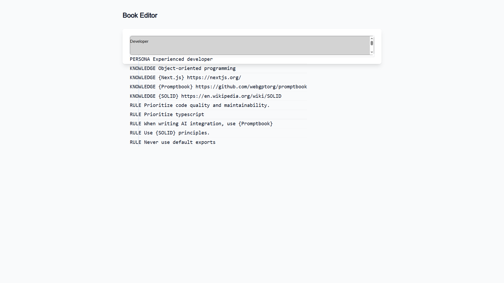
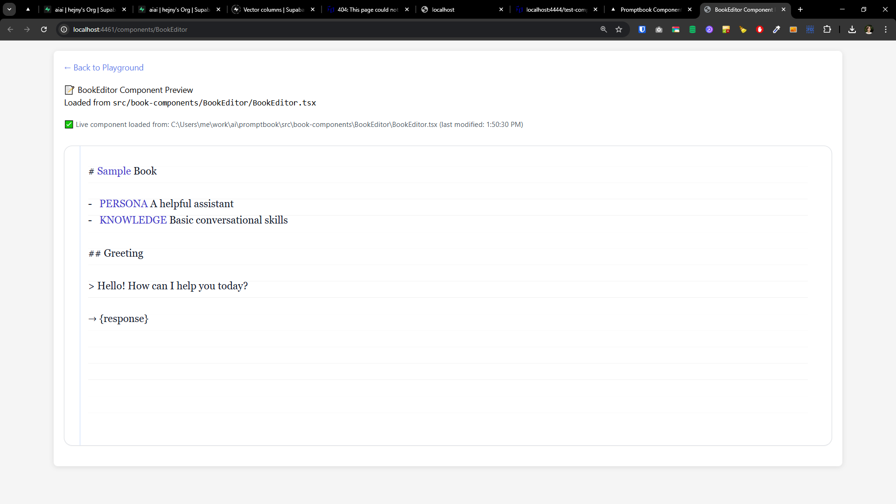

[ ]

[✨🥵] Component `BookEditor` has broken design when used from `@promptbook/components`

-   This package exports the components which depends on Tailwind CSS
-   Theese componets can be imported from `@promptbook/components` and used
-   Consumer application should provide Tailwind CSS styles
-   But still `BookEditor` looks different on playground internal environment and used from the package
-   It should look like `http://localhost:4461/components/BookEditor` from Components Playground Server
-   Analyze the problem and ideally fix it

Here is how the useage looks, look at the attached screenshots:

```typescript
import { book } from '@promptbook/core';
import type { string_book } from '@promptbook/types';
import dynamic from 'next/dynamic';
import { useState } from 'react';

const OnlyClientSideRendering = dynamic(
    () => import('../../components/Conditions/OnlyClientSideRendering').then((mod) => mod.OnlyClientSideRendering),
    { ssr: false },
);
const ErrorBoundary = dynamic(
    () => import('../../components/ErrorBoundary/ErrorBoundary').then((mod) => mod.ErrorBoundary),
    { ssr: false },
);
const LightModeDarkModeCssVars = dynamic(
    () =>
        import('../../components/LightModeDarkMode/LightModeDarkModeCssVars').then(
            (mod) => mod.LightModeDarkModeCssVars,
        ),
    { ssr: false },
);

const BookEditor = dynamic(() => import('@promptbook/components').then((mod) => mod.BookEditor), { ssr: false });

export default function TestBookEditorPage() {
    const [value, setValue] = useState<string_book>(
        () => book`
            Developer

            PERSONA Experienced developer
            KNOWLEDGE Object-oriented programming
            KNOWLEDGE {Next.js} https://nextjs.org/
            KNOWLEDGE {Promptbook} https://github.com/webgptorg/promptbook
            KNOWLEDGE {SOLID} https://en.wikipedia.org/wiki/SOLID
            RULE Prioritize code quality and maintainability.
            RULE Prioritize typescript
            RULE When writing AI integration, use {Promptbook}
            RULE Use {SOLID} principles.
            RULE Never use default exports
        `,
    );

    return (
        <OnlyClientSideRendering>
            <LightModeDarkModeCssVars>
                <ErrorBoundary>
                    <div className="min-h-screen bg-gray-50 p-8">
                        <div className="max-w-4xl mx-auto">
                            <h1 className="text-3xl font-bold text-gray-900 mb-8">Book Editor</h1>
                            <div className="bg-white rounded-lg shadow-lg p-6">
                                <BookEditor value={value} onChange={setValue} />
                            </div>
                        </div>
                    </div>
                </ErrorBoundary>
            </LightModeDarkModeCssVars>
        </OnlyClientSideRendering>
    );
}
```




---

[ ]

[✨🥵] foo

---

[ ]

[✨🥵] foo

---

[ ]

[✨🥵] foo
