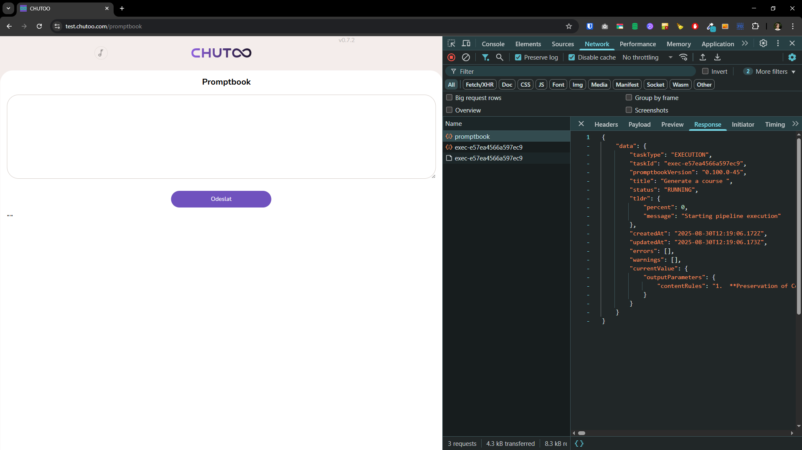
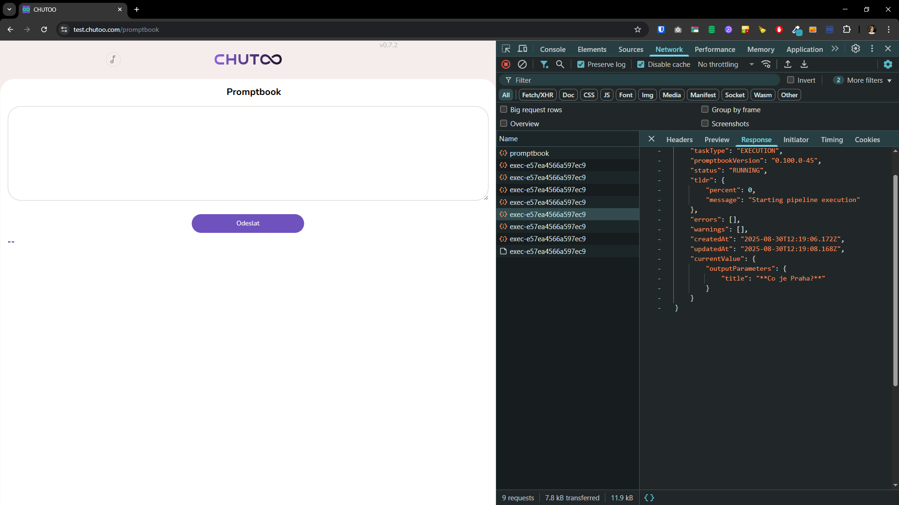
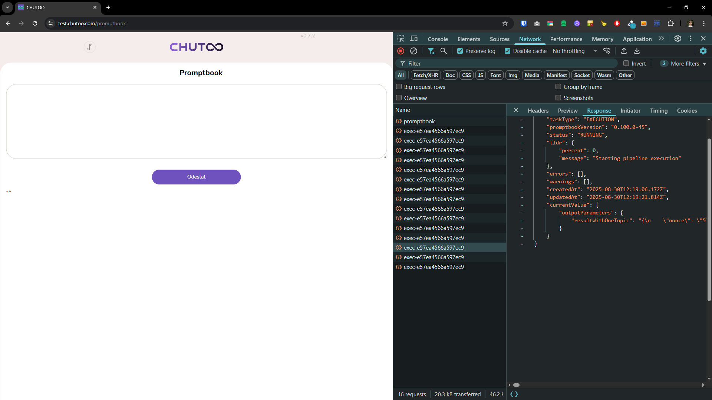
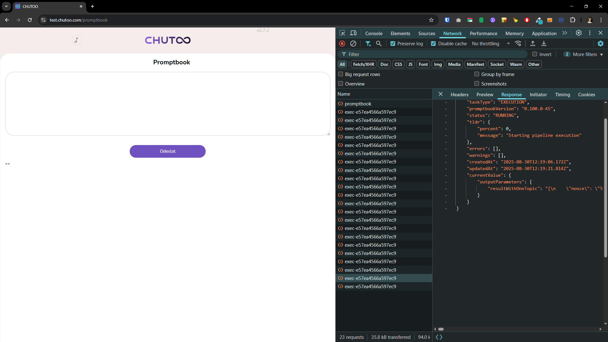

[x]

[✨🍝] `tldr` should report real progress of the task

-   Now it's reporting just `0` or `1` as a percentage; try to provide a better estimate.
-   At minimum, simulate progress by assuming the full task takes 5 minutes _(put this number in config)_, with progress evenly split across each subtask.
-   When querying the task via the HTTP server, report the proportional percentage.
-   The message should be like "working on xxx".
-   Look at `/src/remote-server/startRemoteServer.ts` and `/src/execution/ExecutionTask.ts`, but edit or create every file necessary for the implementation.
-   Keep in mind the DRY (don't repeat yourself) principle.

---

[x]

[✨🍝] `tldr` should not be faked in `/src/execution/ExecutionTask.ts` but passed into `createTask` from `/src/execution/createPipelineExecutor/00-createPipelineExecutor.ts` and its internal logic.

-   try to provide a better estimate based on internal structure of executed pipeline
-   At minimum, simulate progress by assuming the full pipeline takes 5 minutes with progress evenly split across each subtask.
-   The message should be like "working on task 123".
-   Keep in mind the DRY (don't repeat yourself) principle.

---

[x]

[✨🍝] Refactor `/src/execution/createPipelineExecutor/00-createPipelineExecutor.ts` and `createTask` in a such way that there is no `tldrProvider` passed in the `createTask` but alongside `updateOngoingResult` is `updateTldr`

---

[x]

[✨🍝] Fix `createPipelineExecutor`, `tldr` info is empty, it should be update to estimate of progress of entire pipeline execution

It stays still on 0% and "Starting pipeline execution", both `percent` and `message` should be updated as the pipeline progresses.

```json
{
    "percent": 0,
    "message": "Starting pipeline execution"
}
```


**Full task from server:**

```json
{
    "taskId": "exec-e57ea4566a597ec9",
    "title": "Generate a course ",
    "taskType": "EXECUTION",
    "promptbookVersion": "0.100.0-45",
    "status": "RUNNING",
    "tldr": {
        "percent": 0,
        "message": "Starting pipeline execution"
    },
    "errors": [],
    "warnings": [],
    "createdAt": "2025-08-30T12:19:06.172Z",
    "updatedAt": "2025-08-30T12:19:21.814Z",
    "currentValue": {
        "outputParameters": {
            "resultWithOneTopic": "..."
        }
    }
}
```


Fix it






