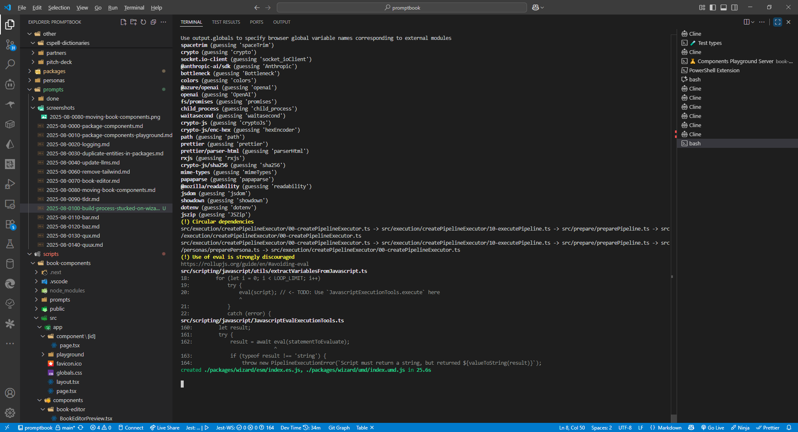

[ ]

[✨🤯] Build process sometimes freezes during the `@promptbook/wizard` package

-   Problem occures during the build in
    command `ts-node ./scripts/generate-packages/generate-packages.ts --commit`
    in step `4️⃣  Generate bundle for each package`
-   It only happens sometimes. The next build is okay, and the build process ends successfully.
-   Analyze the problem and try to fix it.
-   If you cannot fix it, list possible reasons for the problem.

**This is the state how console looks like:**

```bash
--- Commit ---
📖 Convert examples `.book.md` -> `.bookc`
--- /Commit ---
[ Done 📖  Convert examples .book.md -> .bookc]

> promptbook-engine@0.100.0-38 generate-packages
> ts-node ./scripts/generate-packages/generate-packages.ts --commit

📦  Generating packages
0️⃣  Prepare the needed information about the packages
Promptbook version 0.100.0-38
1️⃣  Generate entry file for each package
Generated index file ./src/_packages/anthropic-claude.index.ts
Generated index file ./src/_packages/azure-openai.index.ts
Generated index file ./src/_packages/browser.index.ts
Generated index file ./src/_packages/cli.index.ts
Generated index file ./src/_packages/components.index.ts
Generated index file ./src/_packages/core.index.ts
Generated index file ./src/_packages/deepseek.index.ts
Generated index file ./src/_packages/documents.index.ts
Generated index file ./src/_packages/editable.index.ts
Generated index file ./src/_packages/fake-llm.index.ts
Generated index file ./src/_packages/google.index.ts
Generated index file ./src/_packages/javascript.index.ts
Generated index file ./src/_packages/legacy-documents.index.ts
Generated index file ./src/_packages/markdown-utils.index.ts
Generated index file ./src/_packages/markitdown.index.ts
Generated index file ./src/_packages/node.index.ts
Generated index file ./src/_packages/ollama.index.ts
Generated index file ./src/_packages/openai.index.ts
Generated index file ./src/_packages/pdf.index.ts
Generated index file ./src/_packages/remote-client.index.ts
Generated index file ./src/_packages/remote-server.index.ts
Generated index file ./src/_packages/templates.index.ts
Generated index file ./src/_packages/types.index.ts
Generated index file ./src/_packages/utils.index.ts
Generated index file ./src/_packages/vercel.index.ts
Generated index file ./src/_packages/website-crawler.index.ts
Generated index file ./src/_packages/wizard.index.ts
2️⃣  Generate package.json, README and other crucial files for each package
3️⃣  Cleanup build directories for each package
4️⃣  Generate bundle for each package
C:\Users\me\work\ai\promptbook node --max-old-space-size=32000 ./node_modules/rollup/dist/bin/rollup --config rollup.config.js
Building @promptbook/anthropic-claude v0.100.0-38 (pre-release)

Building @promptbook/azure-openai v0.100.0-38 (pre-release)

Building @promptbook/browser v0.100.0-38 (pre-release)

Building @promptbook/cli v0.100.0-38 (pre-release)

Building @promptbook/components v0.100.0-38 (pre-release)

Building @promptbook/core v0.100.0-38 (pre-release)

Building @promptbook/deepseek v0.100.0-38 (pre-release)

Building @promptbook/documents v0.100.0-38 (pre-release)

Building @promptbook/editable v0.100.0-38 (pre-release)

Building @promptbook/fake-llm v0.100.0-38 (pre-release)

Building @promptbook/google v0.100.0-38 (pre-release)

Building @promptbook/javascript v0.100.0-38 (pre-release)

Building @promptbook/legacy-documents v0.100.0-38 (pre-release)

Building @promptbook/markdown-utils v0.100.0-38 (pre-release)

Building @promptbook/markitdown v0.100.0-38 (pre-release)

Building @promptbook/node v0.100.0-38 (pre-release)

Building @promptbook/ollama v0.100.0-38 (pre-release)

Building @promptbook/openai v0.100.0-38 (pre-release)

Building @promptbook/pdf v0.100.0-38 (pre-release)

Building @promptbook/remote-client v0.100.0-38 (pre-release)

Building @promptbook/remote-server v0.100.0-38 (pre-release)

Building @promptbook/templates v0.100.0-38 (pre-release)

Building @promptbook/types v0.100.0-38 (pre-release)

Building @promptbook/utils v0.100.0-38 (pre-release)

Building @promptbook/vercel v0.100.0-38 (pre-release)

Building @promptbook/website-crawler v0.100.0-38 (pre-release)

Building @promptbook/wizard v0.100.0-38 (pre-release)


./src/_packages/anthropic-claude.index.ts → ./packages/anthropic-claude/esm/index.es.js, ./packages/anthropic-claude/umd/index.umd.js...

(!) Unresolved dependencies

https://rollupjs.org/guide/en/#warning-treating-module-as-external-dependency
@anthropic-ai/sdk (imported by src/llm-providers/anthropic-claude/AnthropicClaudeExecutionTools.ts)
bottleneck (imported by src/llm-providers/anthropic-claude/AnthropicClaudeExecutionTools.ts)
colors (imported by src/llm-providers/anthropic-claude/AnthropicClaudeExecutionTools.ts)
spacetrim (imported by src/llm-providers/anthropic-claude/AnthropicClaudeExecutionTools.ts, src/errors/UnexpectedError.ts, src/utils/serialization/checkSerializableAsJson.ts, src/errors/utils/getErrorReportUrl.ts, src/errors/utils/deserializeError.ts, src/remote-server/createRemoteClient.ts, src/errors/NotYetImplementedError.ts, src/errors/WrappedError.ts, src/errors/MissingToolsError.ts)
crypto (imported by src/utils/random/$randomToken.ts)
socket.io-client (imported by src/remote-server/createRemoteClient.ts)

(!) Missing global variable names
Use output.globals to specify browser global variable names corresponding to external modules
spacetrim (guessing 'spaceTrim')
@anthropic-ai/sdk (guessing 'Anthropic')
bottleneck (guessing 'Bottleneck')
colors (guessing 'colors')
crypto (guessing 'crypto')
socket.io-client (guessing 'socket_ioClient')

created ./packages/anthropic-claude/esm/index.es.js, ./packages/anthropic-claude/umd/index.umd.js in 24.4s

./src/_packages/azure-openai.index.ts → ./packages/azure-openai/esm/index.es.js, ./packages/azure-openai/umd/index.umd.js...

(!) Unresolved dependencies
https://rollupjs.org/guide/en/#warning-treating-module-as-external-dependency

@azure/openai (imported by src/llm-providers/azure-openai/AzureOpenAiExecutionTools.ts)
bottleneck (imported by src/llm-providers/azure-openai/AzureOpenAiExecutionTools.ts)
colors (imported by src/llm-providers/azure-openai/AzureOpenAiExecutionTools.ts)
spacetrim (imported by src/errors/UnexpectedError.ts, src/errors/utils/getErrorReportUrl.ts, src/utils/serialization/checkSerializableAsJson.ts, src/errors/NotYetImplementedError.ts, src/errors/WrappedError.ts)
crypto (imported by src/utils/random/$randomToken.ts)
(!) Missing global variable names
Use output.globals to specify browser global variable names corresponding to external modules
@azure/openai (guessing 'openai')
bottleneck (guessing 'Bottleneck')
colors (guessing 'colors')
crypto (guessing 'crypto')
spacetrim (guessing 'spaceTrim')
created ./packages/azure-openai/esm/index.es.js, ./packages/azure-openai/umd/index.umd.js in 23s

./src/_packages/browser.index.ts → ./packages/browser/esm/index.es.js, ./packages/browser/umd/index.umd.js...

(!) Unresolved dependencies
https://rollupjs.org/guide/en/#warning-treating-module-as-external-dependency

spacetrim (imported by src/dialogs/simple-prompt/SimplePromptInterfaceTools.ts, src/errors/UnexpectedError.ts, src/formats/json/utils/jsonParse.ts, src/utils/editable/utils/stringifyPipelineJson.ts, src/errors/NotYetImplementedError.ts, src/errors/utils/getErrorReportUrl.ts, src/utils/serialization/checkSerializableAsJson.ts, src/errors/WrappedError.ts)
openai/core (imported by src/storage/local-storage/getIndexedDbStorage.ts, src/storage/local-storage/getLocalStorage.ts, src/storage/local-storage/getSessionStorage.ts)crypto (imported by src/utils/random/$randomToken.ts)
(!) Missing global variable names
Use output.globals to specify browser global variable names corresponding to external modules
spacetrim (guessing 'spaceTrim')
crypto (guessing 'crypto')
openai/core (guessing 'core')
created ./packages/browser/esm/index.es.js, ./packages/browser/umd/index.umd.js in 20.6s

./src/_packages/cli.index.ts → ./packages/cli/esm/index.es.js, ./packages/cli/umd/index.umd.js...

(!) Missing shims for Node.js built-ins
Creating a browser bundle that depends on "path" and "http". You might need to include https://github.com/FredKSchott/rollup-plugin-polyfill-node

(!) Unresolved dependencies
https://rollupjs.org/guide/en/#warning-treating-module-as-external-dependency

colors (imported by src/cli/promptbookCli.ts, src/cli/cli-commands/about.ts, src/cli/cli-commands/hello.ts, src/cli/cli-commands/list-models.ts, src/cli/cli-commands/make.ts, src/cli/cli-commands/prettify.ts, src/cli/cli-commands/run.ts, src/cli/cli-commands/start-server.ts, src/cli/cli-commands/test-command.ts, src/llm-providers/anthropic-claude/AnthropicClaudeExecutionTools.ts, src/llm-providers/azure-openai/AzureOpenAiExecutionTools.ts, src/llm-providers/vercel/createExecutionToolsFromVercelProvider.ts, src/llm-providers/openai/OpenAiAssistantExecutionTools.ts, src/llm-providers/openai/OpenAiCompatibleExecutionTools.ts, src/cli/cli-commands/common/handleActionErrors.ts, src/llm-providers/_common/register/$registeredLlmToolsMessage.ts, src/cli/common/$provideLlmToolsForCli.ts, src/collection/constructors/createCollectionFromDirectory.ts, src/cli/cli-commands/runInteractiveChatbot.ts, src/remote-server/startRemoteServer.ts, src/utils/execCommand/$execCommand.ts)
commander (imported by src/cli/promptbookCli.ts)
spacetrim (imported by src/cli/promptbookCli.ts, src/cli/cli-commands/about.ts, src/cli/cli-commands/hello.ts, src/cli/cli-commands/list-models.ts, src/cli/cli-commands/list-scrapers.ts, src/cli/cli-commands/login.ts, src/cli/cli-commands/make.ts, src/cli/cli-commands/prettify.ts, src/cli/cli-commands/run.ts, src/cli/cli-commands/start-server.ts, src/cli/cli-commands/test-command.ts, src/llm-providers/anthropic-claude/AnthropicClaudeExecutionTools.ts, src/llm-providers/vercel/createExecutionToolsFromVercelProvider.ts, src/llm-providers/openai/OpenAiCompatibleExecutionTools.ts, src/errors/NotYetImplementedError.ts, src/scrapers/_boilerplate/BoilerplateScraper.ts, src/scrapers/document-legacy/LegacyDocumentScraper.ts, src/scrapers/document/DocumentScraper.ts, src/scrapers/markdown/MarkdownScraper.ts, src/llm-providers/_common/register/$registeredLlmToolsMessage.ts, src/cli/common/$provideLlmToolsForCli.ts, src/scrapers/_common/register/$registeredScrapersMessage.ts, src/collection/constructors/createCollectionFromDirectory.ts, src/conversion/validation/validatePipeline.ts, src/errors/UnexpectedError.ts, src/execution/utils/usageToHuman.ts, src/utils/editable/utils/stringifyPipelineJson.ts, src/conversion/prettify/prettifyPipelineString.ts, src/execution/createPipelineExecutor/00-createPipelineExecutor.ts, src/execution/execution-report/executionReportJsonToString.ts, src/formats/json/utils/jsonParse.ts, src/scrapers/_common/utils/promptbookFetch.ts, src/wizard/$getCompiledBook.ts, src/cli/cli-commands/runInteractiveChatbot.ts, src/remote-server/startRemoteServer.ts, src/utils/serialization/checkSerializableAsJson.ts, src/errors/utils/deserializeError.ts, src/remote-server/createRemoteClient.ts, src/errors/MissingToolsError.ts, src/utils/execCommand/$execCommand.ts, src/llm-providers/_multiple/joinLlmExecutionTools.ts,
src/conversion/pipelineJsonToString.ts, src/errors/utils/getErrorReportUrl.ts, src/utils/markdown/addAutoGeneratedSection.ts, src/conversion/prettify/renderPipelineMermaidOptions.ts, src/errors/WrappedError.ts, src/errors/utils/serializeError.ts, src/execution/createPipelineExecutor/10-executePipeline.ts, src/scripting/javascript/JavascriptEvalExecutionTools.ts, src/llm-providers/_common/register/createLlmToolsFromConfiguration.ts, src/conversion/parsePipeline.ts, src/collection/SimplePipelineCollection.ts, src/llm-providers/_multiple/MultipleLlmExecutionTools.ts, src/storage/env-storage/$EnvStorage.ts, src/llm-providers/_common/utils/cache/cacheLlmTools.ts, src/llm-providers/_common/register/$provideLlmToolsFromEnv.ts, src/utils/markdown/removeMarkdownComments.ts, src/execution/assertsTaskSuccessful.ts, src/execution/createPipelineExecutor/20-executeTask.ts, src/execution/createPipelineExecutor/filterJustOutputParameters.ts, src/utils/trimCodeBlock.ts, src/utils/trimEndOfCodeBlock.ts, src/utils/unwrapResult.ts, src/scrapers/_common/prepareKnowledgePieces.ts, src/prepare/prepareTasks.ts, src/commands/SECTION/sectionCommandParser.ts, src/commands/_common/getParserForCommand.ts, src/commands/_common/parseCommand.ts, src/utils/editable/edit-pipeline-string/deflatePipeline.ts, src/utils/markdown/extractOneBlockFromMarkdown.ts, src/utils/markdown/flattenMarkdown.ts, src/utils/markdown/parseMarkdownSection.ts, src/utils/markdown/splitMarkdownIntoSections.ts, src/execution/utils/validatePromptResult.ts, src/execution/createPipelineExecutor/30-executeFormatSubvalues.ts, src/execution/createPipelineExecutor/getReservedParametersForTask.ts, src/pipeline/prompt-notation.ts, src/utils/organization/spaceTrim.ts, src/scrapers/_common/utils/makeKnowledgeSourceHandler.ts, src/commands/KNOWLEDGE/knowledgeCommandParser.ts, src/utils/editable/utils/isFlatPipeline.ts, src/scripting/javascript/utils/extractVariablesFromJavascript.ts, src/utils/parameters/mapAvailableToExpectedParameters.ts, src/execution/createPipelineExecutor/40-executeAttempts.ts, src/commands/EXPECT/expectCommandParser.ts, src/commands/FOREACH/foreachCommandParser.ts, src/commands/FORMAT/formatCommandParser.ts, src/commands/FORMFACTOR/formfactorCommandParser.ts, src/commands/MODEL/modelCommandParser.ts, src/commands/PARAMETER/parameterCommandParser.ts, src/commands/PERSONA/personaCommandParser.ts, src/formats/csv/CsvFormatParser.ts, src/utils/validators/parameterName/validateParameterName.ts)
waitasecond (imported by src/cli/cli-commands/hello.ts, src/cli/cli-commands/start-server.ts, src/cli/cli-commands/runInteractiveChatbot.ts, src/remote-server/startRemoteServer.ts, src/utils/execCommand/$execCommand.ts, src/execution/createPipelineExecutor/10-executePipeline.ts, src/scripting/javascript/utils/preserve.ts)
fs/promises (imported by src/cli/cli-commands/make.ts, src/cli/cli-commands/prettify.ts, src/cli/cli-commands/run.ts, src/cli/cli-commands/test-command.ts, src/scrapers/_boilerplate/BoilerplateScraper.ts, src/scrapers/document-legacy/LegacyDocumentScraper.ts, src/scrapers/document/DocumentScraper.ts, src/scrapers/markitdown/MarkitdownScraper.ts, src/collection/constructors/createCollectionFromDirectory.ts, src/scrapers/_common/register/$provideFilesystemForNode.ts, src/scrapers/_common/utils/getScraperIntermediateSource.ts, src/storage/env-storage/$EnvStorage.ts, src/storage/file-cache-storage/FileCacheStorage.ts)
path (imported by src/cli/cli-commands/make.ts, src/cli/cli-commands/prettify.ts, src/cli/cli-commands/run.ts, src/cli/cli-commands/test-command.ts, src/scrapers/document-legacy/LegacyDocumentScraper.ts, src/collection/constructors/createCollectionFromDirectory.ts, src/wizard/$getCompiledBook.ts, src/scrapers/_common/utils/getScraperIntermediateSource.ts, src/utils/normalization/titleToName.ts, src/llm-providers/_common/register/$provideLlmToolsForWizardOrCli.ts, src/utils/files/listAllFiles.ts, src/storage/env-storage/$EnvStorage.ts, src/storage/file-cache-storage/FileCacheStorage.ts, src/llm-providers/_common/register/$provideEnvFilename.ts, src/executables/platforms/locateAppOnWindows.ts, src/scrapers/_common/utils/makeKnowledgeSourceHandler.ts)
glob-promise (imported by src/cli/cli-commands/prettify.ts, src/cli/cli-commands/test-command.ts)
prompts (imported by src/cli/cli-commands/run.ts, src/cli/common/$provideLlmToolsForCli.ts, src/cli/cli-commands/runInteractiveChatbot.ts)
@anthropic-ai/sdk (imported by src/llm-providers/anthropic-claude/AnthropicClaudeExecutionTools.ts)
bottleneck (imported by src/llm-providers/anthropic-claude/AnthropicClaudeExecutionTools.ts, src/llm-providers/azure-openai/AzureOpenAiExecutionTools.ts, src/llm-providers/openai/OpenAiCompatibleExecutionTools.ts)
@azure/openai (imported by src/llm-providers/azure-openai/AzureOpenAiExecutionTools.ts)
openai (imported by src/llm-providers/openai/OpenAiCompatibleExecutionTools.ts)
@mozilla/readability (imported by src/scrapers/website/WebsiteScraper.ts)
jsdom (imported by src/scrapers/website/WebsiteScraper.ts)
jszip (imported by src/conversion/archive/saveArchive.ts, src/conversion/archive/loadArchive.ts)
moment (imported by src/execution/execution-report/executionReportJsonToString.ts)
express (imported by src/remote-server/startRemoteServer.ts)
express-openapi-validator (imported by src/remote-server/startRemoteServer.ts)
http (imported by src/remote-server/startRemoteServer.ts)
socket.io (imported by src/remote-server/startRemoteServer.ts)
swagger-ui-express (imported by src/remote-server/startRemoteServer.ts)
socket.io-client (imported by src/remote-server/createRemoteClient.ts)
crypto (imported by src/utils/random/$randomToken.ts)
child_process (imported by src/utils/execCommand/$execCommand.ts)
crypto-js (imported by src/scrapers/_common/utils/getScraperIntermediateSource.ts, src/commands/KNOWLEDGE/utils/knowledgeSourceContentToName.ts)
crypto-js/enc-hex (imported by src/scrapers/_common/utils/getScraperIntermediateSource.ts, src/storage/file-cache-storage/FileCacheStorage.ts, src/llm-providers/_common/utils/cache/cacheLlmTools.ts, src/scrapers/_common/utils/makeKnowledgeSourceHandler.ts, src/commands/KNOWLEDGE/utils/knowledgeSourceContentToName.ts)
showdown (imported by src/scrapers/website/utils/createShowdownConverter.ts)
prettier (imported by src/utils/markdown/prettifyMarkdown.ts)
prettier/parser-html (imported by src/utils/markdown/prettifyMarkdown.ts)
rxjs (imported by src/execution/ExecutionTask.ts, src/llm-providers/_common/utils/count-total-usage/countUsage.ts)
dotenv (imported by src/storage/env-storage/$EnvStorage.ts, src/llm-providers/_common/register/$provideLlmToolsConfigurationFromEnv.ts)
crypto-js/sha256 (imported by src/storage/file-cache-storage/FileCacheStorage.ts, src/llm-providers/_common/utils/cache/cacheLlmTools.ts, src/scrapers/_common/utils/makeKnowledgeSourceHandler.ts)
mime-types (imported by src/utils/files/extensionToMimeType.ts, src/utils/files/mimeTypeToExtension.ts)
papaparse (imported by src/formats/csv/CsvFormatParser.ts, src/formats/csv/utils/csvParse.ts)
(!) Missing global variable names
Use output.globals to specify browser global variable names corresponding to external modules
colors (guessing 'colors')
commander (guessing 'commander')
spacetrim (guessing 'spaceTrim')
waitasecond (guessing 'waitasecond')
prompts (guessing 'prompts')
path (guessing 'path')
fs/promises (guessing 'promises')
dotenv (guessing 'dotenv')
crypto-js/enc-hex (guessing 'hexEncoder')
crypto-js/sha256 (guessing 'sha256')
crypto (guessing 'crypto')
socket.io-client (guessing 'socket_ioClient')
rxjs (guessing 'rxjs')
child_process (guessing 'child_process')
jszip (guessing 'JSZip')
prettier (guessing 'prettier')
prettier/parser-html (guessing 'parserHtml')
papaparse (guessing 'papaparse')
crypto-js (guessing 'cryptoJs')
mime-types (guessing 'mimeTypes')
glob-promise (guessing 'glob')
moment (guessing 'moment')
express (guessing 'express')
express-openapi-validator (guessing 'OpenApiValidator')
http (guessing 'http')
socket.io (guessing 'socket_io')
swagger-ui-express (guessing 'swaggerUi')
@anthropic-ai/sdk (guessing 'Anthropic')
bottleneck (guessing 'Bottleneck')
@azure/openai (guessing 'openai')
openai (guessing 'OpenAI')
@mozilla/readability (guessing 'readability')
jsdom (guessing 'jsdom')
showdown (guessing 'showdown')
(!) Use of eval is strongly discouraged
https://rollupjs.org/guide/en/#avoiding-eval
src/scripting/javascript/utils/extractVariablesFromJavascript.ts
18:         for (let i = 0; i < LOOP_LIMIT; i++)
19:             try {
20:                 eval(script); // <- TODO: Use `JavascriptExecutionTools.execute` here
                    ^
21:             }
22:             catch (error) {
src/scripting/javascript/JavascriptEvalExecutionTools.ts
160:         let result;
161:         try {
162:             result = await eval(statementToEvaluate);
                                ^
163:             if (typeof result !== 'string') {
164:                 throw new PipelineExecutionError(`Script must return a string, but returned ${valueToString(result)}`);
(!) Circular dependency
src/prepare/preparePipeline.ts -> src/execution/createPipelineExecutor/00-createPipelineExecutor.ts -> src/execution/createPipelineExecutor/10-executePipeline.ts -> src/prepare/preparePipeline.ts
created ./packages/cli/esm/index.es.js, ./packages/cli/umd/index.umd.js in 30.4s

./src/_packages/components.index.ts → ./packages/components/esm/index.es.js, ./packages/components/umd/index.umd.js...

Browserslist: browsers data (caniuse-lite) is 6 months old. Please run:
  npx update-browserslist-db@latest
  Why you should do it regularly: https://github.com/browserslist/update-db#readme

(!) Unresolved dependencies

https://rollupjs.org/guide/en/#warning-treating-module-as-external-dependency
react/jsx-runtime (imported by src/book-components/BookEditor/BookEditor.tsx)
react (imported by src/book-components/BookEditor/BookEditor.tsx)
react-dom (imported by src/book-components/BookEditor/BookEditor.tsx)
spacetrim (imported by src/book-2.0/agent-source/string_book.ts, src/book-2.0/commitments/ACTION/ACTION.ts, src/book-2.0/commitments/FORMAT/FORMAT.ts, src/book-2.0/commitments/KNOWLEDGE/KNOWLEDGE.ts, src/book-2.0/commitments/META_IMAGE/META_IMAGE.ts, src/book-2.0/commitments/META_LINK/META_LINK.ts, src/book-2.0/commitments/MODEL/MODEL.ts, src/book-2.0/commitments/NOTE/NOTE.ts, src/book-2.0/commitments/PERSONA/PERSONA.ts, src/book-2.0/commitments/RULE/RULE.ts, src/book-2.0/commitments/SAMPLE/SAMPLE.ts, src/book-2.0/commitments/STYLE/STYLE.ts, src/book-2.0/commitments/_base/NotYetImplementedCommitmentDefinition.ts, src/scrapers/_common/utils/promptbookFetch.ts, src/errors/UnexpectedError.ts, src/errors/WrappedError.ts, src/errors/utils/getErrorReportUrl.ts)
(!) Missing global variable names
Use output.globals to specify browser global variable names corresponding to external modules
react/jsx-runtime (guessing 'jsxRuntime')
react (guessing 'react')
react-dom (guessing 'reactDom')
spacetrim (guessing 'spaceTrim')
created ./packages/components/esm/index.es.js, ./packages/components/umd/index.umd.js in 22s

./src/_packages/core.index.ts → ./packages/core/esm/index.es.js, ./packages/core/umd/index.umd.js...

(!) Missing shims for Node.js built-ins
Creating a browser bundle that depends on "path". You might need to include https://github.com/FredKSchott/rollup-plugin-polyfill-node

(!) Unresolved dependencies
https://rollupjs.org/guide/en/#warning-treating-module-as-external-dependency

spacetrim (imported by src/book-2.0/agent-source/string_book.ts, src/book-2.0/commitments/_base/NotYetImplementedCommitmentDefinition.ts, src/collection/constructors/createSubcollection.ts, src/conversion/parsePipeline.ts, src/conversion/pipelineJsonToString.ts, src/conversion/prettify/prettifyPipelineString.ts, src/conversion/validation/validatePipeline.ts, src/dialogs/callback/CallbackInterfaceTools.ts, src/errors/MissingToolsError.ts, src/errors/NotYetImplementedError.ts, src/errors/UnexpectedError.ts, src/errors/WrappedError.ts, src/execution/createPipelineExecutor/00-createPipelineExecutor.ts, src/execution/execution-report/executionReportJsonToString.ts, src/execution/utils/usageToHuman.ts, src/formats/csv/CsvFormatParser.ts, src/llm-providers/_common/register/createLlmToolsFromConfiguration.ts, src/llm-providers/_common/utils/cache/cacheLlmTools.ts, src/llm-providers/_multiple/joinLlmExecutionTools.ts, src/llm-providers/_multiple/MultipleLlmExecutionTools.ts, src/pipeline/book-notation.ts, src/scrapers/_common/prepareKnowledgePieces.ts, src/scrapers/_common/utils/makeKnowledgeSourceHandler.ts, src/scrapers/_common/utils/promptbookFetch.ts, src/book-2.0/commitments/_misc/parseAgentSourceWithCommitments.ts, src/book-2.0/commitments/ACTION/ACTION.ts, src/book-2.0/commitments/FORMAT/FORMAT.ts, src/book-2.0/commitments/KNOWLEDGE/KNOWLEDGE.ts, src/book-2.0/commitments/META_IMAGE/META_IMAGE.ts, src/book-2.0/commitments/META_LINK/META_LINK.ts, src/book-2.0/commitments/MODEL/MODEL.ts, src/book-2.0/commitments/NOTE/NOTE.ts, src/book-2.0/commitments/PERSONA/PERSONA.ts, src/book-2.0/commitments/RULE/RULE.ts, src/book-2.0/commitments/SAMPLE/SAMPLE.ts, src/book-2.0/commitments/STYLE/STYLE.ts, src/collection/SimplePipelineCollection.ts, src/commands/SECTION/sectionCommandParser.ts, src/commands/_common/getParserForCommand.ts, src/commands/_common/parseCommand.ts, src/utils/editable/edit-pipeline-string/deflatePipeline.ts, src/utils/markdown/extractOneBlockFromMarkdown.ts, src/utils/markdown/flattenMarkdown.ts, src/utils/markdown/parseMarkdownSection.ts, src/utils/markdown/removeMarkdownComments.ts, src/utils/markdown/splitMarkdownIntoSections.ts, src/utils/markdown/addAutoGeneratedSection.ts, src/conversion/prettify/renderPipelineMermaidOptions.ts, src/scripting/javascript/utils/extractVariablesFromJavascript.ts, src/errors/utils/getErrorReportUrl.ts, src/errors/utils/serializeError.ts, src/execution/createPipelineExecutor/10-executePipeline.ts, src/llm-providers/_common/register/$registeredLlmToolsMessage.ts, src/execution/utils/validatePromptResult.ts, src/formats/json/utils/jsonParse.ts, src/pipeline/prompt-notation.ts, src/prepare/prepareTasks.ts, src/scrapers/_common/register/$registeredScrapersMessage.ts, src/utils/serialization/checkSerializableAsJson.ts, src/commands/KNOWLEDGE/knowledgeCommandParser.ts, src/utils/editable/utils/isFlatPipeline.ts, src/execution/assertsTaskSuccessful.ts, src/execution/createPipelineExecutor/20-executeTask.ts, src/execution/createPipelineExecutor/filterJustOutputParameters.ts, src/commands/EXPECT/expectCommandParser.ts, src/commands/FOREACH/foreachCommandParser.ts, src/commands/FORMAT/formatCommandParser.ts, src/commands/FORMFACTOR/formfactorCommandParser.ts, src/commands/MODEL/modelCommandParser.ts, src/commands/PARAMETER/parameterCommandParser.ts, src/commands/PERSONA/personaCommandParser.ts, src/errors/utils/deserializeError.ts, src/execution/createPipelineExecutor/30-executeFormatSubvalues.ts, src/execution/createPipelineExecutor/getReservedParametersForTask.ts, src/utils/validators/parameterName/validateParameterName.ts, src/utils/parameters/mapAvailableToExpectedParameters.ts, src/execution/createPipelineExecutor/40-executeAttempts.ts)
moment (imported by src/execution/execution-report/executionReportJsonToString.ts)
papaparse (imported by src/formats/csv/CsvFormatParser.ts, src/formats/csv/utils/csvParse.ts)
crypto-js/enc-hex (imported by src/llm-providers/_common/utils/cache/cacheLlmTools.ts, src/scrapers/_common/utils/makeKnowledgeSourceHandler.ts, src/commands/KNOWLEDGE/utils/knowledgeSourceContentToName.ts)
crypto-js/sha256 (imported by src/llm-providers/_common/utils/cache/cacheLlmTools.ts, src/scrapers/_common/utils/makeKnowledgeSourceHandler.ts)
rxjs (imported by src/llm-providers/_common/utils/count-total-usage/countUsage.ts, src/execution/ExecutionTask.ts)
path (imported by src/scrapers/_common/utils/makeKnowledgeSourceHandler.ts, src/utils/normalization/titleToName.ts)
prettier (imported by src/utils/markdown/prettifyMarkdown.ts)
prettier/parser-html (imported by src/utils/markdown/prettifyMarkdown.ts)
crypto (imported by src/utils/random/$randomToken.ts)
waitasecond (imported by src/execution/createPipelineExecutor/10-executePipeline.ts)
colors (imported by src/llm-providers/_common/register/$registeredLlmToolsMessage.ts)
crypto-js (imported by src/commands/KNOWLEDGE/utils/knowledgeSourceContentToName.ts)
mime-types (imported by src/utils/files/extensionToMimeType.ts, src/utils/files/mimeTypeToExtension.ts)
(!) Missing global variable names
Use output.globals to specify browser global variable names corresponding to external modules
spacetrim (guessing 'spaceTrim')
prettier (guessing 'prettier')
prettier/parser-html (guessing 'parserHtml')
crypto (guessing 'crypto')
rxjs (guessing 'rxjs')
waitasecond (guessing 'waitasecond')
papaparse (guessing 'papaparse')
crypto-js/enc-hex (guessing 'hexEncoder')
crypto-js/sha256 (guessing 'sha256')
path (guessing 'path')
crypto-js (guessing 'cryptoJs')
mime-types (guessing 'mimeTypes')
moment (guessing 'moment')
colors (guessing 'colors')
(!) Circular dependencies
src/book-2.0/commitments/_misc/createAgentModelRequirements.ts -> src/book-2.0/commitments/_misc/createAgentModelRequirementsWithCommitments.ts -> src/book-2.0/commitments/_misc/createAgentModelRequirements.ts
src/prepare/preparePipeline.ts -> src/execution/createPipelineExecutor/00-createPipelineExecutor.ts -> src/execution/createPipelineExecutor/10-executePipeline.ts -> src/prepare/preparePipeline.ts
(!) Use of eval is strongly discouraged
https://rollupjs.org/guide/en/#avoiding-eval
src/scripting/javascript/utils/extractVariablesFromJavascript.ts
18:         for (let i = 0; i < LOOP_LIMIT; i++)
19:             try {
20:                 eval(script); // <- TODO: Use `JavascriptExecutionTools.execute` here
                    ^
21:             }
22:             catch (error) {
created ./packages/core/esm/index.es.js, ./packages/core/umd/index.umd.js in 22.5s

./src/_packages/deepseek.index.ts → ./packages/deepseek/esm/index.es.js, ./packages/deepseek/umd/index.umd.js...

(!) Unresolved dependencies
https://rollupjs.org/guide/en/#warning-treating-module-as-external-dependency

colors (imported by src/llm-providers/vercel/createExecutionToolsFromVercelProvider.ts)
spacetrim (imported by src/llm-providers/vercel/createExecutionToolsFromVercelProvider.ts, src/utils/serialization/checkSerializableAsJson.ts, src/errors/UnexpectedError.ts, src/errors/NotYetImplementedError.ts, src/errors/utils/getErrorReportUrl.ts, src/errors/WrappedError.ts)
crypto (imported by src/utils/random/$randomToken.ts)
(!) Missing global variable names
Use output.globals to specify browser global variable names corresponding to external modules
colors (guessing 'colors')
spacetrim (guessing 'spaceTrim')
crypto (guessing 'crypto')
created ./packages/deepseek/esm/index.es.js, ./packages/deepseek/umd/index.umd.js in 20s

./src/_packages/documents.index.ts → ./packages/documents/esm/index.es.js, ./packages/documents/umd/index.umd.js...

(!) Missing shims for Node.js built-ins
Creating a browser bundle that depends on "path". You might need to include https://github.com/FredKSchott/rollup-plugin-polyfill-node

(!) Unresolved dependencies

https://rollupjs.org/guide/en/#warning-treating-module-as-external-dependency
fs/promises (imported by src/scrapers/document/DocumentScraper.ts, src/scrapers/_common/utils/getScraperIntermediateSource.ts)
spacetrim (imported by src/scrapers/document/DocumentScraper.ts, src/errors/MissingToolsError.ts, src/errors/UnexpectedError.ts, src/utils/execCommand/$execCommand.ts,
src/scrapers/markdown/MarkdownScraper.ts, src/errors/utils/getErrorReportUrl.ts, src/execution/createPipelineExecutor/00-createPipelineExecutor.ts, src/llm-providers/_multiple/joinLlmExecutionTools.ts, src/collection/SimplePipelineCollection.ts, src/conversion/validation/validatePipeline.ts, src/errors/utils/serializeError.ts, src/execution/createPipelineExecutor/10-executePipeline.ts, src/llm-providers/_multiple/MultipleLlmExecutionTools.ts, src/errors/NotYetImplementedError.ts, src/conversion/pipelineJsonToString.ts, src/errors/WrappedError.ts, src/utils/serialization/checkSerializableAsJson.ts, src/execution/assertsTaskSuccessful.ts, src/execution/createPipelineExecutor/20-executeTask.ts, src/execution/createPipelineExecutor/filterJustOutputParameters.ts, src/formats/json/utils/jsonParse.ts, src/errors/utils/deserializeError.ts, src/scrapers/_common/prepareKnowledgePieces.ts, src/prepare/prepareTasks.ts, src/execution/createPipelineExecutor/30-executeFormatSubvalues.ts, src/execution/createPipelineExecutor/getReservedParametersForTask.ts, src/scrapers/_common/register/$registeredScrapersMessage.ts, src/scrapers/_common/utils/makeKnowledgeSourceHandler.ts, src/scripting/javascript/utils/extractVariablesFromJavascript.ts, src/utils/parameters/mapAvailableToExpectedParameters.ts, src/execution/createPipelineExecutor/40-executeAttempts.ts, src/scrapers/_common/utils/promptbookFetch.ts, src/formats/csv/CsvFormatParser.ts, src/execution/utils/validatePromptResult.ts)
child_process (imported by src/utils/execCommand/$execCommand.ts)
colors (imported by src/utils/execCommand/$execCommand.ts)
waitasecond (imported by src/utils/execCommand/$execCommand.ts, src/execution/createPipelineExecutor/10-executePipeline.ts)
crypto-js (imported by src/scrapers/_common/utils/getScraperIntermediateSource.ts, src/commands/KNOWLEDGE/utils/knowledgeSourceContentToName.ts)
crypto-js/enc-hex (imported by src/scrapers/_common/utils/getScraperIntermediateSource.ts, src/scrapers/_common/utils/makeKnowledgeSourceHandler.ts, src/commands/KNOWLEDGE/utils/knowledgeSourceContentToName.ts)
path (imported by src/scrapers/_common/utils/getScraperIntermediateSource.ts, src/utils/normalization/titleToName.ts, src/scrapers/_common/utils/makeKnowledgeSourceHandler.ts)
crypto (imported by src/utils/random/$randomToken.ts)
rxjs (imported by src/execution/ExecutionTask.ts, src/llm-providers/_common/utils/count-total-usage/countUsage.ts)
prettier (imported by src/utils/markdown/prettifyMarkdown.ts)
prettier/parser-html (imported by src/utils/markdown/prettifyMarkdown.ts)
crypto-js/sha256 (imported by src/scrapers/_common/utils/makeKnowledgeSourceHandler.ts)
mime-types (imported by src/utils/files/extensionToMimeType.ts, src/utils/files/mimeTypeToExtension.ts)
papaparse (imported by src/formats/csv/CsvFormatParser.ts, src/formats/csv/utils/csvParse.ts)
(!) Missing global variable names
Use output.globals to specify browser global variable names corresponding to external modules
fs/promises (guessing 'promises')
spacetrim (guessing 'spaceTrim')
child_process (guessing 'child_process')
colors (guessing 'colors')
waitasecond (guessing 'waitasecond')
crypto-js (guessing 'cryptoJs')
crypto-js/enc-hex (guessing 'hexEncoder')
path (guessing 'path')
prettier (guessing 'prettier')
prettier/parser-html (guessing 'parserHtml')
crypto (guessing 'crypto')
rxjs (guessing 'rxjs')
crypto-js/sha256 (guessing 'sha256')
mime-types (guessing 'mimeTypes')
papaparse (guessing 'papaparse')
(!) Circular dependencies
src/execution/createPipelineExecutor/00-createPipelineExecutor.ts -> src/execution/createPipelineExecutor/10-executePipeline.ts -> src/prepare/preparePipeline.ts -> src/execution/createPipelineExecutor/00-createPipelineExecutor.ts
src/execution/createPipelineExecutor/00-createPipelineExecutor.ts -> src/execution/createPipelineExecutor/10-executePipeline.ts -> src/prepare/preparePipeline.ts -> src/personas/preparePersona.ts -> src/execution/createPipelineExecutor/00-createPipelineExecutor.ts
(!) Use of eval is strongly discouraged
https://rollupjs.org/guide/en/#avoiding-eval
src/scripting/javascript/utils/extractVariablesFromJavascript.ts
18:         for (let i = 0; i < LOOP_LIMIT; i++)
19:             try {
20:                 eval(script); // <- TODO: Use `JavascriptExecutionTools.execute` here
                    ^
21:             }
22:             catch (error) {
created ./packages/documents/esm/index.es.js, ./packages/documents/umd/index.umd.js in 20.9s

./src/_packages/editable.index.ts → ./packages/editable/esm/index.es.js, ./packages/editable/umd/index.umd.js...

(!) Unresolved dependencies

https://rollupjs.org/guide/en/#warning-treating-module-as-external-dependency
spacetrim (imported by src/commands/_common/getParserForCommand.ts, src/commands/_common/parseCommand.ts, src/commands/EXPECT/expectCommandParser.ts, src/commands/FOREACH/foreachCommandParser.ts, src/commands/FORMAT/formatCommandParser.ts, src/commands/FORMFACTOR/formfactorCommandParser.ts, src/commands/KNOWLEDGE/knowledgeCommandParser.ts, src/commands/MODEL/modelCommandParser.ts, src/commands/PARAMETER/parameterCommandParser.ts, src/commands/PERSONA/personaCommandParser.ts, src/commands/SECTION/sectionCommandParser.ts, src/utils/editable/edit-pipeline-string/addPipelineCommand.ts, src/utils/editable/edit-pipeline-string/deflatePipeline.ts, src/utils/editable/edit-pipeline-string/removePipelineCommand.ts, src/utils/editable/utils/isFlatPipeline.ts, src/utils/editable/utils/stringifyPipelineJson.ts, src/errors/UnexpectedError.ts, src/errors/NotYetImplementedError.ts, src/utils/validators/parameterName/validateParameterName.ts, src/utils/markdown/removeMarkdownComments.ts, src/errors/utils/getErrorReportUrl.ts, src/errors/WrappedError.ts, src/formats/csv/CsvFormatParser.ts, src/utils/serialization/checkSerializableAsJson.ts)
crypto-js (imported by src/commands/KNOWLEDGE/utils/knowledgeSourceContentToName.ts)
crypto-js/enc-hex (imported by src/commands/KNOWLEDGE/utils/knowledgeSourceContentToName.ts)
papaparse (imported by src/formats/csv/CsvFormatParser.ts, src/formats/csv/utils/csvParse.ts)
(!) Missing global variable names
Use output.globals to specify browser global variable names corresponding to external modules
spacetrim (guessing 'spaceTrim')
papaparse (guessing 'papaparse')
crypto-js (guessing 'cryptoJs')
crypto-js/enc-hex (guessing 'hexEncoder')
created ./packages/editable/esm/index.es.js, ./packages/editable/umd/index.umd.js in 20.7s

./src/_packages/fake-llm.index.ts → ./packages/fake-llm/esm/index.es.js, ./packages/fake-llm/umd/index.umd.js...

(!) Missing shims for Node.js built-ins
Creating a browser bundle that depends on "path". You might need to include https://github.com/FredKSchott/rollup-plugin-polyfill-node

(!) Unresolved dependencies

https://rollupjs.org/guide/en/#warning-treating-module-as-external-dependency
spacetrim (imported by src/llm-providers/mocked/MockedEchoLlmExecutionTools.ts, src/llm-providers/mocked/$fakeTextToExpectations.ts, src/errors/UnexpectedError.ts, src/utils/serialization/checkSerializableAsJson.ts, src/errors/utils/getErrorReportUrl.ts, src/scripting/javascript/JavascriptEvalExecutionTools.ts, src/errors/WrappedError.ts, src/utils/trimCodeBlock.ts, src/utils/trimEndOfCodeBlock.ts, src/utils/unwrapResult.ts, src/conversion/prettify/renderPipelineMermaidOptions.ts, src/errors/utils/deserializeError.ts, src/errors/utils/serializeError.ts, src/formats/json/utils/jsonParse.ts, src/pipeline/prompt-notation.ts, src/utils/organization/spaceTrim.ts, src/utils/markdown/extractOneBlockFromMarkdown.ts, src/errors/MissingToolsError.ts, src/errors/NotYetImplementedError.ts)
lorem-ipsum (imported by src/llm-providers/mocked/$fakeTextToExpectations.ts)
crypto (imported by src/utils/random/$randomToken.ts)
prettier (imported by src/utils/markdown/prettifyMarkdown.ts)
prettier/parser-html (imported by src/utils/markdown/prettifyMarkdown.ts)
waitasecond (imported by src/scripting/javascript/utils/preserve.ts)
path (imported by src/utils/normalization/titleToName.ts)
(!) Missing global variable names
Use output.globals to specify browser global variable names corresponding to external modules
spacetrim (guessing 'spaceTrim')
crypto (guessing 'crypto')
lorem-ipsum (guessing 'loremIpsum')
prettier (guessing 'prettier')
prettier/parser-html (guessing 'parserHtml')
waitasecond (guessing 'waitasecond')
(!) Use of eval is strongly discouraged
https://rollupjs.org/guide/en/#avoiding-eval
src/scripting/javascript/JavascriptEvalExecutionTools.ts
160:         let result;
161:         try {
162:             result = await eval(statementToEvaluate);
                                ^
163:             if (typeof result !== 'string') {
164:                 throw new PipelineExecutionError(`Script must return a string, but returned ${valueToString(result)}`);
created ./packages/fake-llm/esm/index.es.js, ./packages/fake-llm/umd/index.umd.js in 20.9s

./src/_packages/google.index.ts → ./packages/google/esm/index.es.js, ./packages/google/umd/index.umd.js...

(!) Unresolved dependencies

https://rollupjs.org/guide/en/#warning-treating-module-as-external-dependency
colors (imported by src/llm-providers/vercel/createExecutionToolsFromVercelProvider.ts)
spacetrim (imported by src/llm-providers/vercel/createExecutionToolsFromVercelProvider.ts, src/utils/serialization/checkSerializableAsJson.ts, src/errors/UnexpectedError.ts, src/errors/NotYetImplementedError.ts, src/errors/utils/getErrorReportUrl.ts, src/errors/WrappedError.ts)
crypto (imported by src/utils/random/$randomToken.ts)
(!) Missing global variable names
Use output.globals to specify browser global variable names corresponding to external modules
colors (guessing 'colors')
spacetrim (guessing 'spaceTrim')
crypto (guessing 'crypto')
created ./packages/google/esm/index.es.js, ./packages/google/umd/index.umd.js in 22.6s

./src/_packages/javascript.index.ts → ./packages/javascript/esm/index.es.js, ./packages/javascript/umd/index.umd.js...

(!) Missing shims for Node.js built-ins
Creating a browser bundle that depends on "path". You might need to include https://github.com/FredKSchott/rollup-plugin-polyfill-node

(!) Unresolved dependencies
https://rollupjs.org/guide/en/#warning-treating-module-as-external-dependency

spacetrim (imported by src/scripting/javascript/JavascriptEvalExecutionTools.ts, src/scripting/javascript/postprocessing-functions.ts, src/scripting/javascript/utils/extractVariablesFromJavascript.ts, src/utils/trimCodeBlock.ts, src/utils/trimEndOfCodeBlock.ts, src/utils/unwrapResult.ts, src/conversion/prettify/renderPipelineMermaidOptions.ts, src/errors/utils/deserializeError.ts, src/errors/utils/serializeError.ts, src/formats/json/utils/jsonParse.ts, src/pipeline/prompt-notation.ts, src/utils/organization/spaceTrim.ts, src/utils/serialization/checkSerializableAsJson.ts, src/errors/UnexpectedError.ts, src/errors/WrappedError.ts, src/utils/markdown/extractOneBlockFromMarkdown.ts, src/errors/utils/getErrorReportUrl.ts, src/errors/MissingToolsError.ts, src/errors/NotYetImplementedError.ts)
prettier (imported by src/utils/markdown/prettifyMarkdown.ts)
prettier/parser-html (imported by src/utils/markdown/prettifyMarkdown.ts)
waitasecond (imported by src/scripting/javascript/utils/preserve.ts)
path (imported by src/utils/normalization/titleToName.ts)
crypto (imported by src/utils/random/$randomToken.ts)
(!) Missing global variable names
Use output.globals to specify browser global variable names corresponding to external modules
spacetrim (guessing 'spaceTrim')
crypto (guessing 'crypto')
prettier (guessing 'prettier')
prettier/parser-html (guessing 'parserHtml')
waitasecond (guessing 'waitasecond')
(!) Use of eval is strongly discouraged
https://rollupjs.org/guide/en/#avoiding-eval
src/scripting/javascript/JavascriptEvalExecutionTools.ts
160:         let result;
161:         try {
162:             result = await eval(statementToEvaluate);
                                ^
163:             if (typeof result !== 'string') {
164:                 throw new PipelineExecutionError(`Script must return a string, but returned ${valueToString(result)}`);
src/scripting/javascript/utils/extractVariablesFromJavascript.ts
18:         for (let i = 0; i < LOOP_LIMIT; i++)
19:             try {
20:                 eval(script); // <- TODO: Use `JavascriptExecutionTools.execute` here
                    ^
21:             }
22:             catch (error) {
created ./packages/javascript/esm/index.es.js, ./packages/javascript/umd/index.umd.js in 23.4s

./src/_packages/legacy-documents.index.ts → ./packages/legacy-documents/esm/index.es.js, ./packages/legacy-documents/umd/index.umd.js...

(!) Missing shims for Node.js built-ins
Creating a browser bundle that depends on "path". You might need to include https://github.com/FredKSchott/rollup-plugin-polyfill-node

(!) Unresolved dependencies
https://rollupjs.org/guide/en/#warning-treating-module-as-external-dependency

fs/promises (imported by src/scrapers/document-legacy/LegacyDocumentScraper.ts, src/scrapers/_common/utils/getScraperIntermediateSource.ts, src/scrapers/document/DocumentScraper.ts)
path (imported by src/scrapers/document-legacy/LegacyDocumentScraper.ts, src/scrapers/_common/utils/getScraperIntermediateSource.ts, src/utils/normalization/titleToName.ts, src/scrapers/_common/utils/makeKnowledgeSourceHandler.ts)
spacetrim (imported by src/scrapers/document-legacy/LegacyDocumentScraper.ts, src/errors/MissingToolsError.ts, src/errors/UnexpectedError.ts, src/utils/execCommand/$execCommand.ts, src/scrapers/document/DocumentScraper.ts, src/errors/utils/getErrorReportUrl.ts, src/scrapers/markdown/MarkdownScraper.ts, src/execution/createPipelineExecutor/00-createPipelineExecutor.ts, src/llm-providers/_multiple/joinLlmExecutionTools.ts, src/errors/NotYetImplementedError.ts, src/collection/SimplePipelineCollection.ts, src/conversion/validation/validatePipeline.ts, src/errors/utils/serializeError.ts, src/execution/createPipelineExecutor/10-executePipeline.ts, src/llm-providers/_multiple/MultipleLlmExecutionTools.ts, src/conversion/pipelineJsonToString.ts, src/errors/WrappedError.ts, src/utils/serialization/checkSerializableAsJson.ts, src/execution/assertsTaskSuccessful.ts, src/execution/createPipelineExecutor/20-executeTask.ts, src/execution/createPipelineExecutor/filterJustOutputParameters.ts, src/formats/json/utils/jsonParse.ts, src/errors/utils/deserializeError.ts, src/scrapers/_common/prepareKnowledgePieces.ts, src/prepare/prepareTasks.ts, src/execution/createPipelineExecutor/30-executeFormatSubvalues.ts, src/execution/createPipelineExecutor/getReservedParametersForTask.ts, src/scrapers/_common/register/$registeredScrapersMessage.ts, src/scrapers/_common/utils/makeKnowledgeSourceHandler.ts, src/scripting/javascript/utils/extractVariablesFromJavascript.ts, src/utils/parameters/mapAvailableToExpectedParameters.ts, src/execution/createPipelineExecutor/40-executeAttempts.ts, src/scrapers/_common/utils/promptbookFetch.ts, src/formats/csv/CsvFormatParser.ts, src/execution/utils/validatePromptResult.ts)
child_process (imported by src/utils/execCommand/$execCommand.ts)
colors (imported by src/utils/execCommand/$execCommand.ts)
waitasecond (imported by src/utils/execCommand/$execCommand.ts, src/execution/createPipelineExecutor/10-executePipeline.ts)
crypto-js (imported by src/scrapers/_common/utils/getScraperIntermediateSource.ts, src/commands/KNOWLEDGE/utils/knowledgeSourceContentToName.ts)
crypto-js/enc-hex (imported by src/scrapers/_common/utils/getScraperIntermediateSource.ts, src/scrapers/_common/utils/makeKnowledgeSourceHandler.ts, src/commands/KNOWLEDGE/utils/knowledgeSourceContentToName.ts)
crypto (imported by src/utils/random/$randomToken.ts)
rxjs (imported by src/execution/ExecutionTask.ts, src/llm-providers/_common/utils/count-total-usage/countUsage.ts)
prettier (imported by src/utils/markdown/prettifyMarkdown.ts)
prettier/parser-html (imported by src/utils/markdown/prettifyMarkdown.ts)
crypto-js/sha256 (imported by src/scrapers/_common/utils/makeKnowledgeSourceHandler.ts)
mime-types (imported by src/utils/files/extensionToMimeType.ts, src/utils/files/mimeTypeToExtension.ts)
papaparse (imported by src/formats/csv/CsvFormatParser.ts, src/formats/csv/utils/csvParse.ts)
(!) Missing global variable names
Use output.globals to specify browser global variable names corresponding to external modules
fs/promises (guessing 'promises')
path (guessing 'path')
spacetrim (guessing 'spaceTrim')
child_process (guessing 'child_process')
colors (guessing 'colors')
waitasecond (guessing 'waitasecond')
crypto-js (guessing 'cryptoJs')
crypto-js/enc-hex (guessing 'hexEncoder')
prettier (guessing 'prettier')
prettier/parser-html (guessing 'parserHtml')
crypto (guessing 'crypto')
rxjs (guessing 'rxjs')
crypto-js/sha256 (guessing 'sha256')
mime-types (guessing 'mimeTypes')
papaparse (guessing 'papaparse')
(!) Circular dependencies
src/execution/createPipelineExecutor/00-createPipelineExecutor.ts -> src/execution/createPipelineExecutor/10-executePipeline.ts -> src/prepare/preparePipeline.ts -> src/execution/createPipelineExecutor/00-createPipelineExecutor.ts
src/execution/createPipelineExecutor/00-createPipelineExecutor.ts -> src/execution/createPipelineExecutor/10-executePipeline.ts -> src/prepare/preparePipeline.ts -> src/personas/preparePersona.ts -> src/execution/createPipelineExecutor/00-createPipelineExecutor.ts
(!) Use of eval is strongly discouraged
https://rollupjs.org/guide/en/#avoiding-eval
src/scripting/javascript/utils/extractVariablesFromJavascript.ts
18:         for (let i = 0; i < LOOP_LIMIT; i++)
19:             try {
20:                 eval(script); // <- TODO: Use `JavascriptExecutionTools.execute` here
                    ^
21:             }
22:             catch (error) {
created ./packages/legacy-documents/esm/index.es.js, ./packages/legacy-documents/umd/index.umd.js in 28.2s

./src/_packages/markdown-utils.index.ts → ./packages/markdown-utils/esm/index.es.js, ./packages/markdown-utils/umd/index.umd.js...

(!) Missing shims for Node.js built-ins
Creating a browser bundle that depends on "path". You might need to include https://github.com/FredKSchott/rollup-plugin-polyfill-node

(!) Unresolved dependencies

https://rollupjs.org/guide/en/#warning-treating-module-as-external-dependency
spacetrim (imported by src/scrapers/markdown/MarkdownScraper.ts, src/utils/markdown/addAutoGeneratedSection.ts, src/utils/markdown/extractOneBlockFromMarkdown.ts, src/utils/markdown/flattenMarkdown.ts, src/utils/markdown/parseMarkdownSection.ts, src/utils/markdown/removeMarkdownComments.ts, src/utils/markdown/splitMarkdownIntoSections.ts, src/errors/MissingToolsError.ts, src/execution/createPipelineExecutor/00-createPipelineExecutor.ts, src/llm-providers/_multiple/joinLlmExecutionTools.ts, src/collection/SimplePipelineCollection.ts, src/conversion/validation/validatePipeline.ts, src/errors/utils/serializeError.ts, src/execution/createPipelineExecutor/10-executePipeline.ts, src/llm-providers/_multiple/MultipleLlmExecutionTools.ts, src/errors/UnexpectedError.ts, src/errors/WrappedError.ts, src/conversion/pipelineJsonToString.ts, src/utils/serialization/checkSerializableAsJson.ts, src/execution/assertsTaskSuccessful.ts, src/execution/createPipelineExecutor/20-executeTask.ts, src/execution/createPipelineExecutor/filterJustOutputParameters.ts, src/errors/NotYetImplementedError.ts, src/errors/utils/getErrorReportUrl.ts, src/formats/json/utils/jsonParse.ts, src/errors/utils/deserializeError.ts, src/scrapers/_common/prepareKnowledgePieces.ts, src/prepare/prepareTasks.ts, src/execution/createPipelineExecutor/30-executeFormatSubvalues.ts, src/execution/createPipelineExecutor/getReservedParametersForTask.ts, src/scrapers/_common/register/$registeredScrapersMessage.ts, src/scrapers/_common/utils/makeKnowledgeSourceHandler.ts, src/scripting/javascript/utils/extractVariablesFromJavascript.ts, src/utils/parameters/mapAvailableToExpectedParameters.ts, src/execution/createPipelineExecutor/40-executeAttempts.ts, src/scrapers/_common/utils/promptbookFetch.ts, src/formats/csv/CsvFormatParser.ts, src/execution/utils/validatePromptResult.ts)
path (imported by src/utils/normalization/titleToName.ts, src/scrapers/_common/utils/makeKnowledgeSourceHandler.ts)
crypto (imported by src/utils/random/$randomToken.ts)
rxjs (imported by src/execution/ExecutionTask.ts, src/llm-providers/_common/utils/count-total-usage/countUsage.ts)
waitasecond (imported by src/execution/createPipelineExecutor/10-executePipeline.ts)
prettier (imported by src/utils/markdown/prettifyMarkdown.ts)
prettier/parser-html (imported by src/utils/markdown/prettifyMarkdown.ts)
crypto-js/enc-hex (imported by src/scrapers/_common/utils/makeKnowledgeSourceHandler.ts, src/commands/KNOWLEDGE/utils/knowledgeSourceContentToName.ts)
crypto-js/sha256 (imported by src/scrapers/_common/utils/makeKnowledgeSourceHandler.ts)
crypto-js (imported by src/commands/KNOWLEDGE/utils/knowledgeSourceContentToName.ts)
mime-types (imported by src/utils/files/extensionToMimeType.ts, src/utils/files/mimeTypeToExtension.ts)
papaparse (imported by src/formats/csv/CsvFormatParser.ts, src/formats/csv/utils/csvParse.ts)
(!) Missing global variable names
Use output.globals to specify browser global variable names corresponding to external modules
spacetrim (guessing 'spaceTrim')
prettier (guessing 'prettier')
prettier/parser-html (guessing 'parserHtml')
crypto (guessing 'crypto')
rxjs (guessing 'rxjs')
waitasecond (guessing 'waitasecond')
crypto-js/enc-hex (guessing 'hexEncoder')
crypto-js/sha256 (guessing 'sha256')
path (guessing 'path')
crypto-js (guessing 'cryptoJs')
mime-types (guessing 'mimeTypes')
papaparse (guessing 'papaparse')
(!) Circular dependencies
src/execution/createPipelineExecutor/00-createPipelineExecutor.ts -> src/execution/createPipelineExecutor/10-executePipeline.ts -> src/prepare/preparePipeline.ts -> src/execution/createPipelineExecutor/00-createPipelineExecutor.ts
src/execution/createPipelineExecutor/00-createPipelineExecutor.ts -> src/execution/createPipelineExecutor/10-executePipeline.ts -> src/prepare/preparePipeline.ts -> src/personas/preparePersona.ts -> src/execution/createPipelineExecutor/00-createPipelineExecutor.ts
(!) Use of eval is strongly discouraged
https://rollupjs.org/guide/en/#avoiding-eval
src/scripting/javascript/utils/extractVariablesFromJavascript.ts
18:         for (let i = 0; i < LOOP_LIMIT; i++)
19:             try {
20:                 eval(script); // <- TODO: Use `JavascriptExecutionTools.execute` here
                    ^
21:             }
22:             catch (error) {
created ./packages/markdown-utils/esm/index.es.js, ./packages/markdown-utils/umd/index.umd.js in 29s

./src/_packages/markitdown.index.ts → ./packages/markitdown/esm/index.es.js, ./packages/markitdown/umd/index.umd.js...

(!) Missing shims for Node.js built-ins
Creating a browser bundle that depends on "path". You might need to include https://github.com/FredKSchott/rollup-plugin-polyfill-node

(!) Unresolved dependencies

https://rollupjs.org/guide/en/#warning-treating-module-as-external-dependency
fs/promises (imported by src/scrapers/markitdown/MarkitdownScraper.ts, src/scrapers/_common/utils/getScraperIntermediateSource.ts)
spacetrim (imported by src/errors/UnexpectedError.ts, src/scrapers/markdown/MarkdownScraper.ts, src/errors/utils/getErrorReportUrl.ts, src/errors/MissingToolsError.ts,
src/execution/createPipelineExecutor/00-createPipelineExecutor.ts, src/llm-providers/_multiple/joinLlmExecutionTools.ts, src/collection/SimplePipelineCollection.ts, src/conversion/validation/validatePipeline.ts, src/errors/utils/serializeError.ts, src/execution/createPipelineExecutor/10-executePipeline.ts, src/llm-providers/_multiple/MultipleLlmExecutionTools.ts, src/errors/NotYetImplementedError.ts, src/conversion/pipelineJsonToString.ts, src/errors/WrappedError.ts, src/utils/serialization/checkSerializableAsJson.ts, src/execution/assertsTaskSuccessful.ts, src/execution/createPipelineExecutor/20-executeTask.ts, src/execution/createPipelineExecutor/filterJustOutputParameters.ts, src/formats/json/utils/jsonParse.ts, src/errors/utils/deserializeError.ts, src/scrapers/_common/prepareKnowledgePieces.ts, src/prepare/prepareTasks.ts,
src/execution/createPipelineExecutor/30-executeFormatSubvalues.ts, src/execution/createPipelineExecutor/getReservedParametersForTask.ts, src/scrapers/_common/register/$registeredScrapersMessage.ts, src/scrapers/_common/utils/makeKnowledgeSourceHandler.ts, src/scripting/javascript/utils/extractVariablesFromJavascript.ts, src/utils/parameters/mapAvailableToExpectedParameters.ts, src/execution/createPipelineExecutor/40-executeAttempts.ts, src/scrapers/_common/utils/promptbookFetch.ts, src/formats/csv/CsvFormatParser.ts, src/execution/utils/validatePromptResult.ts)
crypto-js (imported by src/scrapers/_common/utils/getScraperIntermediateSource.ts, src/commands/KNOWLEDGE/utils/knowledgeSourceContentToName.ts)
crypto-js/enc-hex (imported by src/scrapers/_common/utils/getScraperIntermediateSource.ts, src/scrapers/_common/utils/makeKnowledgeSourceHandler.ts, src/commands/KNOWLEDGE/utils/knowledgeSourceContentToName.ts)
path (imported by src/scrapers/_common/utils/getScraperIntermediateSource.ts, src/utils/normalization/titleToName.ts, src/scrapers/_common/utils/makeKnowledgeSourceHandler.ts)
crypto (imported by src/utils/random/$randomToken.ts)
rxjs (imported by src/execution/ExecutionTask.ts, src/llm-providers/_common/utils/count-total-usage/countUsage.ts)
waitasecond (imported by src/execution/createPipelineExecutor/10-executePipeline.ts)
prettier (imported by src/utils/markdown/prettifyMarkdown.ts)
prettier/parser-html (imported by src/utils/markdown/prettifyMarkdown.ts)
crypto-js/sha256 (imported by src/scrapers/_common/utils/makeKnowledgeSourceHandler.ts)
mime-types (imported by src/utils/files/extensionToMimeType.ts, src/utils/files/mimeTypeToExtension.ts)
papaparse (imported by src/formats/csv/CsvFormatParser.ts, src/formats/csv/utils/csvParse.ts)
(!) Missing global variable names
Use output.globals to specify browser global variable names corresponding to external modules
fs/promises (guessing 'promises')
spacetrim (guessing 'spaceTrim')
crypto-js (guessing 'cryptoJs')
crypto-js/enc-hex (guessing 'hexEncoder')
path (guessing 'path')
prettier (guessing 'prettier')
prettier/parser-html (guessing 'parserHtml')
crypto (guessing 'crypto')
rxjs (guessing 'rxjs')
waitasecond (guessing 'waitasecond')
crypto-js/sha256 (guessing 'sha256')
mime-types (guessing 'mimeTypes')
papaparse (guessing 'papaparse')
(!) Circular dependencies
src/execution/createPipelineExecutor/00-createPipelineExecutor.ts -> src/execution/createPipelineExecutor/10-executePipeline.ts -> src/prepare/preparePipeline.ts -> src/execution/createPipelineExecutor/00-createPipelineExecutor.ts
src/execution/createPipelineExecutor/00-createPipelineExecutor.ts -> src/execution/createPipelineExecutor/10-executePipeline.ts -> src/prepare/preparePipeline.ts -> src/personas/preparePersona.ts -> src/execution/createPipelineExecutor/00-createPipelineExecutor.ts
(!) Use of eval is strongly discouraged
https://rollupjs.org/guide/en/#avoiding-eval
src/scripting/javascript/utils/extractVariablesFromJavascript.ts
18:         for (let i = 0; i < LOOP_LIMIT; i++)
19:             try {
20:                 eval(script); // <- TODO: Use `JavascriptExecutionTools.execute` here
                    ^
21:             }
22:             catch (error) {
created ./packages/markitdown/esm/index.es.js, ./packages/markitdown/umd/index.umd.js in 21.6s

./src/_packages/node.index.ts → ./packages/node/esm/index.es.js, ./packages/node/umd/index.umd.js...

(!) Missing shims for Node.js built-ins

Creating a browser bundle that depends on "path". You might need to include https://github.com/FredKSchott/rollup-plugin-polyfill-node

(!) Unresolved dependencies
https://rollupjs.org/guide/en/#warning-treating-module-as-external-dependency

colors (imported by src/collection/constructors/createCollectionFromDirectory.ts, src/utils/execCommand/$execCommand.ts, src/llm-providers/_common/register/$registeredLlmToolsMessage.ts)
fs/promises (imported by src/collection/constructors/createCollectionFromDirectory.ts, src/scrapers/_common/register/$provideFilesystemForNode.ts, src/storage/file-cache-storage/FileCacheStorage.ts)
path (imported by src/collection/constructors/createCollectionFromDirectory.ts, src/storage/file-cache-storage/FileCacheStorage.ts, src/utils/files/listAllFiles.ts, src/llm-providers/_common/register/$provideEnvFilename.ts, src/utils/normalization/titleToName.ts, src/executables/platforms/locateAppOnWindows.ts, src/scrapers/_common/utils/makeKnowledgeSourceHandler.ts)
spacetrim (imported by src/collection/constructors/createCollectionFromDirectory.ts, src/llm-providers/_common/register/$provideLlmToolsFromEnv.ts, src/utils/execCommand/$execCommand.ts, src/conversion/pipelineJsonToString.ts, src/conversion/validation/validatePipeline.ts, src/errors/UnexpectedError.ts, src/llm-providers/_common/register/$registeredLlmToolsMessage.ts, src/llm-providers/_common/register/createLlmToolsFromConfiguration.ts, src/formats/json/utils/jsonParse.ts, src/utils/editable/utils/stringifyPipelineJson.ts, src/conversion/parsePipeline.ts, src/errors/WrappedError.ts, src/scripting/javascript/JavascriptEvalExecutionTools.ts, src/errors/utils/getErrorReportUrl.ts, src/llm-providers/_multiple/joinLlmExecutionTools.ts, src/utils/serialization/checkSerializableAsJson.ts, src/errors/MissingToolsError.ts, src/execution/createPipelineExecutor/00-createPipelineExecutor.ts, src/scrapers/_common/prepareKnowledgePieces.ts, src/prepare/prepareTasks.ts, src/commands/SECTION/sectionCommandParser.ts, src/commands/_common/getParserForCommand.ts, src/commands/_common/parseCommand.ts, src/utils/editable/edit-pipeline-string/deflatePipeline.ts, src/utils/markdown/extractOneBlockFromMarkdown.ts, src/utils/markdown/flattenMarkdown.ts, src/utils/markdown/parseMarkdownSection.ts, src/utils/markdown/removeMarkdownComments.ts, src/utils/markdown/splitMarkdownIntoSections.ts, src/collection/SimplePipelineCollection.ts, src/utils/trimCodeBlock.ts, src/utils/trimEndOfCodeBlock.ts, src/utils/unwrapResult.ts, src/errors/NotYetImplementedError.ts, src/llm-providers/_multiple/MultipleLlmExecutionTools.ts, src/errors/utils/serializeError.ts, src/execution/createPipelineExecutor/10-executePipeline.ts, src/scrapers/_common/register/$registeredScrapersMessage.ts, src/scrapers/_common/utils/makeKnowledgeSourceHandler.ts, src/commands/KNOWLEDGE/knowledgeCommandParser.ts, src/utils/editable/utils/isFlatPipeline.ts, src/scripting/javascript/utils/extractVariablesFromJavascript.ts, src/conversion/prettify/renderPipelineMermaidOptions.ts, src/errors/utils/deserializeError.ts, src/pipeline/prompt-notation.ts, src/utils/organization/spaceTrim.ts, src/execution/assertsTaskSuccessful.ts, src/execution/createPipelineExecutor/20-executeTask.ts, src/execution/createPipelineExecutor/filterJustOutputParameters.ts, src/scrapers/_common/utils/promptbookFetch.ts, src/commands/EXPECT/expectCommandParser.ts, src/commands/FOREACH/foreachCommandParser.ts, src/commands/FORMAT/formatCommandParser.ts, src/commands/FORMFACTOR/formfactorCommandParser.ts, src/commands/MODEL/modelCommandParser.ts, src/commands/PARAMETER/parameterCommandParser.ts, src/commands/PERSONA/personaCommandParser.ts, src/execution/createPipelineExecutor/30-executeFormatSubvalues.ts, src/execution/createPipelineExecutor/getReservedParametersForTask.ts, src/utils/validators/parameterName/validateParameterName.ts, src/utils/parameters/mapAvailableToExpectedParameters.ts, src/execution/createPipelineExecutor/40-executeAttempts.ts, src/formats/csv/CsvFormatParser.ts, src/execution/utils/validatePromptResult.ts)
dotenv (imported by src/llm-providers/_common/register/$provideLlmToolsConfigurationFromEnv.ts)
crypto-js/enc-hex (imported by src/storage/file-cache-storage/FileCacheStorage.ts, src/scrapers/_common/utils/makeKnowledgeSourceHandler.ts, src/commands/KNOWLEDGE/utils/knowledgeSourceContentToName.ts)
crypto-js/sha256 (imported by src/storage/file-cache-storage/FileCacheStorage.ts, src/scrapers/_common/utils/makeKnowledgeSourceHandler.ts)
child_process (imported by src/utils/execCommand/$execCommand.ts)
waitasecond (imported by src/utils/execCommand/$execCommand.ts, src/scripting/javascript/utils/preserve.ts, src/execution/createPipelineExecutor/10-executePipeline.ts)
jszip (imported by src/conversion/archive/loadArchive.ts)
prettier (imported by src/utils/markdown/prettifyMarkdown.ts)
prettier/parser-html (imported by src/utils/markdown/prettifyMarkdown.ts)
rxjs (imported by src/llm-providers/_common/utils/count-total-usage/countUsage.ts, src/execution/ExecutionTask.ts)
crypto (imported by src/utils/random/$randomToken.ts)
crypto-js (imported by src/commands/KNOWLEDGE/utils/knowledgeSourceContentToName.ts)
mime-types (imported by src/utils/files/extensionToMimeType.ts, src/utils/files/mimeTypeToExtension.ts)
papaparse (imported by src/formats/csv/CsvFormatParser.ts, src/formats/csv/utils/csvParse.ts)
(!) Missing global variable names
Use output.globals to specify browser global variable names corresponding to external modules
colors (guessing 'colors')
fs/promises (guessing 'promises')
path (guessing 'path')
spacetrim (guessing 'spaceTrim')
jszip (guessing 'JSZip')
prettier (guessing 'prettier')
prettier/parser-html (guessing 'parserHtml')
crypto (guessing 'crypto')
rxjs (guessing 'rxjs')
waitasecond (guessing 'waitasecond')
papaparse (guessing 'papaparse')
crypto-js/enc-hex (guessing 'hexEncoder')
crypto-js/sha256 (guessing 'sha256')
crypto-js (guessing 'cryptoJs')
mime-types (guessing 'mimeTypes')
child_process (guessing 'child_process')
dotenv (guessing 'dotenv')
(!) Use of eval is strongly discouraged
https://rollupjs.org/guide/en/#avoiding-eval
src/scripting/javascript/utils/extractVariablesFromJavascript.ts
18:         for (let i = 0; i < LOOP_LIMIT; i++)
19:             try {
20:                 eval(script); // <- TODO: Use `JavascriptExecutionTools.execute` here
                    ^
21:             }
22:             catch (error) {
src/scripting/javascript/JavascriptEvalExecutionTools.ts
160:         let result;
161:         try {
162:             result = await eval(statementToEvaluate);
                                ^
163:             if (typeof result !== 'string') {
164:                 throw new PipelineExecutionError(`Script must return a string, but returned ${valueToString(result)}`);
(!) Circular dependency
src/prepare/preparePipeline.ts -> src/execution/createPipelineExecutor/00-createPipelineExecutor.ts -> src/execution/createPipelineExecutor/10-executePipeline.ts -> src/prepare/preparePipeline.ts
created ./packages/node/esm/index.es.js, ./packages/node/umd/index.umd.js in 32.1s

./src/_packages/ollama.index.ts → ./packages/ollama/esm/index.es.js, ./packages/ollama/umd/index.umd.js...

(!) Unresolved dependencies
https://rollupjs.org/guide/en/#warning-treating-module-as-external-dependency

bottleneck (imported by src/llm-providers/openai/OpenAiCompatibleExecutionTools.ts)
colors (imported by src/llm-providers/openai/OpenAiCompatibleExecutionTools.ts)
openai (imported by src/llm-providers/openai/OpenAiCompatibleExecutionTools.ts)
spacetrim (imported by src/llm-providers/openai/OpenAiCompatibleExecutionTools.ts, src/utils/serialization/checkSerializableAsJson.ts, src/errors/UnexpectedError.ts, src/errors/WrappedError.ts, src/errors/NotYetImplementedError.ts, src/errors/utils/getErrorReportUrl.ts)
crypto (imported by src/utils/random/$randomToken.ts)
(!) Missing global variable names
Use output.globals to specify browser global variable names corresponding to external modules
spacetrim (guessing 'spaceTrim')
crypto (guessing 'crypto')
bottleneck (guessing 'Bottleneck')
colors (guessing 'colors')
openai (guessing 'OpenAI')
created ./packages/ollama/esm/index.es.js, ./packages/ollama/umd/index.umd.js in 21.1s

./src/_packages/openai.index.ts → ./packages/openai/esm/index.es.js, ./packages/openai/umd/index.umd.js...

(!) Unresolved dependencies

https://rollupjs.org/guide/en/#warning-treating-module-as-external-dependency
colors (imported by src/llm-providers/openai/OpenAiAssistantExecutionTools.ts, src/llm-providers/openai/OpenAiCompatibleExecutionTools.ts)
bottleneck (imported by src/llm-providers/openai/OpenAiCompatibleExecutionTools.ts)
openai (imported by src/llm-providers/openai/OpenAiCompatibleExecutionTools.ts)
spacetrim (imported by src/llm-providers/openai/OpenAiCompatibleExecutionTools.ts, src/errors/NotYetImplementedError.ts, src/errors/utils/deserializeError.ts, src/remote-server/createRemoteClient.ts, src/utils/serialization/checkSerializableAsJson.ts, src/errors/UnexpectedError.ts, src/errors/WrappedError.ts, src/errors/utils/getErrorReportUrl.ts, src/errors/MissingToolsError.ts)
crypto (imported by src/utils/random/$randomToken.ts)
socket.io-client (imported by src/remote-server/createRemoteClient.ts)
(!) Missing global variable names
Use output.globals to specify browser global variable names corresponding to external modules
colors (guessing 'colors')
spacetrim (guessing 'spaceTrim')
crypto (guessing 'crypto')
bottleneck (guessing 'Bottleneck')
openai (guessing 'OpenAI')
socket.io-client (guessing 'socket_ioClient')
created ./packages/openai/esm/index.es.js, ./packages/openai/umd/index.umd.js in 24.9s

./src/_packages/pdf.index.ts → ./packages/pdf/esm/index.es.js, ./packages/pdf/umd/index.umd.js...

(!) Missing shims for Node.js built-ins
Creating a browser bundle that depends on "path". You might need to include https://github.com/FredKSchott/rollup-plugin-polyfill-node

(!) Unresolved dependencies

https://rollupjs.org/guide/en/#warning-treating-module-as-external-dependency
fs/promises (imported by src/scrapers/markitdown/MarkitdownScraper.ts, src/scrapers/_common/utils/getScraperIntermediateSource.ts)
spacetrim (imported by src/errors/UnexpectedError.ts, src/scrapers/markdown/MarkdownScraper.ts, src/errors/NotYetImplementedError.ts, src/errors/utils/getErrorReportUrl.ts, src/errors/MissingToolsError.ts, src/execution/createPipelineExecutor/00-createPipelineExecutor.ts, src/llm-providers/_multiple/joinLlmExecutionTools.ts, src/collection/SimplePipelineCollection.ts, src/conversion/validation/validatePipeline.ts, src/errors/utils/serializeError.ts, src/execution/createPipelineExecutor/10-executePipeline.ts, src/llm-providers/_multiple/MultipleLlmExecutionTools.ts, src/conversion/pipelineJsonToString.ts, src/errors/WrappedError.ts, src/utils/serialization/checkSerializableAsJson.ts, src/execution/assertsTaskSuccessful.ts, src/execution/createPipelineExecutor/20-executeTask.ts, src/execution/createPipelineExecutor/filterJustOutputParameters.ts, src/formats/json/utils/jsonParse.ts, src/errors/utils/deserializeError.ts, src/scrapers/_common/prepareKnowledgePieces.ts, src/prepare/prepareTasks.ts,
src/execution/createPipelineExecutor/30-executeFormatSubvalues.ts, src/execution/createPipelineExecutor/getReservedParametersForTask.ts, src/scrapers/_common/register/$registeredScrapersMessage.ts, src/scrapers/_common/utils/makeKnowledgeSourceHandler.ts, src/scripting/javascript/utils/extractVariablesFromJavascript.ts, src/utils/parameters/mapAvailableToExpectedParameters.ts, src/execution/createPipelineExecutor/40-executeAttempts.ts, src/scrapers/_common/utils/promptbookFetch.ts, src/formats/csv/CsvFormatParser.ts, src/execution/utils/validatePromptResult.ts)
crypto-js (imported by src/scrapers/_common/utils/getScraperIntermediateSource.ts, src/commands/KNOWLEDGE/utils/knowledgeSourceContentToName.ts)
crypto-js/enc-hex (imported by src/scrapers/_common/utils/getScraperIntermediateSource.ts, src/scrapers/_common/utils/makeKnowledgeSourceHandler.ts, src/commands/KNOWLEDGE/utils/knowledgeSourceContentToName.ts)
path (imported by src/scrapers/_common/utils/getScraperIntermediateSource.ts, src/utils/normalization/titleToName.ts, src/scrapers/_common/utils/makeKnowledgeSourceHandler.ts)
crypto (imported by src/utils/random/$randomToken.ts)
rxjs (imported by src/execution/ExecutionTask.ts, src/llm-providers/_common/utils/count-total-usage/countUsage.ts)
waitasecond (imported by src/execution/createPipelineExecutor/10-executePipeline.ts)
prettier (imported by src/utils/markdown/prettifyMarkdown.ts)
prettier/parser-html (imported by src/utils/markdown/prettifyMarkdown.ts)
crypto-js/sha256 (imported by src/scrapers/_common/utils/makeKnowledgeSourceHandler.ts)
mime-types (imported by src/utils/files/extensionToMimeType.ts, src/utils/files/mimeTypeToExtension.ts)
papaparse (imported by src/formats/csv/CsvFormatParser.ts, src/formats/csv/utils/csvParse.ts)
(!) Missing global variable names
Use output.globals to specify browser global variable names corresponding to external modules
fs/promises (guessing 'promises')
spacetrim (guessing 'spaceTrim')
crypto-js (guessing 'cryptoJs')
crypto-js/enc-hex (guessing 'hexEncoder')
path (guessing 'path')
prettier (guessing 'prettier')
prettier/parser-html (guessing 'parserHtml')
crypto (guessing 'crypto')
rxjs (guessing 'rxjs')
waitasecond (guessing 'waitasecond')
crypto-js/sha256 (guessing 'sha256')
mime-types (guessing 'mimeTypes')
papaparse (guessing 'papaparse')
(!) Circular dependencies
src/execution/createPipelineExecutor/00-createPipelineExecutor.ts -> src/execution/createPipelineExecutor/10-executePipeline.ts -> src/prepare/preparePipeline.ts -> src/execution/createPipelineExecutor/00-createPipelineExecutor.ts
src/execution/createPipelineExecutor/00-createPipelineExecutor.ts -> src/execution/createPipelineExecutor/10-executePipeline.ts -> src/prepare/preparePipeline.ts -> src/personas/preparePersona.ts -> src/execution/createPipelineExecutor/00-createPipelineExecutor.ts
(!) Use of eval is strongly discouraged
https://rollupjs.org/guide/en/#avoiding-eval
src/scripting/javascript/utils/extractVariablesFromJavascript.ts
18:         for (let i = 0; i < LOOP_LIMIT; i++)
19:             try {
20:                 eval(script); // <- TODO: Use `JavascriptExecutionTools.execute` here
                    ^
21:             }
22:             catch (error) {
created ./packages/pdf/esm/index.es.js, ./packages/pdf/umd/index.umd.js in 29.4s

./src/_packages/remote-client.index.ts → ./packages/remote-client/esm/index.es.js, ./packages/remote-client/umd/index.umd.js...

(!) Missing shims for Node.js built-ins
Creating a browser bundle that depends on "path". You might need to include https://github.com/FredKSchott/rollup-plugin-polyfill-node

(!) Unresolved dependencies

https://rollupjs.org/guide/en/#warning-treating-module-as-external-dependency
spacetrim (imported by src/conversion/parsePipeline.ts, src/errors/utils/deserializeError.ts, src/remote-server/createRemoteClient.ts, src/commands/SECTION/sectionCommandParser.ts, src/commands/_common/getParserForCommand.ts, src/commands/_common/parseCommand.ts, src/errors/UnexpectedError.ts, src/utils/editable/edit-pipeline-string/deflatePipeline.ts, src/utils/markdown/extractOneBlockFromMarkdown.ts, src/utils/markdown/flattenMarkdown.ts, src/utils/markdown/parseMarkdownSection.ts, src/utils/markdown/removeMarkdownComments.ts, src/utils/markdown/splitMarkdownIntoSections.ts, src/errors/NotYetImplementedError.ts, src/commands/KNOWLEDGE/knowledgeCommandParser.ts,
src/errors/utils/getErrorReportUrl.ts, src/utils/editable/utils/isFlatPipeline.ts, src/utils/serialization/checkSerializableAsJson.ts, src/scripting/javascript/utils/extractVariablesFromJavascript.ts, src/errors/MissingToolsError.ts, src/errors/WrappedError.ts, src/commands/EXPECT/expectCommandParser.ts, src/commands/FOREACH/foreachCommandParser.ts, src/commands/FORMAT/formatCommandParser.ts, src/commands/FORMFACTOR/formfactorCommandParser.ts, src/commands/MODEL/modelCommandParser.ts, src/commands/PARAMETER/parameterCommandParser.ts, src/commands/PERSONA/personaCommandParser.ts, src/utils/validators/parameterName/validateParameterName.ts, src/formats/csv/CsvFormatParser.ts)
socket.io-client (imported by src/remote-server/createRemoteClient.ts)
path (imported by src/utils/normalization/titleToName.ts)
crypto-js (imported by src/commands/KNOWLEDGE/utils/knowledgeSourceContentToName.ts)
crypto-js/enc-hex (imported by src/commands/KNOWLEDGE/utils/knowledgeSourceContentToName.ts)
crypto (imported by src/utils/random/$randomToken.ts)
papaparse (imported by src/formats/csv/CsvFormatParser.ts, src/formats/csv/utils/csvParse.ts)
(!) Missing global variable names
Use output.globals to specify browser global variable names corresponding to external modules
spacetrim (guessing 'spaceTrim')
crypto (guessing 'crypto')
socket.io-client (guessing 'socket_ioClient')
crypto-js (guessing 'cryptoJs')
crypto-js/enc-hex (guessing 'hexEncoder')
papaparse (guessing 'papaparse')
path (guessing 'path')
(!) Use of eval is strongly discouraged
https://rollupjs.org/guide/en/#avoiding-eval
src/scripting/javascript/utils/extractVariablesFromJavascript.ts
18:         for (let i = 0; i < LOOP_LIMIT; i++)
19:             try {
20:                 eval(script); // <- TODO: Use `JavascriptExecutionTools.execute` here
                    ^
21:             }
22:             catch (error) {
created ./packages/remote-client/esm/index.es.js, ./packages/remote-client/umd/index.umd.js in 22.2s

./src/_packages/remote-server.index.ts → ./packages/remote-server/esm/index.es.js, ./packages/remote-server/umd/index.umd.js...

(!) Missing shims for Node.js built-ins
Creating a browser bundle that depends on "http" and "path". You might need to include https://github.com/FredKSchott/rollup-plugin-polyfill-node

(!) Unresolved dependencies
https://rollupjs.org/guide/en/#warning-treating-module-as-external-dependency

colors (imported by src/remote-server/startRemoteServer.ts, src/llm-providers/_common/register/$registeredLlmToolsMessage.ts, src/utils/execCommand/$execCommand.ts)
express (imported by src/remote-server/startRemoteServer.ts)
express-openapi-validator (imported by src/remote-server/startRemoteServer.ts)
http (imported by src/remote-server/startRemoteServer.ts)
socket.io (imported by src/remote-server/startRemoteServer.ts)
spacetrim (imported by src/remote-server/startRemoteServer.ts, src/errors/utils/serializeError.ts, src/execution/createPipelineExecutor/00-createPipelineExecutor.ts, src/llm-providers/_common/register/createLlmToolsFromConfiguration.ts, src/scrapers/_common/utils/promptbookFetch.ts, src/errors/UnexpectedError.ts, src/errors/WrappedError.ts, src/conversion/validation/validatePipeline.ts, src/execution/createPipelineExecutor/10-executePipeline.ts, src/llm-providers/_multiple/joinLlmExecutionTools.ts,
src/llm-providers/_common/register/$registeredLlmToolsMessage.ts, src/errors/MissingToolsError.ts, src/scrapers/_common/prepareKnowledgePieces.ts, src/prepare/prepareTasks.ts, src/errors/utils/getErrorReportUrl.ts, src/errors/NotYetImplementedError.ts, src/utils/serialization/checkSerializableAsJson.ts, src/execution/assertsTaskSuccessful.ts, src/execution/createPipelineExecutor/20-executeTask.ts, src/execution/createPipelineExecutor/filterJustOutputParameters.ts, src/llm-providers/_multiple/MultipleLlmExecutionTools.ts, src/collection/SimplePipelineCollection.ts, src/formats/json/utils/jsonParse.ts, src/scrapers/_common/register/$registeredScrapersMessage.ts, src/scrapers/_common/utils/makeKnowledgeSourceHandler.ts, src/scripting/javascript/JavascriptEvalExecutionTools.ts, src/errors/utils/deserializeError.ts, src/execution/createPipelineExecutor/30-executeFormatSubvalues.ts, src/execution/createPipelineExecutor/getReservedParametersForTask.ts, src/conversion/pipelineJsonToString.ts, src/utils/trimCodeBlock.ts, src/utils/trimEndOfCodeBlock.ts, src/utils/unwrapResult.ts, src/utils/execCommand/$execCommand.ts, src/scripting/javascript/utils/extractVariablesFromJavascript.ts, src/utils/parameters/mapAvailableToExpectedParameters.ts, src/execution/createPipelineExecutor/40-executeAttempts.ts, src/conversion/prettify/renderPipelineMermaidOptions.ts, src/pipeline/prompt-notation.ts, src/utils/organization/spaceTrim.ts, src/utils/markdown/extractOneBlockFromMarkdown.ts, src/formats/csv/CsvFormatParser.ts, src/execution/utils/validatePromptResult.ts)
swagger-ui-express (imported by src/remote-server/startRemoteServer.ts)
waitasecond (imported by src/remote-server/startRemoteServer.ts, src/execution/createPipelineExecutor/10-executePipeline.ts, src/scripting/javascript/utils/preserve.ts, src/utils/execCommand/$execCommand.ts)
fs/promises (imported by src/scrapers/_common/register/$provideFilesystemForNode.ts)
crypto (imported by src/utils/random/$randomToken.ts)
rxjs (imported by src/execution/ExecutionTask.ts, src/llm-providers/_common/utils/count-total-usage/countUsage.ts)
crypto-js/enc-hex (imported by src/scrapers/_common/utils/makeKnowledgeSourceHandler.ts, src/commands/KNOWLEDGE/utils/knowledgeSourceContentToName.ts)
crypto-js/sha256 (imported by src/scrapers/_common/utils/makeKnowledgeSourceHandler.ts)
path (imported by src/scrapers/_common/utils/makeKnowledgeSourceHandler.ts, src/executables/platforms/locateAppOnWindows.ts, src/utils/normalization/titleToName.ts)
crypto-js (imported by src/commands/KNOWLEDGE/utils/knowledgeSourceContentToName.ts)
mime-types (imported by src/utils/files/extensionToMimeType.ts, src/utils/files/mimeTypeToExtension.ts)
prettier (imported by src/utils/markdown/prettifyMarkdown.ts)
prettier/parser-html (imported by src/utils/markdown/prettifyMarkdown.ts)
child_process (imported by src/utils/execCommand/$execCommand.ts)
papaparse (imported by src/formats/csv/CsvFormatParser.ts, src/formats/csv/utils/csvParse.ts)
(!) Missing global variable names
Use output.globals to specify browser global variable names corresponding to external modules
colors (guessing 'colors')
express (guessing 'express')
express-openapi-validator (guessing 'OpenApiValidator')
http (guessing 'http')
socket.io (guessing 'socket_io')
spacetrim (guessing 'spaceTrim')
swagger-ui-express (guessing 'swaggerUi')
waitasecond (guessing 'waitasecond')
crypto (guessing 'crypto')
child_process (guessing 'child_process')
fs/promises (guessing 'promises')
path (guessing 'path')
rxjs (guessing 'rxjs')
prettier (guessing 'prettier')
prettier/parser-html (guessing 'parserHtml')
crypto-js/enc-hex (guessing 'hexEncoder')
crypto-js/sha256 (guessing 'sha256')
crypto-js (guessing 'cryptoJs')
mime-types (guessing 'mimeTypes')
papaparse (guessing 'papaparse')
(!) Circular dependencies
src/execution/createPipelineExecutor/00-createPipelineExecutor.ts -> src/execution/createPipelineExecutor/10-executePipeline.ts -> src/prepare/preparePipeline.ts -> src/execution/createPipelineExecutor/00-createPipelineExecutor.ts
src/execution/createPipelineExecutor/00-createPipelineExecutor.ts -> src/execution/createPipelineExecutor/10-executePipeline.ts -> src/prepare/preparePipeline.ts -> src/personas/preparePersona.ts -> src/execution/createPipelineExecutor/00-createPipelineExecutor.ts
(!) Use of eval is strongly discouraged
https://rollupjs.org/guide/en/#avoiding-eval
src/scripting/javascript/utils/extractVariablesFromJavascript.ts
18:         for (let i = 0; i < LOOP_LIMIT; i++)
19:             try {
20:                 eval(script); // <- TODO: Use `JavascriptExecutionTools.execute` here
                    ^
21:             }
22:             catch (error) {
src/scripting/javascript/JavascriptEvalExecutionTools.ts
160:         let result;
161:         try {
162:             result = await eval(statementToEvaluate);
                                ^
163:             if (typeof result !== 'string') {
164:                 throw new PipelineExecutionError(`Script must return a string, but returned ${valueToString(result)}`);
created ./packages/remote-server/esm/index.es.js, ./packages/remote-server/umd/index.umd.js in 23.3s

./src/_packages/templates.index.ts → ./packages/templates/esm/index.es.js, ./packages/templates/umd/index.umd.js...

(!) Unresolved dependencies
https://rollupjs.org/guide/en/#warning-treating-module-as-external-dependency

spacetrim (imported by src/collection/SimplePipelineCollection.ts, src/conversion/pipelineJsonToString.ts, src/conversion/validation/validatePipeline.ts, src/errors/UnexpectedError.ts, src/errors/utils/getErrorReportUrl.ts, src/utils/serialization/checkSerializableAsJson.ts, src/errors/WrappedError.ts)
prettier (imported by src/utils/markdown/prettifyMarkdown.ts)
prettier/parser-html (imported by src/utils/markdown/prettifyMarkdown.ts)
(!) Missing global variable names
Use output.globals to specify browser global variable names corresponding to external modules
spacetrim (guessing 'spaceTrim')
prettier (guessing 'prettier')
prettier/parser-html (guessing 'parserHtml')
created ./packages/templates/esm/index.es.js, ./packages/templates/umd/index.umd.js in 25.8s

./src/_packages/types.index.ts → ./packages/types/esm/index.es.js, ./packages/types/umd/index.umd.js...

(!) Generated empty chunks

types.index, types.index
created ./packages/types/esm/index.es.js, ./packages/types/umd/index.umd.js in 21.7s

./src/_packages/utils.index.ts → ./packages/utils/esm/index.es.js, ./packages/utils/umd/index.umd.js...

(!) Missing shims for Node.js built-ins
Creating a browser bundle that depends on "path". You might need to include https://github.com/FredKSchott/rollup-plugin-polyfill-node

(!) Unresolved dependencies
https://rollupjs.org/guide/en/#warning-treating-module-as-external-dependency

spacetrim (imported by src/conversion/prettify/renderPipelineMermaidOptions.ts, src/errors/utils/deserializeError.ts, src/errors/utils/serializeError.ts, src/formats/json/utils/jsonParse.ts, src/pipeline/prompt-notation.ts, src/utils/organization/spaceTrim.ts, src/utils/serialization/checkSerializableAsJson.ts, src/utils/trimCodeBlock.ts, src/utils/trimEndOfCodeBlock.ts, src/utils/unwrapResult.ts, src/errors/UnexpectedError.ts, src/errors/utils/getErrorReportUrl.ts, src/errors/MissingToolsError.ts,
src/errors/NotYetImplementedError.ts, src/errors/WrappedError.ts)
path (imported by src/utils/normalization/titleToName.ts)
crypto (imported by src/utils/random/$randomToken.ts)
(!) Missing global variable names
Use output.globals to specify browser global variable names corresponding to external modules
spacetrim (guessing 'spaceTrim$1')
path (guessing 'path')
crypto (guessing 'crypto')
created ./packages/utils/esm/index.es.js, ./packages/utils/umd/index.umd.js in 23s

./src/_packages/vercel.index.ts → ./packages/vercel/esm/index.es.js, ./packages/vercel/umd/index.umd.js...

(!) Unresolved dependencies

https://rollupjs.org/guide/en/#warning-treating-module-as-external-dependency
colors (imported by src/llm-providers/vercel/createExecutionToolsFromVercelProvider.ts)
spacetrim (imported by src/llm-providers/vercel/createExecutionToolsFromVercelProvider.ts, src/errors/UnexpectedError.ts, src/utils/serialization/checkSerializableAsJson.ts, src/errors/utils/getErrorReportUrl.ts, src/errors/WrappedError.ts)
crypto (imported by src/utils/random/$randomToken.ts)
(!) Missing global variable names
Use output.globals to specify browser global variable names corresponding to external modules
colors (guessing 'colors')
spacetrim (guessing 'spaceTrim')
crypto (guessing 'crypto')
created ./packages/vercel/esm/index.es.js, ./packages/vercel/umd/index.umd.js in 22.2s

./src/_packages/website-crawler.index.ts → ./packages/website-crawler/esm/index.es.js, ./packages/website-crawler/umd/index.umd.js...

(!) Missing shims for Node.js built-ins
Creating a browser bundle that depends on "path". You might need to include https://github.com/FredKSchott/rollup-plugin-polyfill-node

(!) Unresolved dependencies
https://rollupjs.org/guide/en/#warning-treating-module-as-external-dependency

@mozilla/readability (imported by src/scrapers/website/WebsiteScraper.ts)
jsdom (imported by src/scrapers/website/WebsiteScraper.ts)
spacetrim (imported by src/errors/UnexpectedError.ts, src/scrapers/markdown/MarkdownScraper.ts, src/errors/utils/getErrorReportUrl.ts, src/errors/MissingToolsError.ts,
src/execution/createPipelineExecutor/00-createPipelineExecutor.ts, src/llm-providers/_multiple/joinLlmExecutionTools.ts, src/errors/NotYetImplementedError.ts, src/collection/SimplePipelineCollection.ts, src/conversion/validation/validatePipeline.ts, src/errors/utils/serializeError.ts, src/execution/createPipelineExecutor/10-executePipeline.ts, src/llm-providers/_multiple/MultipleLlmExecutionTools.ts, src/conversion/pipelineJsonToString.ts, src/errors/WrappedError.ts, src/utils/serialization/checkSerializableAsJson.ts, src/execution/assertsTaskSuccessful.ts, src/execution/createPipelineExecutor/20-executeTask.ts, src/execution/createPipelineExecutor/filterJustOutputParameters.ts, src/formats/json/utils/jsonParse.ts, src/errors/utils/deserializeError.ts, src/scrapers/_common/prepareKnowledgePieces.ts, src/prepare/prepareTasks.ts,
src/execution/createPipelineExecutor/30-executeFormatSubvalues.ts, src/execution/createPipelineExecutor/getReservedParametersForTask.ts, src/scrapers/_common/register/$registeredScrapersMessage.ts, src/scrapers/_common/utils/makeKnowledgeSourceHandler.ts, src/scripting/javascript/utils/extractVariablesFromJavascript.ts, src/utils/parameters/mapAvailableToExpectedParameters.ts, src/execution/createPipelineExecutor/40-executeAttempts.ts, src/scrapers/_common/utils/promptbookFetch.ts, src/formats/csv/CsvFormatParser.ts, src/execution/utils/validatePromptResult.ts)
crypto-js (imported by src/scrapers/_common/utils/getScraperIntermediateSource.ts, src/commands/KNOWLEDGE/utils/knowledgeSourceContentToName.ts)
crypto-js/enc-hex (imported by src/scrapers/_common/utils/getScraperIntermediateSource.ts, src/scrapers/_common/utils/makeKnowledgeSourceHandler.ts, src/commands/KNOWLEDGE/utils/knowledgeSourceContentToName.ts)
fs/promises (imported by src/scrapers/_common/utils/getScraperIntermediateSource.ts)
path (imported by src/scrapers/_common/utils/getScraperIntermediateSource.ts, src/utils/normalization/titleToName.ts, src/scrapers/_common/utils/makeKnowledgeSourceHandler.ts)
showdown (imported by src/scrapers/website/utils/createShowdownConverter.ts)
crypto (imported by src/utils/random/$randomToken.ts)
rxjs (imported by src/execution/ExecutionTask.ts, src/llm-providers/_common/utils/count-total-usage/countUsage.ts)
waitasecond (imported by src/execution/createPipelineExecutor/10-executePipeline.ts)
prettier (imported by src/utils/markdown/prettifyMarkdown.ts)
prettier/parser-html (imported by src/utils/markdown/prettifyMarkdown.ts)
crypto-js/sha256 (imported by src/scrapers/_common/utils/makeKnowledgeSourceHandler.ts)
mime-types (imported by src/utils/files/extensionToMimeType.ts, src/utils/files/mimeTypeToExtension.ts)
papaparse (imported by src/formats/csv/CsvFormatParser.ts, src/formats/csv/utils/csvParse.ts)
(!) Missing global variable names
Use output.globals to specify browser global variable names corresponding to external modules
spacetrim (guessing 'spaceTrim')
@mozilla/readability (guessing 'readability')
jsdom (guessing 'jsdom')
crypto-js (guessing 'cryptoJs')
crypto-js/enc-hex (guessing 'hexEncoder')
fs/promises (guessing 'promises')
path (guessing 'path')
prettier (guessing 'prettier')
prettier/parser-html (guessing 'parserHtml')
crypto (guessing 'crypto')
rxjs (guessing 'rxjs')
waitasecond (guessing 'waitasecond')
crypto-js/sha256 (guessing 'sha256')
mime-types (guessing 'mimeTypes')
papaparse (guessing 'papaparse')
showdown (guessing 'showdown')
(!) Circular dependencies
src/execution/createPipelineExecutor/00-createPipelineExecutor.ts -> src/execution/createPipelineExecutor/10-executePipeline.ts -> src/prepare/preparePipeline.ts -> src/execution/createPipelineExecutor/00-createPipelineExecutor.ts
src/execution/createPipelineExecutor/00-createPipelineExecutor.ts -> src/execution/createPipelineExecutor/10-executePipeline.ts -> src/prepare/preparePipeline.ts -> src/personas/preparePersona.ts -> src/execution/createPipelineExecutor/00-createPipelineExecutor.ts
(!) Use of eval is strongly discouraged
https://rollupjs.org/guide/en/#avoiding-eval
src/scripting/javascript/utils/extractVariablesFromJavascript.ts
18:         for (let i = 0; i < LOOP_LIMIT; i++)
19:             try {
20:                 eval(script); // <- TODO: Use `JavascriptExecutionTools.execute` here
                    ^
21:             }
22:             catch (error) {
created ./packages/website-crawler/esm/index.es.js, ./packages/website-crawler/umd/index.umd.js in 27.1s

./src/_packages/wizard.index.ts → ./packages/wizard/esm/index.es.js, ./packages/wizard/umd/index.umd.js...

(!) Missing shims for Node.js built-ins
Creating a browser bundle that depends on "path". You might need to include https://github.com/FredKSchott/rollup-plugin-polyfill-node

(!) Unresolved dependencies

https://rollupjs.org/guide/en/#warning-treating-module-as-external-dependency
spacetrim (imported by src/execution/createPipelineExecutor/00-createPipelineExecutor.ts, src/scrapers/_common/utils/promptbookFetch.ts, src/wizard/$getCompiledBook.ts, src/llm-providers/anthropic-claude/AnthropicClaudeExecutionTools.ts, src/llm-providers/vercel/createExecutionToolsFromVercelProvider.ts, src/llm-providers/openai/OpenAiCompatibleExecutionTools.ts, src/errors/NotYetImplementedError.ts, src/scrapers/_boilerplate/BoilerplateScraper.ts, src/scrapers/document-legacy/LegacyDocumentScraper.ts, src/scrapers/document/DocumentScraper.ts, src/scrapers/markdown/MarkdownScraper.ts, src/conversion/validation/validatePipeline.ts, src/errors/utils/serializeError.ts, src/execution/createPipelineExecutor/10-executePipeline.ts, src/errors/UnexpectedError.ts, src/storage/env-storage/$EnvStorage.ts, src/llm-providers/_common/utils/cache/cacheLlmTools.ts, src/llm-providers/_common/register/$provideLlmToolsFromEnv.ts, src/scripting/javascript/JavascriptEvalExecutionTools.ts, src/collection/constructors/createCollectionFromDirectory.ts, src/utils/serialization/checkSerializableAsJson.ts, src/errors/utils/deserializeError.ts, src/remote-server/createRemoteClient.ts,
src/errors/MissingToolsError.ts, src/utils/execCommand/$execCommand.ts, src/llm-providers/_multiple/joinLlmExecutionTools.ts, src/errors/WrappedError.ts, src/execution/assertsTaskSuccessful.ts, src/execution/createPipelineExecutor/20-executeTask.ts, src/execution/createPipelineExecutor/filterJustOutputParameters.ts, src/errors/utils/getErrorReportUrl.ts, src/formats/json/utils/jsonParse.ts, src/utils/editable/utils/stringifyPipelineJson.ts, src/execution/utils/validatePromptResult.ts, src/llm-providers/_common/register/$registeredLlmToolsMessage.ts, src/llm-providers/_common/register/createLlmToolsFromConfiguration.ts, src/utils/trimCodeBlock.ts, src/utils/trimEndOfCodeBlock.ts, src/utils/unwrapResult.ts, src/conversion/pipelineJsonToString.ts, src/conversion/parsePipeline.ts, src/collection/SimplePipelineCollection.ts, src/llm-providers/_multiple/MultipleLlmExecutionTools.ts, src/scrapers/_common/prepareKnowledgePieces.ts, src/prepare/prepareTasks.ts, src/execution/createPipelineExecutor/30-executeFormatSubvalues.ts, src/execution/createPipelineExecutor/getReservedParametersForTask.ts, src/conversion/prettify/renderPipelineMermaidOptions.ts, src/pipeline/prompt-notation.ts, src/utils/organization/spaceTrim.ts, src/utils/markdown/extractOneBlockFromMarkdown.ts, src/commands/SECTION/sectionCommandParser.ts, src/commands/_common/getParserForCommand.ts, src/commands/_common/parseCommand.ts, src/utils/editable/edit-pipeline-string/deflatePipeline.ts, src/utils/markdown/flattenMarkdown.ts, src/utils/markdown/parseMarkdownSection.ts, src/utils/markdown/removeMarkdownComments.ts, src/utils/markdown/splitMarkdownIntoSections.ts, src/scrapers/_common/register/$registeredScrapersMessage.ts, src/scrapers/_common/utils/makeKnowledgeSourceHandler.ts, src/scripting/javascript/utils/extractVariablesFromJavascript.ts, src/utils/parameters/mapAvailableToExpectedParameters.ts, src/execution/createPipelineExecutor/40-executeAttempts.ts, src/commands/KNOWLEDGE/knowledgeCommandParser.ts, src/utils/editable/utils/isFlatPipeline.ts, src/formats/csv/CsvFormatParser.ts, src/commands/EXPECT/expectCommandParser.ts, src/commands/FOREACH/foreachCommandParser.ts, src/commands/FORMAT/formatCommandParser.ts, src/commands/FORMFACTOR/formfactorCommandParser.ts, src/commands/MODEL/modelCommandParser.ts, src/commands/PARAMETER/parameterCommandParser.ts, src/commands/PERSONA/personaCommandParser.ts, src/utils/validators/parameterName/validateParameterName.ts)
path (imported by src/llm-providers/_common/register/$provideLlmToolsForWizardOrCli.ts, src/wizard/$getCompiledBook.ts, src/scrapers/document-legacy/LegacyDocumentScraper.ts, src/storage/env-storage/$EnvStorage.ts, src/storage/file-cache-storage/FileCacheStorage.ts, src/collection/constructors/createCollectionFromDirectory.ts, src/scrapers/_common/utils/getScraperIntermediateSource.ts, src/utils/normalization/titleToName.ts, src/llm-providers/_common/register/$provideEnvFilename.ts, src/utils/files/listAllFiles.ts, src/executables/platforms/locateAppOnWindows.ts, src/scrapers/_common/utils/makeKnowledgeSourceHandler.ts)
fs/promises (imported by src/scrapers/_common/register/$provideFilesystemForNode.ts, src/scrapers/_boilerplate/BoilerplateScraper.ts, src/scrapers/document-legacy/LegacyDocumentScraper.ts, src/scrapers/document/DocumentScraper.ts, src/scrapers/markitdown/MarkitdownScraper.ts, src/storage/env-storage/$EnvStorage.ts, src/storage/file-cache-storage/FileCacheStorage.ts, src/collection/constructors/createCollectionFromDirectory.ts, src/scrapers/_common/utils/getScraperIntermediateSource.ts)
@anthropic-ai/sdk (imported by src/llm-providers/anthropic-claude/AnthropicClaudeExecutionTools.ts)
bottleneck (imported by src/llm-providers/anthropic-claude/AnthropicClaudeExecutionTools.ts, src/llm-providers/azure-openai/AzureOpenAiExecutionTools.ts, src/llm-providers/openai/OpenAiCompatibleExecutionTools.ts)
colors (imported by src/llm-providers/anthropic-claude/AnthropicClaudeExecutionTools.ts, src/llm-providers/azure-openai/AzureOpenAiExecutionTools.ts, src/llm-providers/vercel/createExecutionToolsFromVercelProvider.ts, src/llm-providers/openai/OpenAiAssistantExecutionTools.ts, src/llm-providers/openai/OpenAiCompatibleExecutionTools.ts, src/collection/constructors/createCollectionFromDirectory.ts, src/utils/execCommand/$execCommand.ts, src/llm-providers/_common/register/$registeredLlmToolsMessage.ts)
@azure/openai (imported by src/llm-providers/azure-openai/AzureOpenAiExecutionTools.ts)
openai (imported by src/llm-providers/openai/OpenAiCompatibleExecutionTools.ts)
@mozilla/readability (imported by src/scrapers/website/WebsiteScraper.ts)
jsdom (imported by src/scrapers/website/WebsiteScraper.ts)
rxjs (imported by src/execution/ExecutionTask.ts, src/llm-providers/_common/utils/count-total-usage/countUsage.ts)
waitasecond (imported by src/execution/createPipelineExecutor/10-executePipeline.ts, src/utils/execCommand/$execCommand.ts, src/scripting/javascript/utils/preserve.ts)
dotenv (imported by src/storage/env-storage/$EnvStorage.ts, src/llm-providers/_common/register/$provideLlmToolsConfigurationFromEnv.ts)
crypto-js/enc-hex (imported by src/storage/file-cache-storage/FileCacheStorage.ts, src/llm-providers/_common/utils/cache/cacheLlmTools.ts, src/scrapers/_common/utils/getScraperIntermediateSource.ts, src/scrapers/_common/utils/makeKnowledgeSourceHandler.ts, src/commands/KNOWLEDGE/utils/knowledgeSourceContentToName.ts)
crypto-js/sha256 (imported by src/storage/file-cache-storage/FileCacheStorage.ts, src/llm-providers/_common/utils/cache/cacheLlmTools.ts, src/scrapers/_common/utils/makeKnowledgeSourceHandler.ts)
jszip (imported by src/conversion/archive/saveArchive.ts, src/conversion/archive/loadArchive.ts)
socket.io-client (imported by src/remote-server/createRemoteClient.ts)
crypto (imported by src/utils/random/$randomToken.ts)
child_process (imported by src/utils/execCommand/$execCommand.ts)
crypto-js (imported by src/scrapers/_common/utils/getScraperIntermediateSource.ts, src/commands/KNOWLEDGE/utils/knowledgeSourceContentToName.ts)
showdown (imported by src/scrapers/website/utils/createShowdownConverter.ts)
prettier (imported by src/utils/markdown/prettifyMarkdown.ts)
prettier/parser-html (imported by src/utils/markdown/prettifyMarkdown.ts)
mime-types (imported by src/utils/files/extensionToMimeType.ts, src/utils/files/mimeTypeToExtension.ts)
papaparse (imported by src/formats/csv/CsvFormatParser.ts, src/formats/csv/utils/csvParse.ts)
(!) Missing global variable names
Use output.globals to specify browser global variable names corresponding to external modules
spacetrim (guessing 'spaceTrim')
crypto (guessing 'crypto')
socket.io-client (guessing 'socket_ioClient')
@anthropic-ai/sdk (guessing 'Anthropic')
bottleneck (guessing 'Bottleneck')
colors (guessing 'colors')
@azure/openai (guessing 'openai')
openai (guessing 'OpenAI')
fs/promises (guessing 'promises')
child_process (guessing 'child_process')
waitasecond (guessing 'waitasecond')
crypto-js (guessing 'cryptoJs')
crypto-js/enc-hex (guessing 'hexEncoder')
path (guessing 'path')
prettier (guessing 'prettier')
prettier/parser-html (guessing 'parserHtml')
rxjs (guessing 'rxjs')
crypto-js/sha256 (guessing 'sha256')
mime-types (guessing 'mimeTypes')
papaparse (guessing 'papaparse')
@mozilla/readability (guessing 'readability')
jsdom (guessing 'jsdom')
showdown (guessing 'showdown')
dotenv (guessing 'dotenv')
jszip (guessing 'JSZip')
(!) Circular dependencies
src/execution/createPipelineExecutor/00-createPipelineExecutor.ts -> src/execution/createPipelineExecutor/10-executePipeline.ts -> src/prepare/preparePipeline.ts -> src/execution/createPipelineExecutor/00-createPipelineExecutor.ts
src/execution/createPipelineExecutor/00-createPipelineExecutor.ts -> src/execution/createPipelineExecutor/10-executePipeline.ts -> src/prepare/preparePipeline.ts -> src/personas/preparePersona.ts -> src/execution/createPipelineExecutor/00-createPipelineExecutor.ts
(!) Use of eval is strongly discouraged
https://rollupjs.org/guide/en/#avoiding-eval
src/scripting/javascript/utils/extractVariablesFromJavascript.ts
18:         for (let i = 0; i < LOOP_LIMIT; i++)
19:             try {
20:                 eval(script); // <- TODO: Use `JavascriptExecutionTools.execute` here
                    ^
21:             }
22:             catch (error) {
src/scripting/javascript/JavascriptEvalExecutionTools.ts
160:         let result;
161:         try {
162:             result = await eval(statementToEvaluate);
                                ^
163:             if (typeof result !== 'string') {
164:                 throw new PipelineExecutionError(`Script must return a string, but returned ${valueToString(result)}`);
created ./packages/wizard/esm/index.es.js, ./packages/wizard/umd/index.umd.js in 25.6s
dotenv (guessing 'dotenv')
jszip (guessing 'JSZip')
(!) Circular dependencies
src/execution/createPipelineExecutor/00-createPipelineExecutor.ts -> src/execution/createPipelineExecutor/10-executePipeline.ts -> src/prepare/preparePipeline.ts -> src/execution/createPipelineExecutor/00-createPipelineExecutor.ts
src/execution/createPipelineExecutor/00-createPipelineExecutor.ts -> src/execution/createPipelineExecutor/10-executePipeline.ts -> src/prepare/preparePipeline.ts -> src/personas/preparePersona.ts -> src/execution/createPipelineExecutor/00-createPipelineExecutor.ts
(!) Use of eval is strongly discouraged
https://rollupjs.org/guide/en/#avoiding-eval
src/scripting/javascript/utils/extractVariablesFromJavascript.ts
18:         for (let i = 0; i < LOOP_LIMIT; i++)
19:             try {
20:                 eval(script); // <- TODO: Use `JavascriptExecutionTools.execute` here
                    ^
21:             }
22:             catch (error) {
src/scripting/javascript/JavascriptEvalExecutionTools.ts
160:         let result;
161:         try {
162:             result = await eval(statementToEvaluate);
                                ^
dotenv (guessing 'dotenv')
jszip (guessing 'JSZip')
(!) Circular dependencies
src/execution/createPipelineExecutor/00-createPipelineExecutor.ts -> src/execution/createPipelineExecutor/10-executePipeline.ts -> src/prepare/preparePipeline.ts -> src/execution/createPipelineExecutor/00-createPipelineExecutor.ts
src/execution/createPipelineExecutor/00-createPipelineExecutor.ts -> src/execution/createPipelineExecutor/10-executePipeline.ts -> src/prepare/preparePipeline.ts -> src/personas/preparePersona.ts -> src/execution/createPipelineExecutor/00-createPipelineExecutor.ts
dotenv (guessing 'dotenv')
jszip (guessing 'JSZip')
(!) Circular dependencies
dotenv (guessing 'dotenv')
jszip (guessing 'JSZip')
dotenv (guessing 'dotenv')
dotenv (guessing 'dotenv')
jszip (guessing 'JSZip')
(!) Circular dependencies
src/execution/createPipelineExecutor/00-createPipelineExecutor.ts -> src/execution/createPipelineExecutor/10-executePipeline.ts -> src/prepare/preparePipeline.ts -> src/execution/createPipelineExecutor/00-createPipelineExecutor.ts
src/execution/createPipelineExecutor/00-createPipelineExecutor.ts -> src/execution/createPipelineExecutor/10-executePipeline.ts -> src/prepare/preparePipeline.ts -> src/personas/preparePersona.ts -> src/execution/createPipelineExecutor/00-createPipelineExecutor.ts
(!) Use of eval is strongly discouraged
https://rollupjs.org/guide/en/#avoiding-eval
src/scripting/javascript/utils/extractVariablesFromJavascript.ts
18:         for (let i = 0; i < LOOP_LIMIT; i++)
19:             try {
20:                 eval(script); // <- TODO: Use `JavascriptExecutionTools.execute` here
                    ^
21:             }
22:             catch (error) {
src/scripting/javascript/JavascriptEvalExecutionTools.ts
160:         let result;
161:         try {
162:             result = await eval(statementToEvaluate);
                                ^
163:             if (typeof result !== 'string') {
164:                 throw new PipelineExecutionError(`Script must return a string, but returned ${valueToString(result)}`);
created ./packages/wizard/esm/index.es.js, ./packages/wizard/umd/index.umd.js in 25.6s
```

## 

[ ]

[✨🤯] foo

---

[ ]

[✨🤯] foo

---

[ ]

[✨🤯] foo
