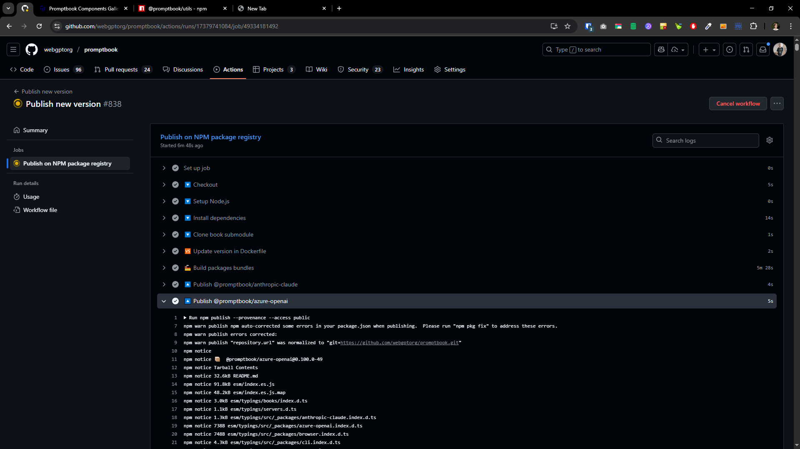

[x]

[✨🤯] Build process sometimes freezes during the `@promptbook/wizard` package

-   Problem occures during the build in
    command `ts-node ./scripts/generate-packages/generate-packages.ts --commit`
    in step `4️⃣  Generate bundle for each package`
-   It only happens sometimes. The next build is okay, and the build process ends successfully.
-   Even when it doesnt stuck it takes **up to hour** on a local machine
-   On Github Action `Publish new version` -> `Publish on NPM package registry` -> `🏭 Build packages bundles` -> `npx ts-node ./scripts/generate-packages/generate-packages.ts` it takes just about 5 ~ 6 minutes _(see the screenshot)_
-   Analyze the problem and try to fix it.
-   If you cannot fix it, list possible reasons for the problem.

**This is the state how console looks like:**

```bash
...
(!) Unresolved dependencies
https://rollupjs.org/guide/en/#warning-treating-module-as-external-dependency
prettier/parser-html (imported by src/utils/markdown/prettifyMarkdown.ts)
prettier/parser-markdown (imported by src/utils/markdown/prettifyMarkdown.ts)
prettier/standalone (imported by src/utils/markdown/prettifyMarkdown.ts)
(!) Circular dependencies
src/execution/createPipelineExecutor/00-createPipelineExecutor.ts -> src/execution/createPipelineExecutor/10-executePipeline.ts -> src/prepare/preparePipeline.ts -> src/execution/createPipelineExecutor/00-createPipelineExecutor.ts
src/execution/createPipelineExecutor/00-createPipelineExecutor.ts -> src/execution/createPipelineExecutor/10-executePipeline.ts -> src/prepare/preparePipeline.ts -> src/personas/preparePersona.ts -> src/execution/createPipelineExecutor/00-createPipelineExecutor.ts
(!) Use of eval is strongly discouraged
https://rollupjs.org/guide/en/#avoiding-eval
src/scripting/javascript/utils/extractVariablesFromJavascript.ts
18:         for (let i = 0; i < LOOP_LIMIT; i++)
19:             try {
20:                 eval(script); // <- TODO: Use `JavascriptExecutionTools.execute` here
                    ^
21:             }
22:             catch (error) {
created ./packages/website-crawler/esm/index.es.js, ./packages/website-crawler/umd/index.umd.js in 55.9s

./src/_packages/wizard.index.ts → ./packages/wizard/esm/index.es.js, ./packages/wizard/umd/index.umd.js...

(!) Missing shims for Node.js built-ins

Creating a browser bundle that depends on "path". You might need to include https://github.com/FredKSchott/rollup-plugin-polyfill-node

!!! Building 24 minutes
(!) Missing global variable names

Use output.globals to specify browser global variable names corresponding to external modules
spacetrim (guessing 'spaceTrim')
crypto (guessing 'crypto')
socket.io-client (guessing 'socket_ioClient')
@anthropic-ai/sdk (guessing 'Anthropic')
bottleneck (guessing 'Bottleneck')
colors (guessing 'colors')
@azure/openai (guessing 'openai')
openai (guessing 'OpenAI')
fs/promises (guessing 'promises')
child_process (guessing 'child_process')
waitasecond (guessing 'waitasecond')
crypto-js (guessing 'cryptoJs')
crypto-js/enc-hex (guessing 'hexEncoder')
path (guessing 'path')
prettier/parser-html (guessing 'parserHtml')
prettier/parser-markdown (guessing 'parserMarkdown')
prettier/standalone (guessing 'standalone')
rxjs (guessing 'rxjs')
crypto-js/sha256 (guessing 'sha256')
mime-types (guessing 'mimeTypes')
papaparse (guessing 'papaparse')
@mozilla/readability (guessing 'readability')
jsdom (guessing 'jsdom')
showdown (guessing 'showdown')
dotenv (guessing 'dotenv')
jszip (guessing 'JSZip')
(!) Unresolved dependencies
https://rollupjs.org/guide/en/#warning-treating-module-as-external-dependency
prettier/parser-html (imported by src/utils/markdown/prettifyMarkdown.ts)
prettier/parser-markdown (imported by src/utils/markdown/prettifyMarkdown.ts)
prettier/standalone (imported by src/utils/markdown/prettifyMarkdown.ts)
(!) Circular dependencies
src/execution/createPipelineExecutor/00-createPipelineExecutor.ts -> src/execution/createPipelineExecutor/10-executePipeline.ts -> src/prepare/preparePipeline.ts -> src/execution/createPipelineExecutor/00-createPipelineExecutor.ts
src/execution/createPipelineExecutor/00-createPipelineExecutor.ts -> src/execution/createPipelineExecutor/10-executePipeline.ts -> src/prepare/preparePipeline.ts -> src/personas/preparePersona.ts -> src/execution/createPipelineExecutor/00-createPipelineExecutor.ts
(!) Use of eval is strongly discouraged
https://rollupjs.org/guide/en/#avoiding-eval
src/scripting/javascript/utils/extractVariablesFromJavascript.ts
18:         for (let i = 0; i < LOOP_LIMIT; i++)
19:             try {
20:                 eval(script); // <- TODO: Use `JavascriptExecutionTools.execute` here
                    ^
21:             }
22:             catch (error) {
src/scripting/javascript/JavascriptEvalExecutionTools.ts
160:         let result;
161:         try {
162:             result = await eval(statementToEvaluate);
                                ^
163:             if (typeof result !== 'string') {
164:                 throw new PipelineExecutionError(`Script must return a string, but returned ${valueToString(result)}`);
created ./packages/wizard/esm/index.es.js, ./packages/wizard/umd/index.umd.js in 1m 8s

!!! Building 25 minutes
!!! Building 26 minutes
!!! Building 27 minutes
!!! Building 28 minutes
!!! Building 29 minutes
!!! Building 30 minutes
!!! Building 31 minutes
!!! Building 32 minutes
!!! Building 33 minutes
!!! Building 34 minutes
!!! Building 35 minutes
!!! Building 36 minutes
!!! Building 37 minutes
!!! Building 38 minutes
!!! Building 39 minutes
!!! Building 40 minutes
!!! Building 41 minutes
!!! Building 42 minutes
!!! Building 43 minutes
!!! Building 44 minutes
!!! Building 45 minutes
!!! Building 46 minutes
!!! Building 47 minutes
!!! Building 48 minutes
!!! Building 49 minutes
!!! Building 50 minutes
!!! Building 51 minutes
!!! Building 52 minutes
!!! Building 53 minutes
!!! Building 54 minutes
!!! Building 55 minutes
!!! Building 56 minutes
!!! Building 57 minutes
!!! Building 58 minutes
!!! Building 59 minutes
!!! Building 60 minutes
!!! Building 61 minutes
!!! Building 62 minutes
!!! Building 63 minutes
!!! Building 64 minutes
!!! Building 65 minutes
!!! Building 66 minutes
!!! Building 67 minutes
!!! Building 68 minutes
!!! Building 69 minutes
!!! Building 70 minutes
!!! Building 71 minutes
!!! Building 72 minutes
!!! Building 73 minutes
!!! Building 74 minutes
!!! Building 75 minutes
!!! Building 76 minutes
!!! Building 77 minutes
!!! Building 78 minutes
!!! Building 79 minutes
!!! Building 80 minutes
!!! Building 81 minutes
!!! Building 82 minutes
!!! Building 83 minutes
!!! Building 84 minutes
!!! Building 85 minutes
!!! Building 86 minutes
!!! Building 87 minutes
!!! Building 88 minutes
!!! Building 89 minutes
!!! Building 90 minutes
!!! Building 91 minutes
!!! Building 92 minutes
!!! Building 93 minutes
!!! Building 94 minutes
!!! Building 95 minutes
!!! Building 96 minutes
!!! Building 97 minutes
!!! Building 98 minutes
!!! Building 99 minutes
!!! Building 100 minutes
!!! Building 101 minutes
!!! Building 102 minutes
!!! Building 103 minutes
!!! Building 104 minutes
!!! Building 105 minutes
!!! Building 106 minutes
!!! Building 107 minutes
!!! Building 108 minutes
!!! Building 109 minutes
!!! Building 110 minutes
!!! Building 111 minutes
!!! Building 112 minutes
!!! Building 113 minutes
!!! Building 114 minutes
!!! Building 115 minutes
!!! Building 116 minutes
!!! Building 117 minutes
!!! Building 118 minutes
!!! Building 119 minutes
!!! Building 120 minutes
!!! Building 121 minutes
!!! Building 122 minutes
!!! Building 123 minutes
!!! Building 124 minutes
...

```

<- Stucked probbably forever




---

[ ]

[✨🤯] foo

---

[ ]

[✨🤯] foo

---

[ ]

[✨🤯] foo
