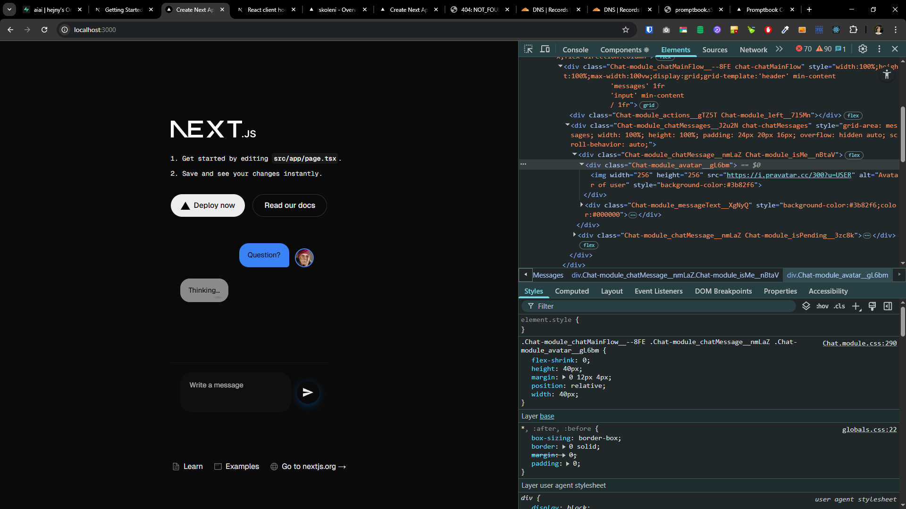

[x]

[✨🦬] Fix `<Chat/>` loading

-   When the Chat is rendered, its rendered without the styles for few miliseconds
-   This will cause the ugly jump of the layout
-   Fix it, style of the chat should be loaded together with the chat
-   Keep in mind the DRY _(don't repeat yourself)_ principle.
-   You are NOT fixing the preview `ChatPreview`, you are fixing actual [`Chat`](/src/book-components/Chat/Chat/Chat.tsx)
-   Add the changes into the `CHANGELOG.md` as one short line

---

[x]

[✨🦬] Fix `<Chat/>` loading

-   When the Chat is rendered, its rendered without the styles for few miliseconds
-   This is problem when there some participant has profile image _(see the attached screenshots)_
-   This will cause the ugly jump of the layout and refocus
-   Fix it, style of the chat should be loaded together with the chat
-   Keep in mind the DRY _(don't repeat yourself)_ principle.
-   You are NOT fixing the preview `ChatPreview`, you are fixing actual [`Chat`](/src/book-components/Chat/Chat/Chat.tsx)
-   Add the changes into the `CHANGELOG.md` as one short line

---

[ ]

[✨🦬] qux

---

[ ]

[✨🦬] qux
