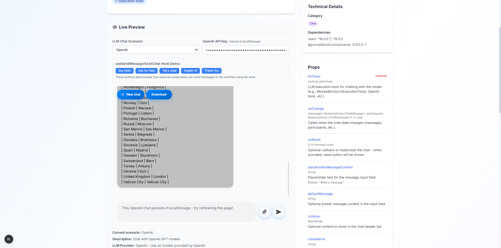
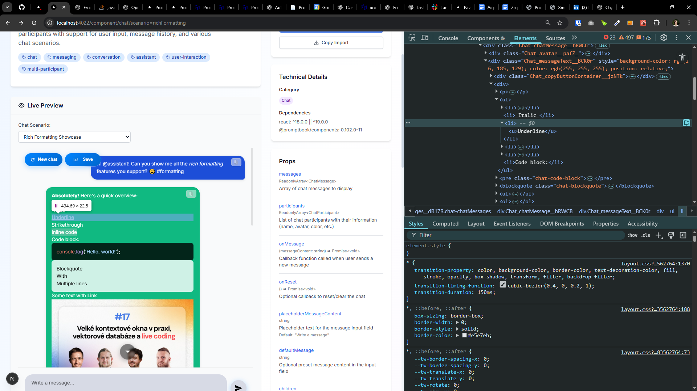

[x]

[✨🪢] `<Chat>` component should support markdown and html tables

-   When the message content contains markdown or html tables, there should be rendered as tables not as plain text with "---" and "|"
-   Chat component is in /src/book-components/Chat/Chat/Chat.tsx
-   Keep in mind the DRY _(don't repeat yourself)_ principle.
-   Add the changes into the `CHANGELOG.md`

---

[x]

[✨🪢] Add sample of tables into `<ChatPreview />`

-   Add sample (scenario) with table in the conversation in http://localhost:4022/component/chat name it "Chat with tables"
-   Chat component is in /src/book-components/Chat/Chat/Chat.tsx
-   Add both markdown and html tables
-   Keep in mind the DRY _(don't repeat yourself)_ principle.
-   Add the changes into the `CHANGELOG.md`

---

[x]

[✨🪢] Enhance visual contrast for tables in `<Chat />`

-   Chat should have good contrast color of text inside a <table>s nested in chat messages
-   It shouldnt depent if the table is markdown or html
-   Chat component is in /src/book-components/Chat/Chat/Chat.tsx
-   Keep in mind the DRY _(don't repeat yourself)_ principle.
-   Add the changes into the `CHANGELOG.md`

---

[x]

[✨🪢] Enhance code blocks in `<Chat />`

-   Code blocks inside chat messages should have similar visual style as tables and other nested elements inside chat messages
-   Code blocks should have a dark background and light text color for better contrast
-   Do the syntax highlighting for code blocks
-   Chat component is in /src/book-components/Chat/Chat/Chat.tsx
-   Keep in mind the DRY _(don't repeat yourself)_ principle.
-   Add the changes into the `CHANGELOG.md`

---

[x.]

[✨🪢] Enhance the <blockquote> in `<Chat />`

-   Make visual for <blockquote> simmilar to <code>
-   They are in the same box but light
-   Chat component is in /src/book-components/Chat/Chat/Chat.tsx
-   Keep in mind the DRY _(don't repeat yourself)_ principle.
-   Add the changes into the `CHANGELOG.md`

---

[x]

[✨🪢] Enhance the `inputContainer` in `<Chat />`

-   Background color of the input container should be same is `isMe` participant of the chat
-   The text color should be set accordingly for good contrast - see how its done in the message bubbles
-   The default color of `isMe` is `#1D4ED8`
-   Chat component is in /src/book-components/Chat/Chat/Chat.tsx
-   Keep in mind the DRY _(don't repeat yourself)_ principle.
-   Add the changes into the `CHANGELOG.md`

---

[x]

[✨🪢] Enhance design of `<Chat/>` - `<ul>`, `<ol>` and `<li>`

-   Chat component is in /src/book-components/Chat/Chat/Chat.tsx
-   Lists in chat messages _(both ordered and unordered)_ should be rendered as lists
-   Keep in mind the DRY _(don't repeat yourself)_ principle.
-   Add the changes into the `CHANGELOG.md`

---

[ ]

[✨🪢] Enhance the `<table>` in `<Chat />`

-   ...
-   Enhance visual style of tables in chat messages
-   Chat component is in /src/book-components/Chat/Chat/Chat.tsx
-   Keep in mind the DRY _(don't repeat yourself)_ principle.
-   Add the changes into the `CHANGELOG.md`

---

[ ]

[✨🪢] Enhance the math embedded in `<Chat />` messages

-   Chat component is in /src/book-components/Chat/Chat/Chat.tsx
-   When there is math embedded in the chat messages, it should be rendered properly
-   For example: $a^2 + b^2 = c^2$
-   Keep in mind the DRY _(don't repeat yourself)_ principle.
-   Add the changes into the `CHANGELOG.md`

---

[ ]

[✨🪢] Enhance the ... in `<Chat />`

-   Chat component is in /src/book-components/Chat/Chat/Chat.tsx
-   Keep in mind the DRY _(don't repeat yourself)_ principle.
-   Add the changes into the `CHANGELOG.md`
