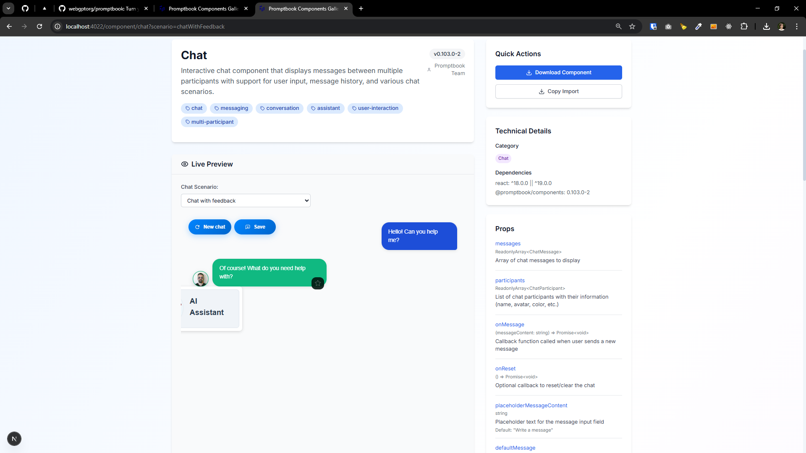
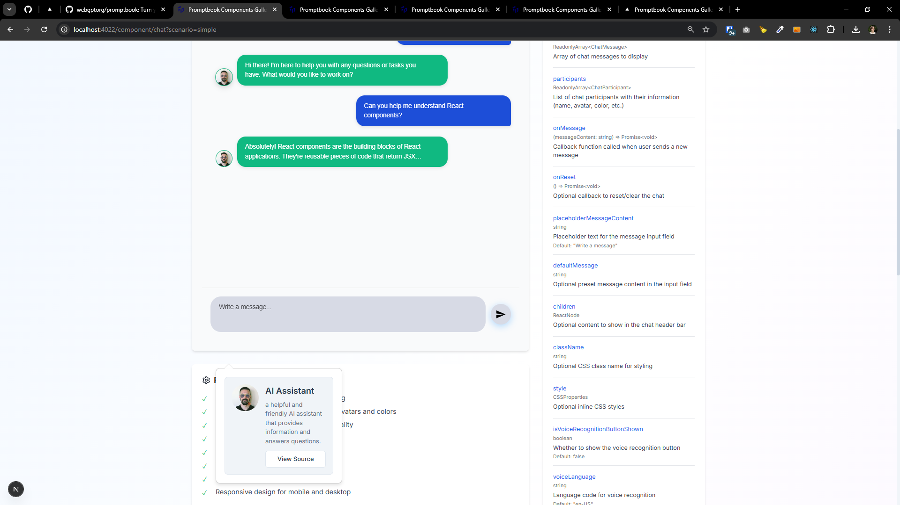

[x]

[✨🔞] Chat component should have avatar profile on hover

-   When user hovers over the participant avatar in the chat component, it should show the avatar profile
-   Chat component is located in `src/book-components/Chat/Chat/Chat.tsx`
-   The avatar profile is located in `src/book-components/AvatarProfile/AvatarProfile/AvatarProfileFromSource.tsx`
-   Keep in mind the DRY _(don't repeat yourself)_ principle.

---

[x] _<- Repeat for other `style={{` _

[✨🔞] Do not use inline styles, use CSS modules

-   `
`, the Book editor should be popup on top of everything
-   Keep in mind the DRY _(don't repeat yourself)_ principle.
-   Add the changes into the `CHANGELOG.md`

---

[x]

[✨🔞] Add prop `isReadonly` to `<BookEditor />`

-   Keep in mind the DRY _(don't repeat yourself)_ principle.
-   Add the changes into the `CHANGELOG.md`

---

[x]

[✨🔞] Chat component have avatar profile on hover

-   Allow to view the entire agent source in `<BookEditor />` from this preview
-   Keep in mind the DRY _(don't repeat yourself)_ principle.
-   Add the changes into the `CHANGELOG.md`

---

[ ]

[✨🔞] foo

-   Keep in mind the DRY _(don't repeat yourself)_ principle.
-   Add the changes into the `CHANGELOG.md`
