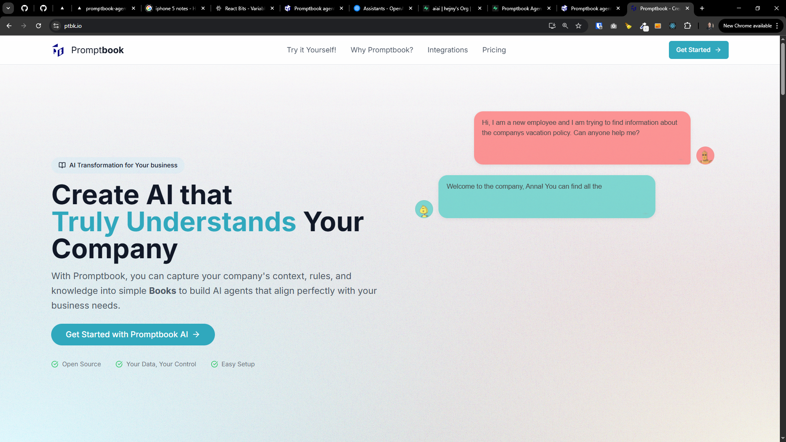

[x]

[✨🍛] Homepage of the Agents Server should display heading bar

-   Look at `C:/Users/me/work/promptbook-experiments-and-landing-pages/aldaron/components/header.tsx` how the heading bar is implemented there and should look like
-   Same heading bar is in ptbk.io website and in attached screenshot
-   You are working with the `Agents Server` application `/apps/agents-server`
-   Keep in mind the DRY _(don't repeat yourself)_ principle.

---

[x]

[✨🍛] Add logging in / out on the right end of the heading bar

-   There is implemented lightweight authentication system _(The env `ADMIN_PASSWORD`)_ in Agents Server, so add "Log in" / "Log out" button on the right end of the heading bar
-   Keep in mind the DRY _(don't repeat yourself)_ principle.
-   You are working with the `Agents Server` application `/apps/agents-server`

---

[ ]

[✨🍛] Allow to set branding options in Agents Server via `Metadata` table

-   It should be possible to set essential branding options of the Agents Server via Metadata, so that when deploying the Agents Server, user can customize the branding without changing the code.
-   Keep in mind the DRY _(don't repeat yourself)_ principle.
-   You are working with the `Agents Server` application `/apps/agents-server`

---

[ ]

[✨🍛] foo

-   Keep in mind the DRY _(don't repeat yourself)_ principle.
-   You are working with the `Agents Server` application `/apps/agents-server`
