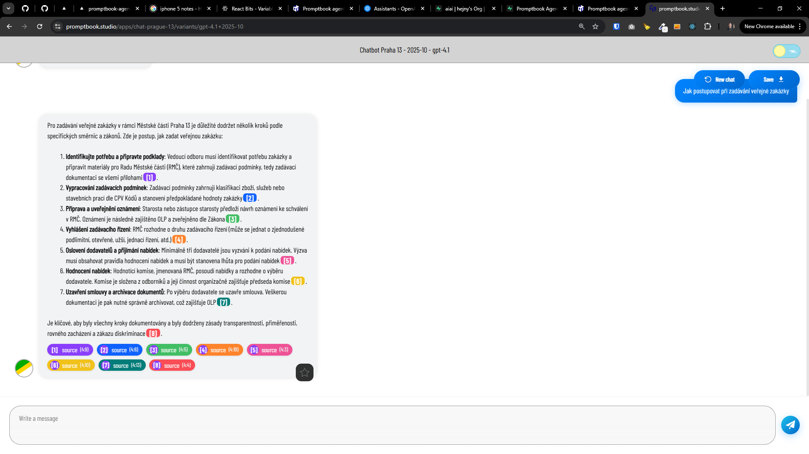

[x]

[✨🚸] Render text citations

-   Citation looks like "【4:0†source】"
-   The citations are already implemented in `C:/Users/me/work/webgptorg/promptbook-studio/src/components/Content/extensions/sourceCitationExtension.ts`, take a look how they are implemented there
-   Implement the citation rendering into [Chat component](/src/book-components/Chat/Chat/Chat.tsx)
-   Keep in mind the DRY _(don't repeat yourself)_ principle.

---

[ ]

[✨🚸] Citate the name of the KNOWLEDGE not "source"

-   Citation rendering in [Chat component](/src/book-components/Chat/Chat/Chat.tsx) shows the citations
-   Now there are "【7:15†source】" or "【7:16†source】." instead of the document name e.g. "【7:15†document123.doc】"
-   It should work in the context of the `Agents Server` application `/apps/agents-server`
-   Keep in mind the DRY _(don't repeat yourself)_ principle.
-   Add the changes into the `/changelog/_current-preversion.md`

---

[ ]

[✨🚸] bar

-   Keep in mind the DRY _(don't repeat yourself)_ principle.
-   Add the changes into the `/changelog/_current-preversion.md`

---

[ ]

[✨🚸] bar

-   Keep in mind the DRY _(don't repeat yourself)_ principle.
-   Add the changes into the `/changelog/_current-preversion.md`
