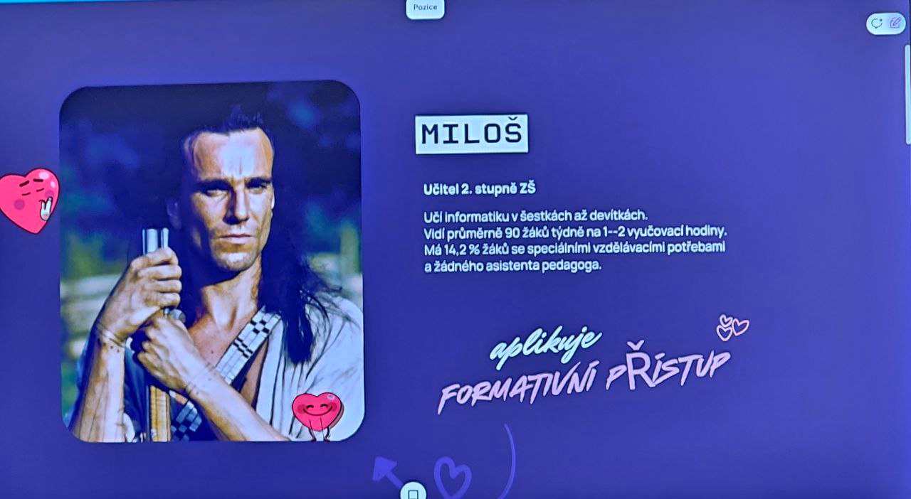

[x]

[✨🏦] Simplify the design of the agent page

-   Agent page has pathname `/agents/[agentName]`
-   Current design has too much information and clutter, it should have just:
    -   Visually appealing and good looking agent profile
    -   Ability to start chat with the agent
-   All the links and complexity should be hidden in a dropdown menu or "More options" menu
-   Look for inspiration at attachment photo
-   It should visually match the Agent color theme, use `Color` object to create matching colors for background, buttons, etc.
-   Use some nice font for the agent name, like `Poppins`, `Montserrat`, `Raleway`, `Nunito`, etc.
-   Use nice rounded cards with Agent image
-   You are working with the `Agents Server` application `/apps/agents-server`
-   Keep in mind the DRY _(don't repeat yourself)_ principle.



---

[x]

[✨🏦] Use the agents font on the agent page

-   Create new `META` commitment `META FONT` to set the font(s) for the agent
-   Syntax of the commitment is `META FONT Poppins, Arial, sans-serif`
-   Dynamically support all the fonts from Google Fonts
-   This font should be used on the agent page `/agents/[agentName]` for the agent name and other agent text
    -   But not for the header and footer on the agent page
-   Commitments are in the folder `/src/commitments`
-   Add the changes of the commitment into the `/changelog/_current-preversion.md`
-   You are working with the `Agents Server` application `/apps/agents-server`
-   Keep in mind the DRY _(don't repeat yourself)_ principle.

---

[ ]

[✨🏦] Allow multiple agent colors and use them all on the agent page

-   Update commitment `META COLOR` to be able to set multiple colors
-   Syntax of the commitment is `META COLOR #FF5733, #33FF57, #3357FF`
-   Theese colors are used on the agent page `/agents/[agentName]` for design
    -   But not for the header and footer on the agent page
-   Commitments are in the folder `/src/commitments`
-   It is still perfectly fine to not set `META COLOR` commitment at all or use just one color
-   Add the changes of the commitment into the `/changelog/_current-preversion.md`
-   You are working with the `Agents Server` application `/apps/agents-server`
-   Keep in mind the DRY _(don't repeat yourself)_ principle.

---

[ ]

[✨🏦] Enhance the design of the card on agent page

-   Make the agent card look more visually appealing
-   The background should be separate gradient from entire page gradient using the agent color
-   Make it 1:1.62 ratio (golden ratio, height = 1.62 \* width)
-   Make agent avatar card flippable, on the back is the QR code with VCard
-   You are working with the `Agents Server` application `/apps/agents-server`
-   Keep in mind the DRY _(don't repeat yourself)_ principle.

---

[-]

[✨🏦] Make the background of agent page noisy

-   Now the background of the agent page is just smooth gradient using agent color(s)
-   It looks nice, but it would look even better with some grainy noise on top of the gradient
-   Create ad-hoc SVG background with strong grainy noise on top of the gradient
-   This should push the design of the agent page from nice to awesome
-   You are working with the `Agents Server` application `/apps/agents-server`
-   Keep in mind the DRY _(don't repeat yourself)_ principle.

```svg
<?xml version="1.0" encoding="UTF-8"?>
<svg xmlns="http://www.w3.org/2000/svg"
  viewBox="0 0 1920 1080"
  width="1920" height="1080"
  preserveAspectRatio="xMidYMid slice">
  <defs>
    <!-- Bottom-left blue -->
    <radialGradient id="blueGrad" cx="0%" cy="100%" r="90%">
      <stop offset="0%" stop-color="#79EAFD" />
      <stop offset="50%" stop-color="#218794" />
      <stop offset="100%" stop-color="#0a1a2f" />
    </radialGradient>

    <!-- Bottom-right red -->
    <radialGradient id="redGrad" cx="100%" cy="100%" r="90%">
      <stop offset="0%" stop-color="#FEF3B0" />
      <stop offset="50%" stop-color="#913D25" />
      <stop offset="100%" stop-color="#2a0014" />
    </radialGradient>

    <!-- White top fade -->
    <linearGradient id="whiteTopGrad" x1="0%" y1="0%" x2="0%" y2="100%">
      <stop offset="0%" stop-color="#ffffff" stop-opacity="1" />
      <stop offset="100%" stop-color="#ffffff" stop-opacity="0.7" />
    </linearGradient>

    <!-- Strong grain -->
    <filter id="grain" x="-10%" y="-10%" width="120%" height="120%">
      <feTurbulence type="fractalNoise" baseFrequency="3.5" numOctaves="3" seed="8" result="noise" />
      <feComponentTransfer>
        <feFuncR type="linear" slope="3.5" intercept="-1.2" />
        <feFuncG type="linear" slope="3.5" intercept="-1.2" />
        <feFuncB type="linear" slope="3.5" intercept="-1.2" />
        <feFuncA type="table" tableValues="0 0.8" />
      </feComponentTransfer>
    </filter>
  </defs>

  <!-- White base -->
  <rect width="100%" height="100%" fill="#ffffff" />

  <!-- Gradients -->
  <rect width="100%" height="100%" fill="url(#blueGrad)" />
  <rect width="100%" height="100%" fill="url(#redGrad)" style="mix-blend-mode:screen; opacity:0.85" />

  <!-- White fade on top -->
  <rect width="100%" height="100%" fill="url(#whiteTopGrad)" />

  <!-- Strong visible noise -->
  <rect width="100%" height="100%" filter="url(#grain)"
    style="mix-blend-mode:soft-light; opacity:1.2" />
</svg>
```

---

[-]

[✨🏦] quux

-   You are working with the `Agents Server` application `/apps/agents-server`
-   Keep in mind the DRY _(don't repeat yourself)_ principle.

---

[-]

[✨🏦] quux

-   You are working with the `Agents Server` application `/apps/agents-server`
-   Keep in mind the DRY _(don't repeat yourself)_ principle.
