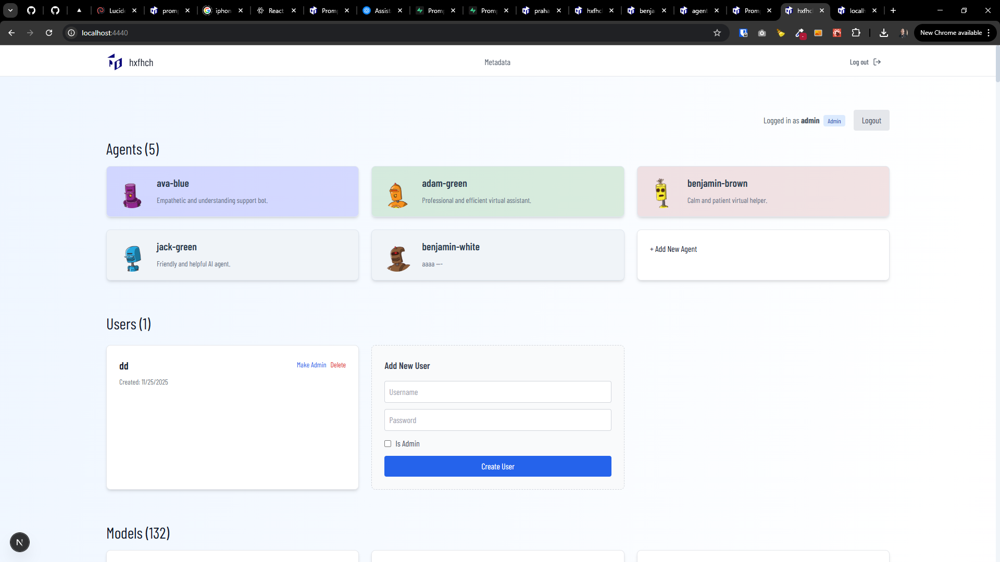

[x][ ]

[✨⛱] Enhance homepage `/` UI and UX of Agents Server

-   You are working with the `Agents Server` application `/apps/agents-server`
-   Keep in mind the DRY _(don't repeat yourself)_ principle.

---

[x]

[✨⛱] Enhance design of header component across the Agents Server

-   You are working with the header component in `/apps/agents-server/src/components/Header/Header.tsx`
-   You are working with the `Agents Server` application `/apps/agents-server`
-   Keep in mind the DRY _(don't repeat yourself)_ principle.

---

[x]

[✨⛱] Add link to every agent in the header

-   Now there is only link to agents page not each specific agent
-   Make it as dropdown with list of agents
-   The "Agents" link will have dropdown arrow and when clicked it will show list of all agents
-   You are working with the header component in `/apps/agents-server/src/components/Header/Header.tsx`
-   You are working with the `Agents Server` application `/apps/agents-server`
-   Keep in mind the DRY _(don't repeat yourself)_ principle.

---

[x]

[✨⛱] Enhance the header menu on mobile

-   Menu has items "Agents", "Models", "Metadata", "About"
-   On PC it looks ok but on mobile it just disappears
-   Make it visible via hamburger menu on mobile
-   You are working with the `Agents Server` application `/apps/agents-server`
-   Keep in mind the DRY _(don't repeat yourself)_ principle.

---

[ ]

[✨⛱] xxx @@@@ hamburger menu 2x

-   You are working with the `Agents Server` application `/apps/agents-server`
-   Keep in mind the DRY _(don't repeat yourself)_ principle.

---

[ ]

[✨⛱] xxx

-   You are working with the `Agents Server` application `/apps/agents-server`
-   Keep in mind the DRY _(don't repeat yourself)_ principle.

---

[ ]

[✨⛱] xxx

-   You are working with the `Agents Server` application `/apps/agents-server`
-   Keep in mind the DRY _(don't repeat yourself)_ principle.

---

[ ]

[✨⛱] xxx

-   You are working with the `Agents Server` application `/apps/agents-server`
-   Keep in mind the DRY _(don't repeat yourself)_ principle.
