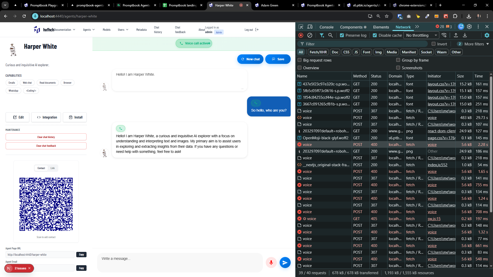

[x]

[✨✷] Add voice calling support to Agents Server

-   Implement voice calling functionality for agents hosted on the Agents Server
-   Implement entrire vertical from UI to implementation in `RemoteAgent`, `Agent`, api endpoints, database, etc.
-   Voicecalling should work alongside the working text messaging
-   You are communicating with same agent, just different modality
-   You are working with the `Agents Server` application `/apps/agents-server`
-   Keep in mind the DRY _(don't repeat yourself)_ principle.

---

[x]

[✨✷] Add metadata field `IS_VOICE_CALLING_ENABLED`

-   By default it is false
-   This should enable/disable voice calling features for agents
-   You are working with the `Agents Server` application `/apps/agents-server`
-   Keep in mind the DRY _(don't repeat yourself)_ principle.

---

[x]

[✨✷] Make the voice calling fluent

-   Now you have to manually press "Start Voice Call" button and the n end it manually by pressing same button, it waits and the transcribes single message
-   Make it fluent, so when user starts voice call, it keeps listening and transcribing until user presses "End Call" button
-   During the call, user can see the live transcription of what they are saying
-   There can be multiple messages during single call
-   You are working with the `Agents Server` application `/apps/agents-server`
-   Keep in mind the DRY _(don't repeat yourself)_ principle.

---

[ ]

[✨✷] When voice calling the first request to `/agents/[agentName]/api/voice` is ok and others fails on 400 "Error: 400 Invalid file format. Supported formats: ['flac', 'm4a', 'mp3', 'mp4', 'mpeg', 'mpga', 'oga', 'ogg', 'wav', ,..."

-   You are working on voice calling feature for Agents Server with api endpoint `/agents/[agentName]/api/voice`
-   You are working with the `Agents Server` application `/apps/agents-server`
-   Keep in mind the DRY _(don't repeat yourself)_ principle.

---

[ ]

[✨✷] baz

-   You are working on voice calling feature for Agents Server with api endpoint `/agents/[agentName]/api/voice`
-   You are working with the `Agents Server` application `/apps/agents-server`
-   Keep in mind the DRY _(don't repeat yourself)_ principle.

---

[ ]

[✨✷] baz

-   You are working on voice calling feature for Agents Server with api endpoint `/agents/[agentName]/api/voice`
-   You are working with the `Agents Server` application `/apps/agents-server`
-   Keep in mind the DRY _(don't repeat yourself)_ principle.

---

[ ]

[✨✷] baz

-   You are working on voice calling feature for Agents Server with api endpoint `/agents/[agentName]/api/voice`
-   You are working with the `Agents Server` application `/apps/agents-server`
-   Keep in mind the DRY _(don't repeat yourself)_ principle.

---

[ ]

[✨✷] baz

-   You are working on voice calling feature for Agents Server with api endpoint `/agents/[agentName]/api/voice`
-   You are working with the `Agents Server` application `/apps/agents-server`
-   Keep in mind the DRY _(don't repeat yourself)_ principle.

---

[ ]

[✨✷] baz

-   You are working on voice calling feature for Agents Server with api endpoint `/agents/[agentName]/api/voice`
-   You are working with the `Agents Server` application `/apps/agents-server`
-   Keep in mind the DRY _(don't repeat yourself)_ principle.

---

[ ]

[✨✷] baz

-   You are working on voice calling feature for Agents Server with api endpoint `/agents/[agentName]/api/voice`
-   You are working with the `Agents Server` application `/apps/agents-server`
-   Keep in mind the DRY _(don't repeat yourself)_ principle.

---

[ ]

[✨✷] Real-time transcription @@@@

-   You are working with the `Agents Server` application `/apps/agents-server`
-   Keep in mind the DRY _(don't repeat yourself)_ principle.

---

[ ]

[✨✷] baz

-   You are working with the `Agents Server` application `/apps/agents-server`
-   Keep in mind the DRY _(don't repeat yourself)_ principle.

---

[ ]

[✨✷] baz

-   You are working with the `Agents Server` application `/apps/agents-server`
-   Keep in mind the DRY _(don't repeat yourself)_ principle.

---

[ ]

[✨✷] baz

-   You are working with the `Agents Server` application `/apps/agents-server`
-   Keep in mind the DRY _(don't repeat yourself)_ principle.
