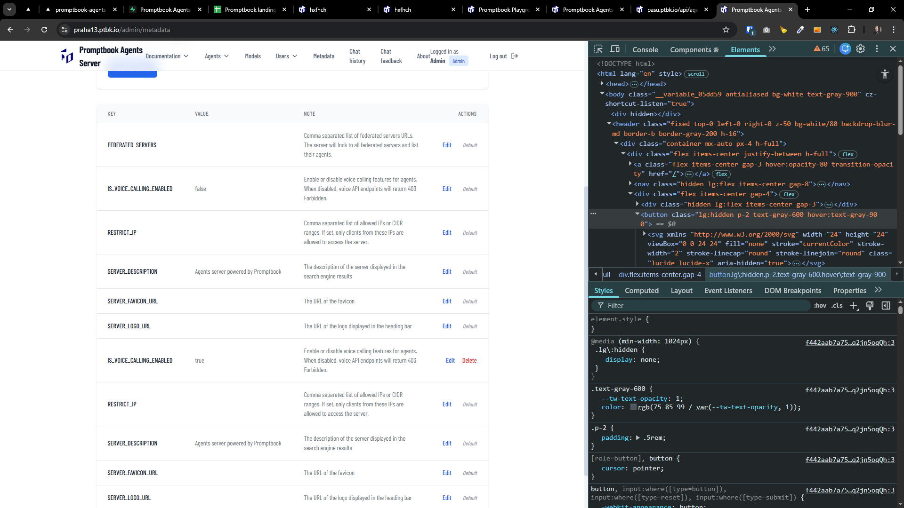

[x]

[✨🛃] Do not show the default value of metadata when there is already set value

-   This will disapper after page reload, but it should not be right away when the value is set
-   You are working with the `Agents Server` application `/apps/agents-server` with page `/admin/metadata`
-   Keep in mind the DRY _(don't repeat yourself)_ principle.

---

[x]

[✨🛃] Add a type for metadata values

-   Add theese information about a type into default values of metadata
-   Use icons to represent types
-   The types are:
    -   `TEXT_SINGLE_LINE`
    -   `TEXT` (multi line)
    -   `NUMBER`
    -   `BOOLEAN` (true/false)
-   For the types show propper input field when editing metadata value
-   You are working with the `Agents Server` application `/apps/agents-server` with page `/admin/metadata`
-   Keep in mind the DRY _(don't repeat yourself)_ principle.

---

[x]

[✨🛃] Create a type of metadata `IMAGE_URL` and use it in key `SERVER_LOGO_URL` and `SERVER_FAVICON_URL`

-   Allow to add value as image url or upload image directly _(look how uploading works in BookEditor component)_
-   Use icon for this metadata type
-   You are working with the `Agents Server` application `/apps/agents-server` with page `/admin/metadata`
-   Keep in mind the DRY _(don't repeat yourself)_ principle, especially reusing the uploading logic and create common components and abstractions if needed.

---

[x]

[✨🛃] Allow to delete metadata item

-   You are working with the `Agents Server` application `/apps/agents-server` with page `/admin/metadata`
-   Keep in mind the DRY _(don't repeat yourself)_ principle.

---

[ ]

[✨🛃] Create a type of metadata `IP_RANGE` and use it in key `RESTRICT_IP`

-   Create some smart input field for IP ranges _(CIDR notation maybe)_
    -   Look how its implemented in `/apps/agents-server/src/utils/isIpAllowed.ts`
-   Use icon for this metadata type
-   You are working with the `Agents Server` application `/apps/agents-server` with page `/admin/metadata`
-   Keep in mind the DRY _(don't repeat yourself)_ principle.

---

[ ]

[✨🛃] When the `IP_RANGE` and client is restricted show ruch UI page not just "Forbidden"

-   Allow to log-in from all IPs, logged in users are not restricted at all
-   Allow to list the agents, even from restricted IPs for users and also for federated servers API
-   For restricted IPs show nice page saying that the server is restricted and user should log in to access it
-   Do not allow to chat from restricted IPs
-   You are working with the `Agents Server` application `/apps/agents-server`
-   Keep in mind the DRY _(don't repeat yourself)_ principle.

---

[-]

[✨🛃] qux

-   You are working with the `Agents Server` application `/apps/agents-server` with page `/admin/metadata`
-   Keep in mind the DRY _(don't repeat yourself)_ principle.

---

[-]

[✨🛃] qux

-   You are working with the `Agents Server` application `/apps/agents-server` with page `/admin/metadata`
-   Keep in mind the DRY _(don't repeat yourself)_ principle.

---

[-]

[✨🛃] qux

-   You are working with the `Agents Server` application `/apps/agents-server` with page `/admin/metadata`
-   Keep in mind the DRY _(don't repeat yourself)_ principle.

---

[-]

[✨🛃] qux

-   You are working with the `Agents Server` application `/apps/agents-server` with page `/admin/metadata`
-   Keep in mind the DRY _(don't repeat yourself)_ principle.

---

[-]

[✨🛃] qux

-   You are working with the `Agents Server` application `/apps/agents-server` with page `/admin/metadata`
-   Keep in mind the DRY _(don't repeat yourself)_ principle.

---

[-]

[✨🛃] qux

-   You are working with the `Agents Server` application `/apps/agents-server` with page `/admin/metadata`
-   Keep in mind the DRY _(don't repeat yourself)_ principle.

---

[-]

[✨🛃] qux

-   You are working with the `Agents Server` application `/apps/agents-server` with page `/admin/metadata`
-   Keep in mind the DRY _(don't repeat yourself)_ principle.

---

[-]

[✨🛃] qux

-   You are working with the `Agents Server` application `/apps/agents-server` with page `/admin/metadata`
-   Keep in mind the DRY _(don't repeat yourself)_ principle.

---

[-]

[✨🛃] qux

-   You are working with the `Agents Server` application `/apps/agents-server` with page `/admin/metadata`
-   Keep in mind the DRY _(don't repeat yourself)_ principle.

---

[-]

[✨🛃] qux

-   You are working with the `Agents Server` application `/apps/agents-server` with page `/admin/metadata`
-   Keep in mind the DRY _(don't repeat yourself)_ principle.
