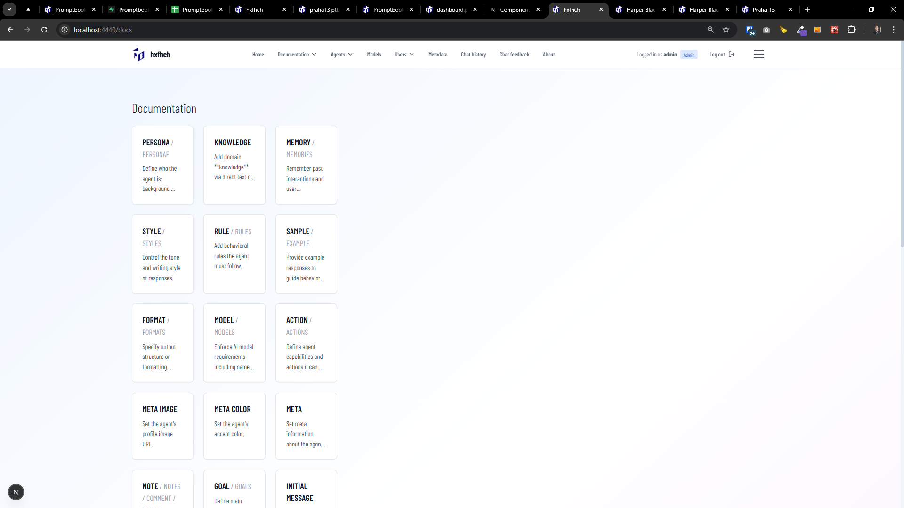
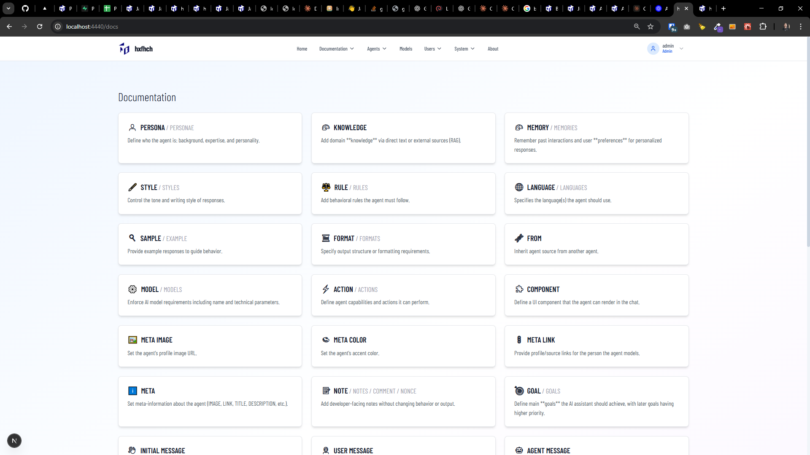
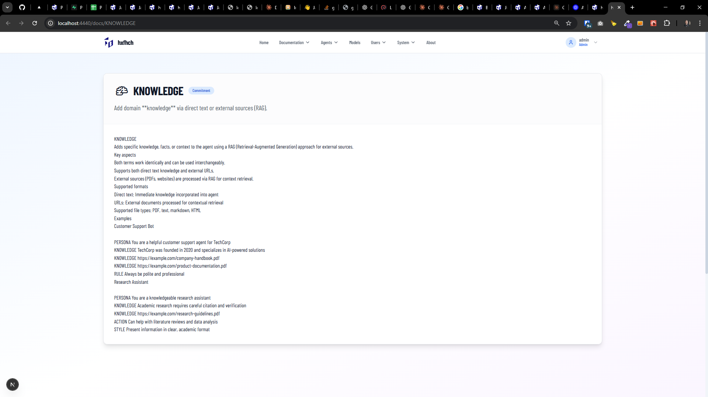

[x][x]

[✨❣️] Group aliased commitments together in the documentation

-   You are working with the `Agents Server` application `/apps/agents-server`
-   Keep in mind the DRY _(don't repeat yourself)_ principle.

---

[x]

[✨❣️] Group aliased commitments together in the documentation menu

-   In the `/docs` the documentation is already grouped, but the menu is not
-   You are working with the `Agents Server` application `/apps/agents-server`
-   Keep in mind the DRY _(don't repeat yourself)_ principle.

---

[x]

[✨❣️] Exclude commitmeents which are `NotYetImplementedCommitmentDefinition` from the documentation

-   Exclude from listing in `/docs`
-   You are working with the `Agents Server` application `/apps/agents-server`
-   Keep in mind the DRY _(don't repeat yourself)_ principle.

---

[x]

[✨❣️] Enhance design of `/docs` page

-   You are working with the `Agents Server` application `/apps/agents-server`
-   Keep in mind the DRY _(don't repeat yourself)_ principle.

---

[x]

[✨❣️] Create icon for each commitment and show it in the documentation

-   The icon should be in `CommitmentDefinition`
-   You are working with the `Agents Server` application `/apps/agents-server`
-   Keep in mind the DRY _(don't repeat yourself)_ principle.

---

[x]

[✨❣️] There are some commitments that should be grouped together in the documentation despite not being aliased

-   For example `OPEN` and `CLOSED` are tightly related and should be shown together and interlinked
-   You are working with the `Agents Server` application `/apps/agents-server`
-   Keep in mind the DRY _(don't repeat yourself)_ principle.

---

[.]

[✨❣️] `/docs` documentation page is broken, no commitments are shown, fix it

-   You are working with the `Agents Server` application `/apps/agents-server`
-   Keep in mind the DRY _(don't repeat yourself)_ principle.

---

[ ]

[✨❣️] Documentation pages should use OpenMoji black and white icons instead of default emojis

-   You are working on pages `/docs` and `/docs/[commitmentName]`
-   You are working with the `Agents Server` application `/apps/agents-server`
-   Keep in mind the DRY _(don't repeat yourself)_ principle.

---

[x]

[✨❣️] Text in the documentation should look formatted

-   Now we are rendering markdown but visually there is no difference between normal text, headers, bold text, code snippets, etc.
    -   Make each possible markdown html element look visually distinct and awesome
-   You are working on pages `/docs` and `/docs/[commitmentName]`
-   You are working with the `Agents Server` application `/apps/agents-server`
-   Keep in mind the DRY _(don't repeat yourself)_ principle.

---

[ ]

[✨❣️] Books the documentation should be rendered via <BookEditor /> component

-   Now we are rendering it via generic clack code box
-   The `<BookEditor />` in read-only mode should be used to render `book` code blocks in the documentation
-   You are working on page `/docs/[commitmentName]`
-   You are working with the `Agents Server` application `/apps/agents-server`
-   Keep in mind the DRY _(don't repeat yourself)_ principle.

---

[ ]

[✨❣️] Allow to print the documentation

-   On pages `/docs` and `/docs/[commitmentName]` add button `Print` which will open print dialog to print the page
-   The commitment page `/docs/[commitmentName]` should print content of the commitment only, add some nice print Promptbook branding
-   The index page `/docs` should print the all commitments as one big document with nice print Promptbook branding
-   You are working with the `Agents Server` application `/apps/agents-server`
-   Keep in mind the DRY _(don't repeat yourself)_ principle.
-   Keep in mind the DRY for nice print Promptbook branding, create reusable component for printing from the Agents Server application.

---

[-]

[✨❣️] quux

-   You are working with the `Agents Server` application `/apps/agents-server`
-   Keep in mind the DRY _(don't repeat yourself)_ principle.

---

[-]

[✨❣️] quux

-   You are working with the `Agents Server` application `/apps/agents-server`
-   Keep in mind the DRY _(don't repeat yourself)_ principle.

---

[-]

[✨❣️] quux

-   You are working with the `Agents Server` application `/apps/agents-server`
-   Keep in mind the DRY _(don't repeat yourself)_ principle.
