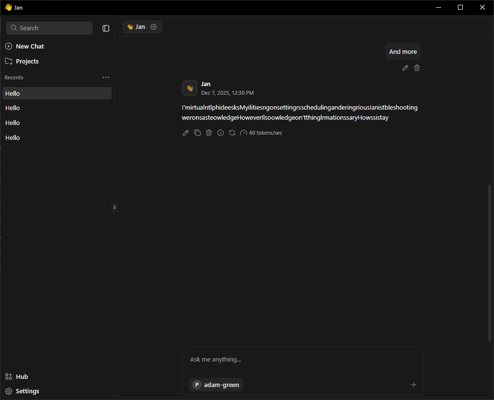

[x]

[✨🧚] Allow to expose agent as OpenAI API compatible API

-   Agent has URL like `/agents/[agentName]`
-   There should be new endpoint `/agents/[agentName]/api/openai` that exposes the Promptbook agent as OpenAI compatible API
-   Implement the OpenAI API specification for chat completions
-   Support the streaming
-   Use tokens for authentication from the `ApiTokens` table and corresponding token middleware
-   You are working with the `Agents Server` application `/apps/agents-server`
-   Keep in mind the DRY _(don't repeat yourself)_ principle.

---

[x]

[✨🧚] Fix the OpenAI API compatibility route of the agents

-   There is endpoint `/agents/[agentName]/api/openai` that exposes the Promptbook agent as OpenAI compatible API
-   You are working with the `Agents Server` application `/apps/agents-server`

But when I try to use it with OpenAI client, it fails with 500 error:

```typescript
const client = new OpenAI({
    baseURL: 'http://localhost:4440/agents/jack-green/api/openai',
    apiKey: 'ptbk_6135a159114a40b99bdbf2d52db59e59',
});

const response = await client.chat.completions.create({
    model: 'agent:jack-green',
    messages: [{ role: 'user', content: 'Hello!' }],
});

console.log(response.choices[0].message.content);
```

It fails:

```bash
Error
InternalServerError: 500 All execution tools of LLM Tools for wizard
or CLI with BYOK strategy failed:

1) **Google (through Vercel)** thrown **AI_APICallError:** * GenerateContentRequest.contents: contents is not specified

2) **OpenAI** thrown **Error:** 404 The model `gemini-2.5-flash-lite` does not exist or you do not have access to it.
```

-   But it shouldnt, agent queried via compatibility route should behave the same as when queried via web chat interface
-   Just check their Promptbook API key _(the `ptbk_6135a159114a40b99bdbf2d52db59e59`)_, the API token for the models is exactly the same as for the web chat interface

---

[x]

[✨🧚] When chatting with Agent via OpenAI API compatible route record the history of the chat in a same way as when chatting via web

-   There is endpoint `/agents/[agentName]/api/openai` that exposes the Promptbook agent as OpenAI compatible API
-   When chatting with the agent via this route, the chat history should be recorded in the same way as when chatting via web chat interface
-   Add new column `source`and `apiKey` to the `ChatHistory` table
    -   `source` can have values `AGENT_PAGE_CHAT` and `OPENAI_API_COMPATIBILITY`
    -   `apiKey` is the api key used for identification of the requestor, for web chat its `NULL`, for OpenAI API compatibility its the `ptbk_...` api key provided in the request
-   OpenAI API compatible route is in `/apps/agents-server/src/utils/handleChatCompletion.ts`
-   You are working with the `Agents Server` application `/apps/agents-server`
-   Keep in mind the DRY _(don't repeat yourself)_ principle.

---

[x]

[✨🧚] When chatting with Agent via OpenAI API compatible route self-learning should work in a same way as when chatting via web chat interface

-   Agent has self-learning capability from conversations
-   There is endpoint `/agents/[agentName]/api/openai` that exposes the Promptbook agent as OpenAI compatible API
-   Make sure that when chatting with the agent via this route, the self-learning from conversations works in the same way as when chatting via web chat interface
-   There should be no difference between web chat and OpenAI API compatible route in this regard
-   You are working with the `Agents Server` application `/apps/agents-server`
-   Keep in mind the DRY _(don't repeat yourself)_ principle.

---

[x]

[✨🧚] Agent OpenAI compatible endpoint should have version suffix

-   Agent OpenAI compatible endpoint is `/agents/[agentName]/api/openai` and its implemented in `/apps/agents-server/src/utils/handleChatCompletion.ts`
-   Move `/agents/[agentName]/api/openai` to `/agents/[agentName]/api/openai/v1` to allow versioning in future
-   Update the link to this endpoint in `/agents/[agentName]/integration` and other places accordingly
-   You are working with the `Agents Server` application `/apps/agents-server`
-   Keep in mind the DRY _(don't repeat yourself)_ principle.

---

[*]

[✨🧚] When calling via Agent OpenAI compatible endpoint,

-   Agent OpenAI compatible endpoint is `/agents/[agentName]/api/openai/v1` and its implemented in `/apps/agents-server/src/utils/handleChatCompletion.ts`
-   You are working with the `Agents Server` application `/apps/agents-server`
-   Keep in mind the DRY _(don't repeat yourself)_ principle.

---

[x]

[✨🧚] Add OpenAI compatible endpoint which contain all the agents NOT just single agent

-   There is Agent OpenAI compatible endpoint is `/agents/[agentName]/api/openai/v1` and its implemented in `/apps/agents-server/src/utils/handleChatCompletion.ts`
-   There should be also endpoint `/api/openai/v1` which will contain all the agents
-   You are working with the `Agents Server` application `/apps/agents-server`
-   Keep in mind the DRY _(don't repeat yourself)_ principle, do not implement anything twice, reuse existing logic and/or create common abstractions between both endpoints.

---

[ ]

[✨🧚] Be aware that when chatting through OpenAI compatible API, client can pass system message / system instructions

-   The passed system message should behave like `CONTEXT` commitment in Promptbook agent source appended to the agent source to the bottom
-   There is Agent OpenAI compatible endpoint is `/agents/[agentName]/api/openai/v1` and its implemented in `/apps/agents-server/src/utils/handleChatCompletion.ts`
-   You are working with the `Agents Server` application `/apps/agents-server`
-   Keep in mind the DRY _(don't repeat yourself)_ principle.

For example, when calling:

```typescript
const response = await client.chat.completions.create({
    model: 'agent:jack-green',
    messages: [
        { role: 'system', content: 'You are helping users of abc.com' },
        { role: 'user', content: 'Hello!' },
    ],
});
```

And the agent `jack-green` has source:

```book
Jack Green

RULE Always speak in modern English.
```

**Then the final source used for the agent should be:**

```book
Jack Green

RULE Always speak in modern English.
CONTEXT You are helping users of abc.com
```

**And model requirements should be created accordingly.**

---

[ ]

[✨🧚] When using extarnal application [Jan](https://www.jan.ai/) to chat with Promptbook Agent via Agent OpenAI compatible endpoint, it scrambles the response messages.

-   The messages are not scrambled when using OpenAI client directly, for example: "Hello! How can I assist you today?"
-   But when using Jan.ai application, same message look like this: "HelloHowssistay"
-   There is Agent OpenAI compatible endpoint is `/agents/[agentName]/api/openai/v1` and its implemented in `/apps/agents-server/src/utils/handleChatCompletion.ts`
-   You are working with the `Agents Server` application `/apps/agents-server`
-   Keep in mind the DRY _(don't repeat yourself)_ principle.



---

[-]

[✨🧚] brr

-   There is Agent OpenAI compatible endpoint is `/agents/[agentName]/api/openai/v1` and its implemented in `/apps/agents-server/src/utils/handleChatCompletion.ts`
-   You are working with the `Agents Server` application `/apps/agents-server`
-   Keep in mind the DRY _(don't repeat yourself)_ principle.

---

[-]

[✨🧚] brr

-   There is Agent OpenAI compatible endpoint is `/agents/[agentName]/api/openai/v1` and its implemented in `/apps/agents-server/src/utils/handleChatCompletion.ts`
-   You are working with the `Agents Server` application `/apps/agents-server`
-   Keep in mind the DRY _(don't repeat yourself)_ principle.

---

[-]

[✨🧚] brr

-   There is Agent OpenAI compatible endpoint is `/agents/[agentName]/api/openai/v1` and its implemented in `/apps/agents-server/src/utils/handleChatCompletion.ts`
-   You are working with the `Agents Server` application `/apps/agents-server`
-   Keep in mind the DRY _(don't repeat yourself)_ principle.

---

[-]

[✨🧚] brr

-   There is Agent OpenAI compatible endpoint is `/agents/[agentName]/api/openai/v1` and its implemented in `/apps/agents-server/src/utils/handleChatCompletion.ts`
-   You are working with the `Agents Server` application `/apps/agents-server`
-   Keep in mind the DRY _(don't repeat yourself)_ principle.

---

[-]

[✨🧚] brr

-   There is Agent OpenAI compatible endpoint is `/agents/[agentName]/api/openai/v1` and its implemented in `/apps/agents-server/src/utils/handleChatCompletion.ts`
-   You are working with the `Agents Server` application `/apps/agents-server`
-   Keep in mind the DRY _(don't repeat yourself)_ principle.
