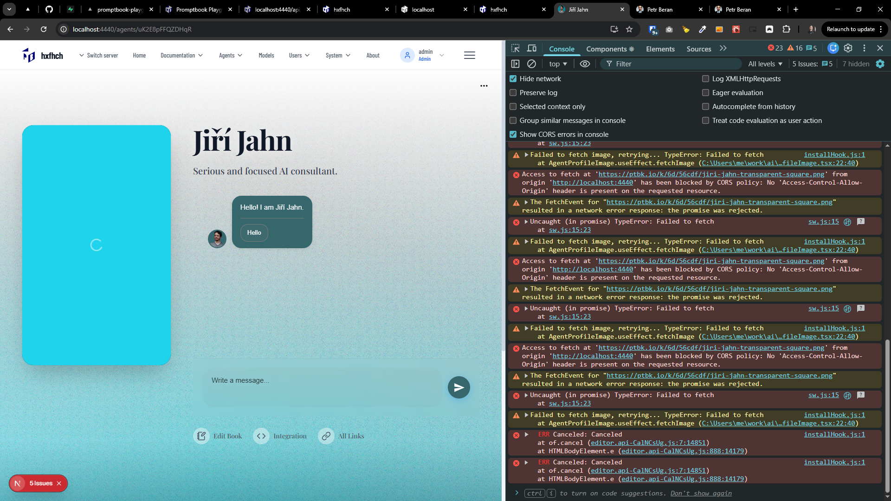

[x]

[✨🏭] Create `/api/images` route

-   Allow to GET `/images/cat-sitting-on-keyboard.png` to get image file
-   The "cat-sitting-on-keyboard.png" should be normalized to "Cat sitting on keyboard" prompt
    -   Create normalization function in `/src/utils/normalization`
-   Use `callImageGenerationModel` to generate image if not exists
-   Upload generated image to CDN
-   Store (cache) generated images in table `Image`
    -   Migrations are located in `/apps/agents-server/src/database/migrations`
    -   Be aware that table names in migrations have prefix `prefix_` _(look at existing migrations for reference)_
-   You are working with the `Agents Server` application `/apps/agents-server`
-   Keep in mind the DRY _(don't repeat yourself)_ principle.

---

[x]

[✨🏭] Create default image for agents

-   Based on the [image route](/apps/agents-server/src/app/api/images/[filename]/route.ts) create the route for the agent default profile image
-   It should be located at `/agents/joe-doe/images/default-avatar.png` where `joe-doe` is the agent's slug
-   The `default-avatar.png` should be dynamically generated based on agent's name and persona, the image prompt should be like: "Image of {agent.name}, {agent.persona}, portrait, use color ${agent.meta.color}, detailed, high quality"
-   Use the `/agents/joe-doe/images/default-avatar.png` instead of Gravatar for agents that do not have custom uploaded avatar
-   Note that there are other images like `/agents/joe-doe/images/screenshot-phone.png`, the `default-avatar.png` is in the same route group but does not interact with those other images directly, just indirectly by `screenshot-phone` -> Looking for agent's avatar -> Default to `default-avatar.png` if no custom avatar
-   You are working with the `Agents Server` application `/apps/agents-server`
-   For `default-avatar.png` use vertical orientation, for generic images keep using square orientation
-   Keep in mind the DRY _(don't repeat yourself)_ principle
    , Espetially reusing the logic like caching between the `/apps/agents-server/src/app/api/images/[filename]/route.ts` and the new route for agent images
    , Querying the `/api/images/coffee-in-space.png` will generate arbitrary image based on prompt in the url "Coffee in space"
    , On the other hand the agent image route will generate image based on agent's data from database but all the behind the scenes logic for caching, storing in database, uploading to CDN **should be reused**

---

[x]

[✨🏭] Use default images instead of gravatar

-   Every agent has default avatar image at `/agents/joe-doe/images/default-avatar.png` where `joe-doe` is the agent's slug
-   The `default-avatar.png` is dynamically generated based on agents source
-   Use the `/agents/joe-doe/images/default-avatar.png` instead of Gravatar for agents that do not have custom uploaded avatar
-   Note that there are other images like `/agents/joe-doe/images/screenshot-phone.png`, the `default-avatar.png` is in the same route group but does not interact with those other images directly, just indirectly by `screenshot-phone` -> Looking for agent's avatar -> Default to `default-avatar.png` if no custom avatar
-   You are working with the `Agents Server` application `/apps/agents-server`
-   Keep in mind the DRY _(don't repeat yourself)_ principle

---

[ ]

[✨🏭] When loading agent image on agent page, work with any external image despite of CORS

```
Access to fetch at 'https://ptbk.io/k/6d/56cdf/jiri-jahn-transparent-square.png' from origin 'http://localhost:4440' has been blocked by CORS policy: No 'Access-Control-Allow-Origin' header is present on the requested resource.
```

-   Agent page is for example http://localhost:4440/agents/uK2E8pFFQZDHqR
-   Every agent has its default avatar image for example at http://localhost:4440/agents/uK2E8pFFQZDHqR/images/default-avatar.png
-   But the avatar image can be overridden by custom uploaded image
-   This image can have arbitrary URL, for example https://ptbk.io/k/6d/56cdf/jiri-jahn-transparent-square.png
-   When loading such external image, CORS policy can block the image loading
-   Bypass the spinning loader in this case and just show the image as is
-   Keep showing the spinner loading only when loading internal images from Agents Server
-   You are working with the `Agents Server` application `/apps/agents-server`
-   Keep in mind the DRY _(don't repeat yourself)_ principle.



---

[-]

[✨🏭] baz

-   You are working with the `Agents Server` application `/apps/agents-server`
-   Keep in mind the DRY _(don't repeat yourself)_ principle.

---

[-]

[✨🏭] baz

-   You are working with the `Agents Server` application `/apps/agents-server`
-   Keep in mind the DRY _(don't repeat yourself)_ principle.
