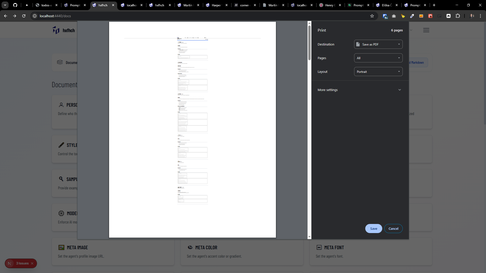

[x]

[✨🛫] Export entire book documentation

-   Export entire book documentation as one coherent markdown file
-   Its purpose is to have a full documentation of the book that can be shared, printed, used as context for AI, or converted to other formats _(for now do not implement the conversion, just do the markdown export on `/api/docs/book.md`)_
-   The Book documentation should be available on `/api/docs/book.md`
-   For inspiration look at `/apps/playground/src/app/voice-instructions-to-create-book/page.tsx` _(it contains proto-documentation generated for different purpose then generic book documentation)_
-   You are working with the `Agents Server` application `/apps/agents-server`
-   Keep in mind the DRY _(don't repeat yourself)_ principle.

---

[x]

[✨🛫] Link the `/api/docs/book.md` in `/docs`

-   In page `/docs` there is a button to print the documentation
-   It isnt working very well
-   Base the new implementation on the `/api/docs/book.md` endpoint which is working much better
-   Move the button to the top of the page, and make it visually better
-   Allow to pick between printing the page _(based on the pdf)_, downloading as pdf _(generated from markdown at `/api/docs/book.md`)_, or downloading the markdown on `/api/docs/book.md`
-   You are working with the `Agents Server` application `/apps/agents-server`
-   Keep in mind the DRY _(don't repeat yourself)_ principle.

---

[ ]

[✨🛫] Enhance pdf / printed documentation in `/docs`

-   When printing or exporting to pdf from `/docs`, improve the visual of the document
-   There are extreme unreasonable left and right margins, reduce them to reasonable size
-   It has also extremere large internal spacing between inside elements
-   Also the font is tinytiny, fix it to reasonable size
-   Content should fit better on the page
-   It shouldnt matter the browser, the pdf / printed document should look good in all major browsers
-   You are working with the `Agents Server` application `/apps/agents-server`
-   Keep in mind the DRY _(don't repeat yourself)_ principle.

---

[-]

[✨🛫] qux

-   You are working with the `Agents Server` application `/apps/agents-server`
-   Keep in mind the DRY _(don't repeat yourself)_ principle.
