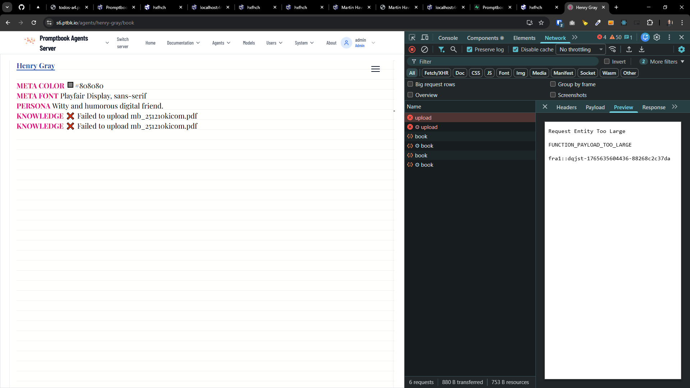

[x][ ]

[✨🧯] Increase upload limit in Agents server

-   Respect the `MAX_FILE_UPLOAD_SIZE_MB` from `Metadata` server configuration
-   Override the default upload limits of Vercel and Next.js to allow larger file uploads according to `MAX_FILE_UPLOAD_SIZE_MB`
-   You are working with the `Agents Server` application `/apps/agents-server`
-   Keep in mind the DRY _(don't repeat yourself)_ principle.



---

[ ]

[✨🧯] Upload files directly to Vercel Blob via signed upload to allow uploading bigger files

```
Browser ──▶ Vercel Blob (direct)
        └─▶ Vercel Function (only metadata)
```

-   Respect the `MAX_FILE_UPLOAD_SIZE_MB` from `Metadata` server configuration
-   You are working with the `Agents Server` application `/apps/agents-server`
-   Keep in mind the DRY _(don't repeat yourself)_ principle.

---

[-]

[✨🧯] brr

-   You are working with the `Agents Server` application `/apps/agents-server`
-   Keep in mind the DRY _(don't repeat yourself)_ principle.

---

[-]

[✨🧯] brr

-   You are working with the `Agents Server` application `/apps/agents-server`
-   Keep in mind the DRY _(don't repeat yourself)_ principle.
