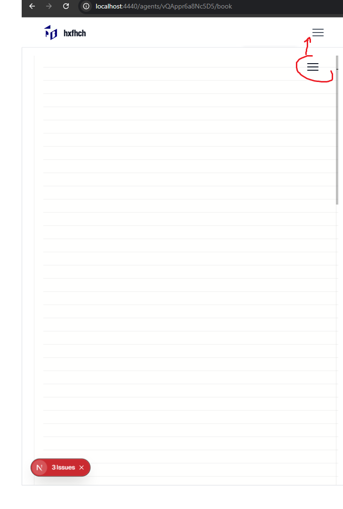

[ ]

[✨🙆] Allow to hoist the menu in the <BookEditor/> component outside to some external menu

-   In Agents Server application can happen a situation when there is a app menu and <BookEditor/> component menu neaerby
-   Automatically hoist the contents of the <BookEditor/> menu outside to the external menu if there is one
-   Create a system that allows to hoist the menu items to the topmost menu bar of the application
-   You are working with the <BookEditor/> component
-   You are working with the `Agents Server` application `/apps/agents-server`
-   Keep in mind the DRY _(don't repeat yourself)_ principle.

---

[-]

[✨🙆] qux

-   You are working with the `Agents Server` application `/apps/agents-server`
-   Keep in mind the DRY _(don't repeat yourself)_ principle.

---

[-]

[✨🙆] qux

-   You are working with the `Agents Server` application `/apps/agents-server`
-   Keep in mind the DRY _(don't repeat yourself)_ principle.

---

[-]

[✨🙆] qux

-   You are working with the `Agents Server` application `/apps/agents-server`
-   Keep in mind the DRY _(don't repeat yourself)_ principle.
