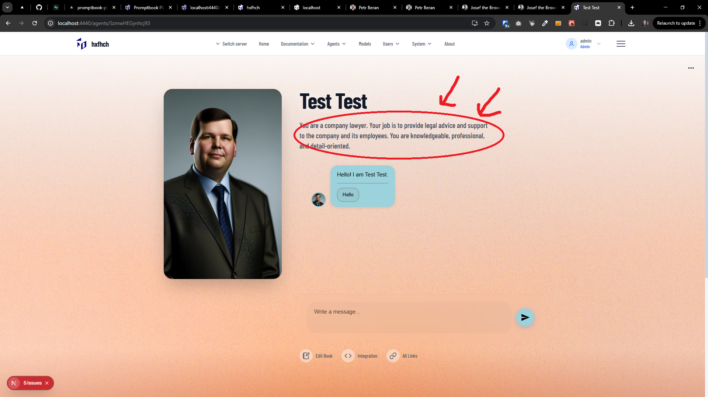

[ ]

[✨😽] @@@

-   It should work for example in the `Agents Server` application `/apps/agents-server` on the agent profile page `/agents/[agentName]`
-   Keep in mind the DRY _(don't repeat yourself)_ principle.
-   Add the changes into the `/changelog/_current-preversion.md`

**Context:**

-   **Commitments** are basic syntax elements that add specific functionalities to AI agents
    -   They are used in `agentSource`, there are commitments like `PERSONA`, `RULE`, `KNOWLEDGE`, `USE BROWSER`, `USE SEARCH ENGINE`, `META IMAGE`, etc.
    -   Commitments are in the folder `/src/commitments`
    -   Each commitment starts with a keyword, e.g., `KNOWLEDGE`, `USE BROWSER`, etc. on a begining of the line and end by new co
    -   Agent source with commitments is parsed by two functions:
        -   `parseAgentSource` which is a lightweight parser for agent source, it parses basic information and its purpose is to be quick and synchronous. The commitments there are hardcoded.
        -   `createAgentModelRequirements` which is an asynchronous function that creates model requirements it applies each commitment one by one and works asynchronously.

---

[-]

[✨😽] foo

-   Keep in mind the DRY _(don't repeat yourself)_ principle.
-   Add the changes into the `/changelog/_current-preversion.md`

---

[-]

[✨😽] foo

-   Keep in mind the DRY _(don't repeat yourself)_ principle.
-   Add the changes into the `/changelog/_current-preversion.md`

---

[-]

[✨😽] foo

-   Keep in mind the DRY _(don't repeat yourself)_ principle.
-   Add the changes into the `/changelog/_current-preversion.md`
