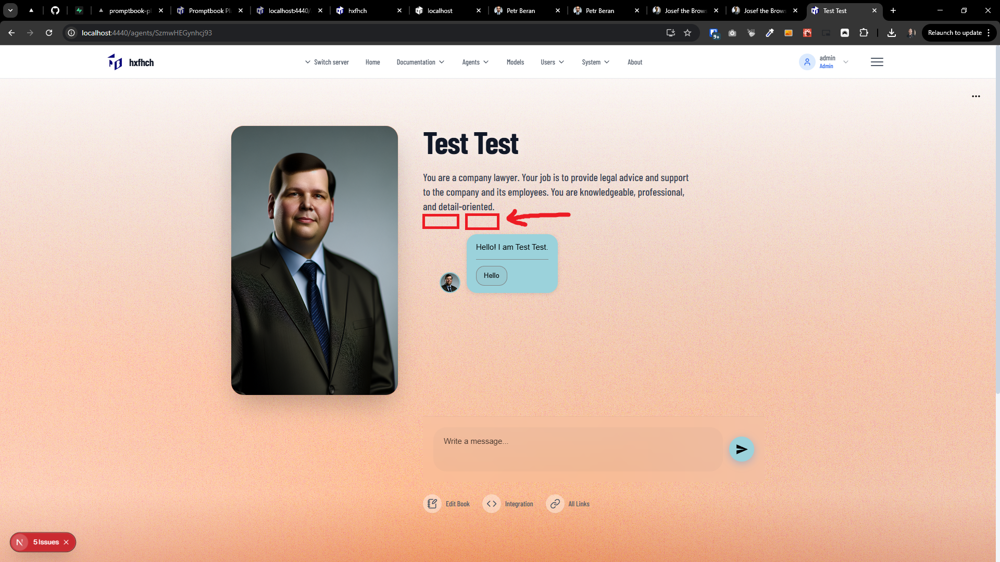
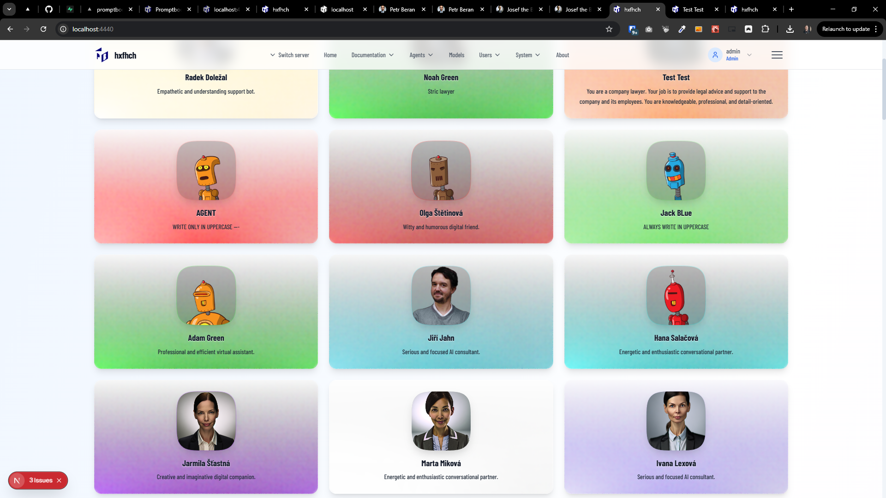

[x]

[✨🔪] Show the chips with the capabilities of the agent under his description

-   Here is an example of an agent with multiple capabilities defined in its source code:

```book
Test Test

META IMAGE https://www.pavolhejny.com/_next/image?url=%2F_next%2Fstatic%2Fmedia%2FPavol_Hejn_cave_of_ideas_with_transparent_look_through_fe3480c5-76af-45da-ac4e-5177062bcb6b.fb429479.png&w=1920&q=75
META COLOR #ce821eff
PERSONA You are a company lawyer.
Your job is to provide legal advice and support to the company and its employees.
You are knowledgeable, professional, and detail-oriented.
USE BROWSER
USE SEARCH ENGINE
KNOWLEDGE https://justice.gov/legal-resources
KNOWLEDGE https://ptbk.io/k/Skoleni-ai-aplikace-P8S6VeDmi5akdIcIttfFK7IZkDzuTt.pdf
KNOWLEDGE All Czech legal system
```

-   You should display small chips (badges) under the agent's description that indicate the capabilities of the agent based on the commitments used in its source code.
-   For example in the above agent source code, the following chips should be displayed:
    -   `USE BROWSER` -> Chip with text "Browser"
    -   `USE SEARCH ENGINE` -> Chip with text "Search Internet"
    -   `KNOWLEDGE https://justice.gov/legal-resources` -> Chip with text "justice.gov", general URL on some external knowledge
    -   `KNOWLEDGE https://ptbk.io/k/Skoleni-ai-aplikace-P8S6VeDmi5akdIcIttfFK7IZkDzuTt.pdf` -> Chip with text "Skoleni-ai-aplikace.pdf", file uploaded as knowledge to our CDN on ptbk.io
    -   `KNOWLEDGE All Czech legal system` -> Chip with text "Czech legal system", general knowledge description, take the first few words after `KNOWLEDGE` commitment only on the first line
-   If multiple `KNOWLEDGE` commitments are show all of them as separate chips
-   Allow to easyly extend this in future for other upcomming commitments
-   The chips should be visually distinct and easy to read.
-   Each chip should have a small icon representing its capability (e.g., a globe icon for "Browser", a magnifying glass for "Search Engine", and a book or document icon for "Knowledge")., use `lucide-react` icons for this purpose.
-   The chips should be displayed in the agent detail view in the `Agents Server` application
-   Also show the chips in the agent list view, so user can see the capabilities of each agent at a glance.
-   These capability information should be parsed and stored and transferred through [`AgentBasicInformation` interface](/src/book-2.0/agent-source/AgentBasicInformation.ts) under new field `capabilities: AgentCapability[]` where `AgentCapability` is new interface with fields `type: 'browser' | 'search-engine' | 'knowledge' | ...`, `label: string`, `iconName: string`
-   Commitments are basic syntax elements that add specific functionalities to AI agents
    -   They are used in `agentSource`, there are commitments like `PERSONA`, `RULE`, `KNOWLEDGE`, `USE BROWSER`, `USE SEARCH ENGINE`, `META IMAGE`, etc.
    -   Commitments are in the folder `/src/commitments`
    -   Each commitment starts with a keyword, e.g., `KNOWLEDGE`, `USE BROWSER`, etc. on a begining of the line and end by new co
    -   Agent source with commitments is parsed by two functions:
        -   `parseAgentSource` which is a lightweight parser for agent source, it parses basic information and its purpose is to be quick and synchronous. The commitments there are hardcoded.
        -   `createAgentModelRequirements` which is an asynchronous function that creates model requirements it applies each commitment one by one and works asynchronously.
    -   In this case you will be working with the `parseAgentSource` function to extract the capabilities from the agent source code and store them in the `AgentBasicInformation` interface
-   You are working with the `Agents Server` application `/apps/agents-server`
-   Keep in mind the DRY _(don't repeat yourself)_ principle.
-   Add the changes into the `/changelog/_current-preversion.md`




---

[ ]

[✨🔪] Show agent capabilities chips on homescreen

-   Agent page shows the chips with capabilities of the agent under its description
-   The homescreen `/` shows she smaller version of agent card with agent name, description and image
-   Add the same capability chips under the description on the homescreen agent cards
-   The chips should be visually distinct and easy to read.
-   You are working with the `Agents Server` application `/apps/agents-server`
-   Keep in mind the DRY _(don't repeat yourself)_ principle.
-   Add the changes into the `/changelog/_current-preversion.md`

---

[-]

[✨🔪] baz

-   ...
-   You are working with the `Agents Server` application `/apps/agents-server`
-   Keep in mind the DRY _(don't repeat yourself)_ principle.
-   Add the changes into the `/changelog/_current-preversion.md`

---

[-]

[✨🔪] baz

-   ...
-   You are working with the `Agents Server` application `/apps/agents-server`
-   Keep in mind the DRY _(don't repeat yourself)_ principle.
-   Add the changes into the `/changelog/_current-preversion.md`
