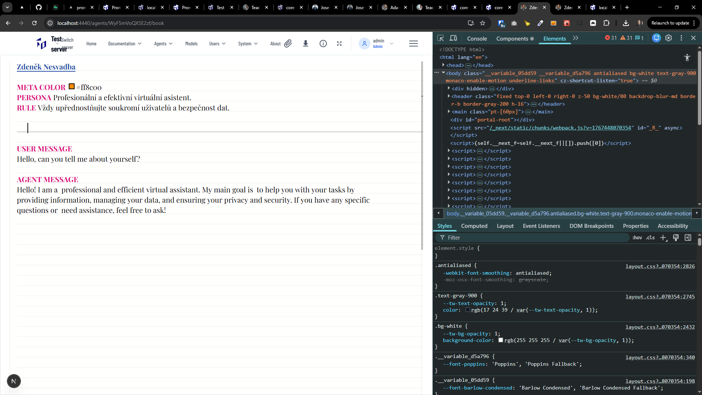

[x]

[✨🏕] When the agent server name is long or multiple words, the name is broken and wrapped. Do not wrap it. Make the design better.

-   You are working with the `Agents Server` application `/apps/agents-server`
-   Keep in mind the DRY _(don't repeat yourself)_ principle.
-   Add the changes into the `/changelog/_current-preversion.md`

---

[-]

[✨🏕] brr

-   ...
-   You are working with the `Agents Server` application `/apps/agents-server`
-   Keep in mind the DRY _(don't repeat yourself)_ principle.
-   Add the changes into the `/changelog/_current-preversion.md`

---

[-]

[✨🏕] brr

-   ...
-   You are working with the `Agents Server` application `/apps/agents-server`
-   Keep in mind the DRY _(don't repeat yourself)_ principle.
-   Add the changes into the `/changelog/_current-preversion.md`

---

[-]

[✨🏕] brr

-   ...
-   You are working with the `Agents Server` application `/apps/agents-server`
-   Keep in mind the DRY _(don't repeat yourself)_ principle.
-   Add the changes into the `/changelog/_current-preversion.md`
