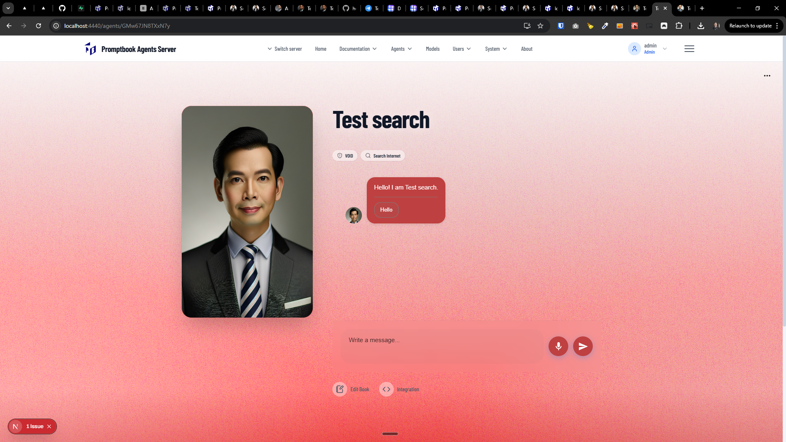
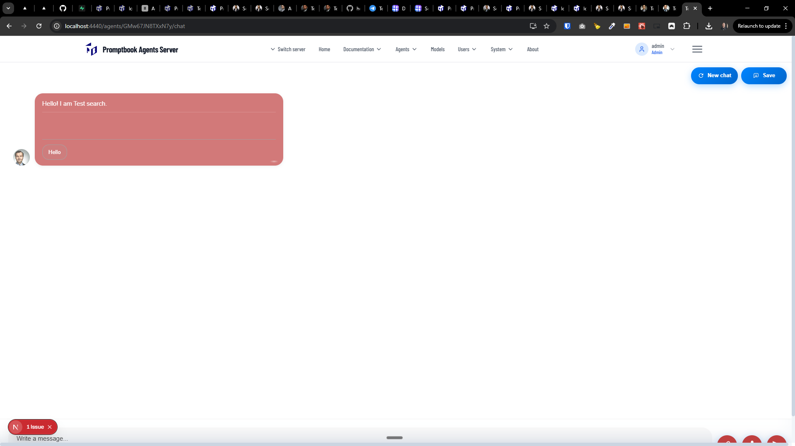

[ ]

[✨🌑] Inherit the meta properties into the agent profile.

-   For example, when the parent agent has `META COLOR #ff0000` and Current agent is from that agent but hasn't set the meta color. The color of that agent in profile should be red.
-   For example in `http://localhost:4440/agents/EqvCgWPytPdfwW/api/profile`
-   You are working with the `Agents Server` application `/apps/agents-server`
-   Keep in mind the DRY _(don't repeat yourself)_ principle.
-   Add the changes into the `/changelog/_current-preversion.md`

---

[x]

[✨🌑] Enhance the visuals of the chat page of the agent.

-   Use the same grained background on [chat page](http://localhost:4440/agents/GMw67JN8TXxN7y/chat) as on the [agent page](http://localhost:4440/agents/GMw67JN8TXxN7y).
-   The messages of the agent should have a more saturated color _(but not too much)_
-   The entire page should take exactly 100 viewport height, not the full height plus something more. It's extremely frustrating that you need to scroll to see input and controls of the chat.
-   For example page http://localhost:4440/agents/EqvCgWPytPdfwW/chat
-   You are working with the `Agents Server` application `/apps/agents-server`
-   Keep in mind the DRY _(don't repeat yourself)_ principle.
-   Add the changes into the `/changelog/_current-preversion.md`

---

[-]

[✨🌑] bar

-   ...
-   You are working with the `Agents Server` application `/apps/agents-server`
-   Keep in mind the DRY _(don't repeat yourself)_ principle.
-   Add the changes into the `/changelog/_current-preversion.md`

---

[-]

[✨🌑] bar

-   ...
-   You are working with the `Agents Server` application `/apps/agents-server`
-   Keep in mind the DRY _(don't repeat yourself)_ principle.
-   Add the changes into the `/changelog/_current-preversion.md`
