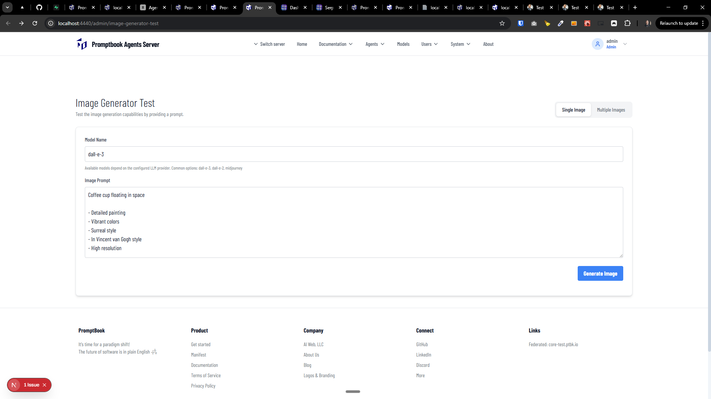

[ ]

[✨🥄] Allow to add additional model requirements like image size in the [Image Generator Test](http://localhost:4440/admin/image-generator-test).

-   Now you can pick only the model and image prompt. Allow to add another parameters for image generation.
-   Look how `LlmExecutionTools` are handling `modelRequirements`
-   It should work for both Single image generation and for the Multiple images generation.
-   When selecting Multiple images, you are putting multiple image prompts but just one set of model requirements (and model) for all images.
-   You are working with the `Agents Server` application `/apps/agents-server`
-   Keep in mind the DRY _(don't repeat yourself)_ principle.
-   Add the changes into the `/changelog/_current-preversion.md`

---

[-]

[✨🥄] qux

-   ...
-   You are working with the `Agents Server` application `/apps/agents-server`
-   Keep in mind the DRY _(don't repeat yourself)_ principle.
-   Add the changes into the `/changelog/_current-preversion.md`

---

[-]

[✨🥄] qux

-   ...
-   You are working with the `Agents Server` application `/apps/agents-server`
-   Keep in mind the DRY _(don't repeat yourself)_ principle.
-   Add the changes into the `/changelog/_current-preversion.md`

---

[-]

[✨🥄] qux

-   ...
-   You are working with the `Agents Server` application `/apps/agents-server`
-   Keep in mind the DRY _(don't repeat yourself)_ principle.
-   Add the changes into the `/changelog/_current-preversion.md`
