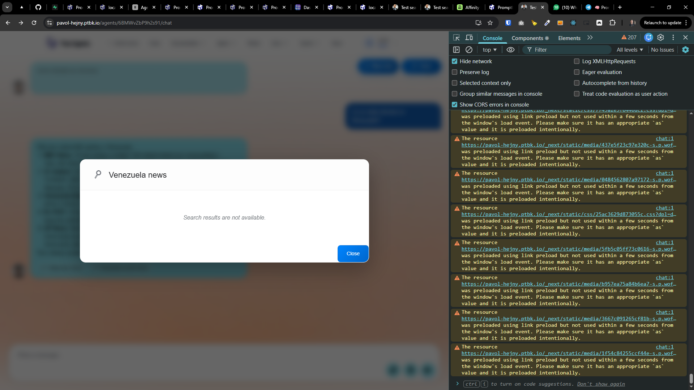
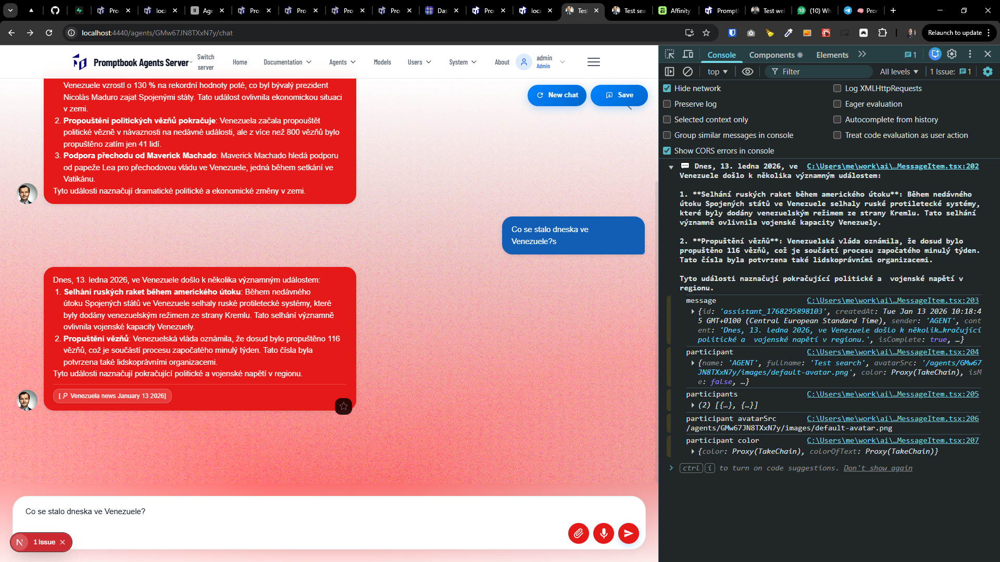
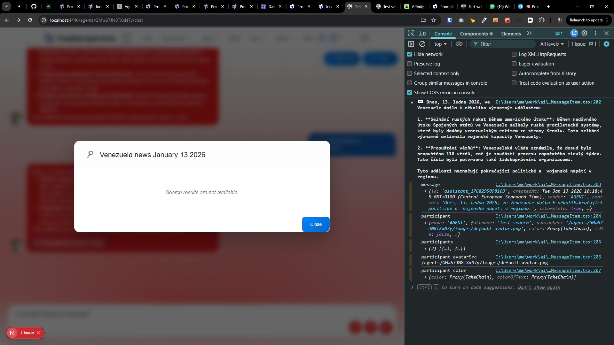

[x] _<- TODO: !!!!! Not working even via `claude-sonnet-4.5`, Maybe be reverted and deeply inspected_

[✨🥉] When the agent searches for the information, it searches correctly, but when you are looking into the search chip, there is shown "Search results are not available.", fix it

-   You are working with the `Agents Server` application `/apps/agents-server`
-   Keep in mind the DRY _(don't repeat yourself)_ principle.
-   Add the changes into the `/changelog/_current-preversion.md`

---

[ ]

[✨🥉] Fix popup from `USE SEARCH ENGINE` chiplet

-   When the agent searches for the information, it searches correctly, but when you are looking into the search chip, there is shown "Search results are not available", fix it
-   It should show the search results in a user-friendly way
-   This is the search that already happened, you are just showing the results from the tool call which was made and this is just a "log" of what happened
-   You are working with the `Agents Server` application `/apps/agents-server`
-   Keep in mind the DRY _(don't repeat yourself)_ principle.
-   Add the changes into the `/changelog/_current-preversion.md`

---

[-]

[✨🥉] baz

-   ...
-   You are working with the `Agents Server` application `/apps/agents-server`
-   Keep in mind the DRY _(don't repeat yourself)_ principle.
-   Add the changes into the `/changelog/_current-preversion.md`
