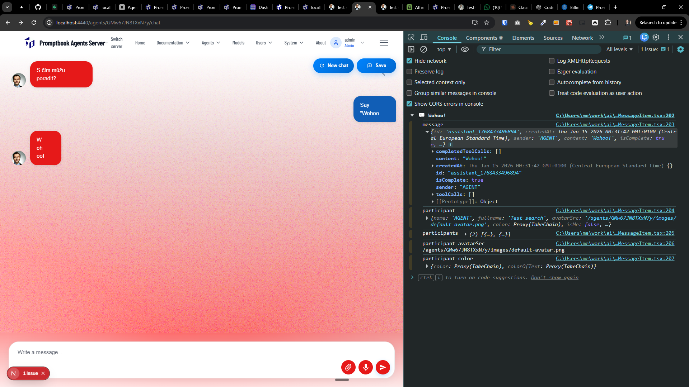

[ ]

[✨👮] Fix message content from the agent when tool call is used

-   When the agent calls a tool _(like search or time)_, the message shown in the chat is empty.
-   Just a chiplet of the tool call is shown, thats correct, but the message content should also contain some text from the agent.
-   Same problem is not happening when the agent just responds with only text.
-   Look at attached screenshots for reference
-   You are working with the `Agents Server` application `/apps/agents-server`
-   You are working with the [<Chat/>](./src/book-components/Chat/Chat/Chat.tsx) component.
-   Keep in mind the DRY _(don't repeat yourself)_ principle.
-   Add the changes into the [changelog](./changelog/_current-preversion.md)

---

[-]

[✨👮] bar

-   ...
-   You are working with the `Agents Server` application `/apps/agents-server`
-   Keep in mind the DRY _(don't repeat yourself)_ principle.
-   Add the changes into the `/changelog/_current-preversion.md`

---

[-]

[✨👮] bar

-   ...
-   You are working with the `Agents Server` application `/apps/agents-server`
-   Keep in mind the DRY _(don't repeat yourself)_ principle.
-   Add the changes into the `/changelog/_current-preversion.md`

---

[-]

[✨👮] bar

-   ...
-   You are working with the `Agents Server` application `/apps/agents-server`
-   Keep in mind the DRY _(don't repeat yourself)_ principle.
-   Add the changes into the `/changelog/_current-preversion.md`
