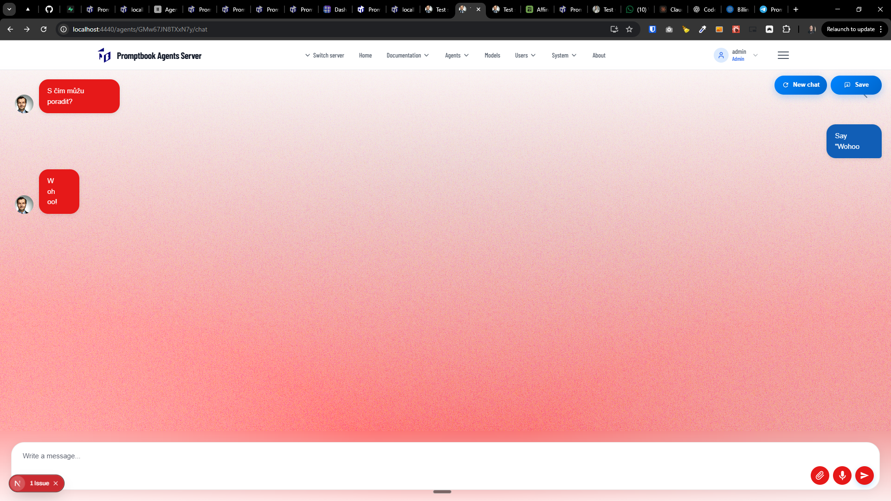
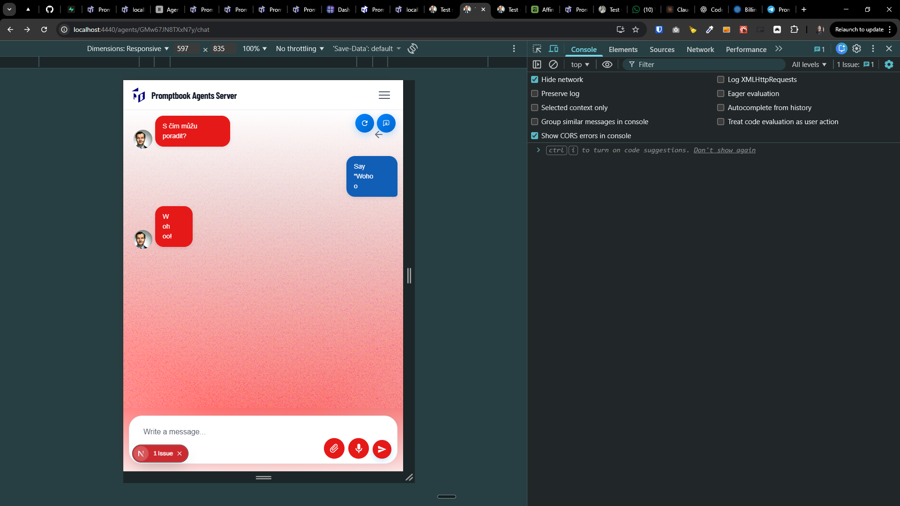

[ ]

[✨💼] Fix the chat design

-   Chat page is for example http://localhost:4440/agents/GMw67JN8TXxN7y/chat
-   Ensure some minimal width for the chat message
-   Ensure the chat looks great on both desktop and mobile devices
-   You are working with the `Agents Server` application `/apps/agents-server`
-   You are working with the [<Chat/>](./src/book-components/Chat/Chat/Chat.tsx) component.

---

[!!!] !!!

[✨💼] Fix the chat design on the Agent Server.

-   Chat page is for example http://localhost:4440/agents/GMw67JN8TXxN7y/chat
-   Use the hoisting mechanism from [book page](http://localhost:4440/agents/GMw67JN8TXxN7y/book) to hoist buttons in the menu of the page
-   Ensure some minimal width for the chat message
-   Look at attached screenshots for reference
-   Ensure the chat looks great on both desktop and mobile devices
-   You are working with the `Agents Server` application `/apps/agents-server`
-   You are working with the [<Chat/>](./src/book-components/Chat/Chat/Chat.tsx) component.
-   Keep in mind the DRY _(don't repeat yourself)_ principle.
-   Add the changes into the [changelog](./changelog/_current-preversion.md)

---

[!!!!]

[✨💼] Hoist the back button in agent pages

-   ...
-   You are working with the `Agents Server` application `/apps/agents-server`
-   Keep in mind the DRY _(don't repeat yourself)_ principle.
-   Add the changes into the `/changelog/_current-preversion.md`

---

[!!!!]

[✨💼] Fix the save and settings popup

-   ...
-   You are working with the `Agents Server` application `/apps/agents-server`
-   Keep in mind the DRY _(don't repeat yourself)_ principle.
-   Add the changes into the `/changelog/_current-preversion.md`

---

[-]

[✨💼] baz

-   ...
-   You are working with the `Agents Server` application `/apps/agents-server`
-   Keep in mind the DRY _(don't repeat yourself)_ principle.
-   Add the changes into the `/changelog/_current-preversion.md`
