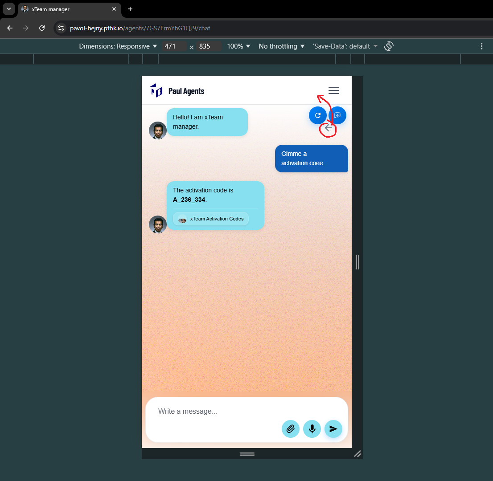
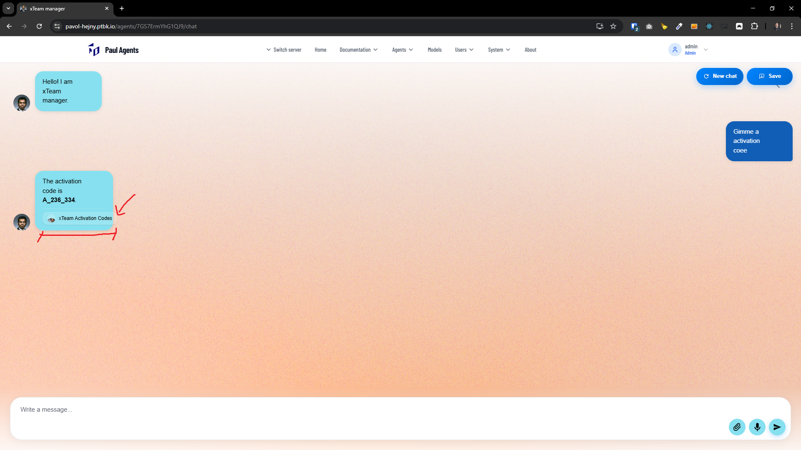
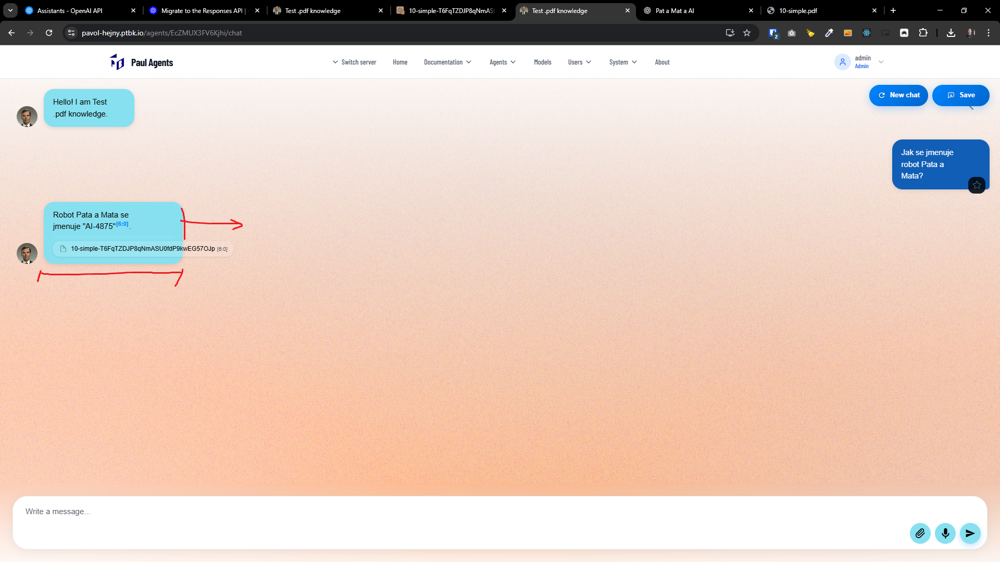
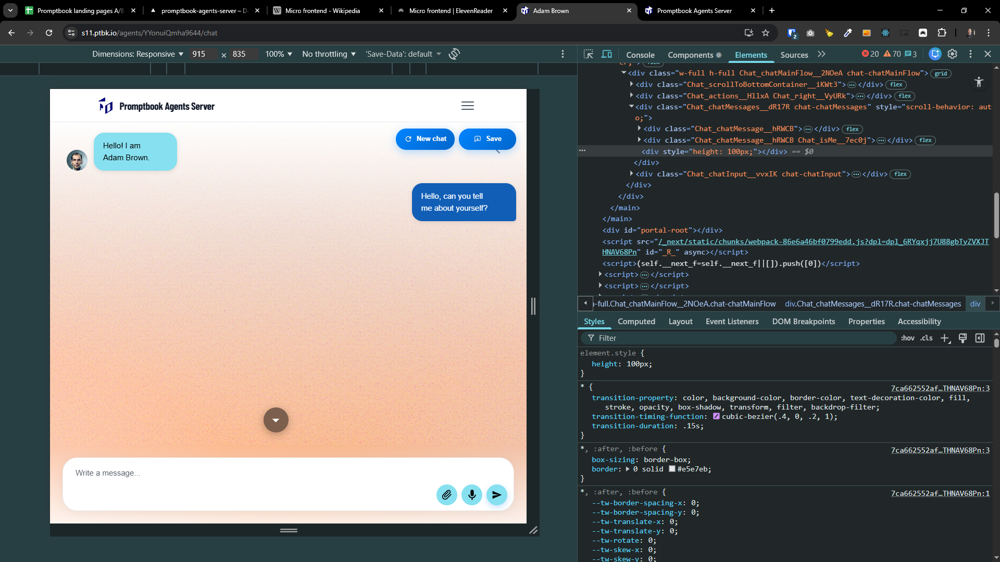
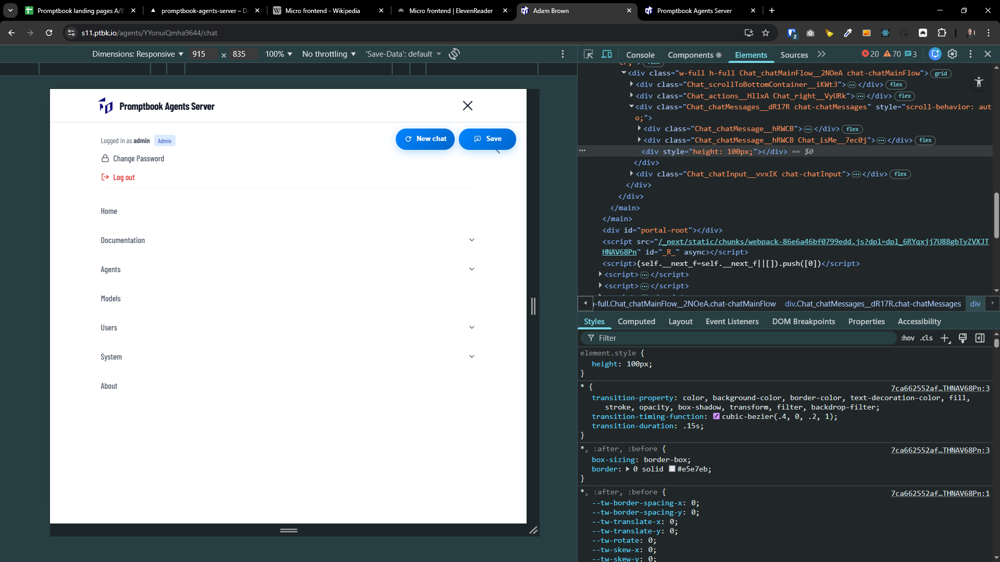

[x] ~$0.00

[✨💼] Fix the chat design

-   Chat page is for example http://localhost:4440/agents/GMw67JN8TXxN7y/chat
-   Ensure some minimal width for the chat message
-   Ensure the chat looks great on both desktop and mobile devices
-   You are working with the `Agents Server` application `/apps/agents-server`
-   You are working with the [<Chat/>](./src/book-components/Chat/Chat/Chat.tsx) component.

---

[.] _<- Note: Not done here but in commits bellow:_

[✨💼] Fix the chat design on the Agent Server.

-   Chat page is for example http://localhost:4440/agents/GMw67JN8TXxN7y/chat
-   Use the hoisting mechanism from [book page](http://localhost:4440/agents/GMw67JN8TXxN7y/book) to hoist buttons in the menu of the page
-   Ensure some minimal width for the chat message
-   Look at attached screenshots for reference
-   Ensure the chat looks great on both desktop and mobile devices
-   You are working with the `Agents Server` application `/apps/agents-server`
-   You are working with the [<Chat/>](./src/book-components/Chat/Chat/Chat.tsx) component.
-   Keep in mind the DRY _(don't repeat yourself)_ principle.
-   Add the changes into the [changelog](./changelog/_current-preversion.md)

---

[x] ~$0.00

[✨💼] Hoist the back button in agent pages

-   Move the back button to the top menu bar, similar to the book page.
-   Use already existing hoisting mechanism from the book page.
-   You are working with the `Agents Server` application `/apps/agents-server`
-   Keep in mind the DRY _(don't repeat yourself)_ principle.

---

[x] ~$0.00

[✨💼] Fix the messages width

-   Ensure the messages have proper width on both desktop and mobile devices.
-   This is especially relevant when the message has source chips.
-   You are working with the `Agents Server` application `/apps/agents-server`
-   Keep in mind the DRY _(don't repeat yourself)_ principle.

---

[ ] !!!

[✨💼] Fix order of buttons in chat page

-   Menu should be above the buttons ("New chat", "Save", etc.)
-   You are working with the `Agents Server` application `/apps/agents-server`
-   Keep in mind the DRY _(don't repeat yourself)_ principle.

---

[-]

[✨💼] baz

-   ...
-   You are working with the `Agents Server` application `/apps/agents-server`
-   Keep in mind the DRY _(don't repeat yourself)_ principle.
-   Add the changes into the `/changelog/_current-preversion.md`

---

[-]

[✨💼] baz

-   ...
-   You are working with the `Agents Server` application `/apps/agents-server`
-   Keep in mind the DRY _(don't repeat yourself)_ principle.
-   Add the changes into the `/changelog/_current-preversion.md`

