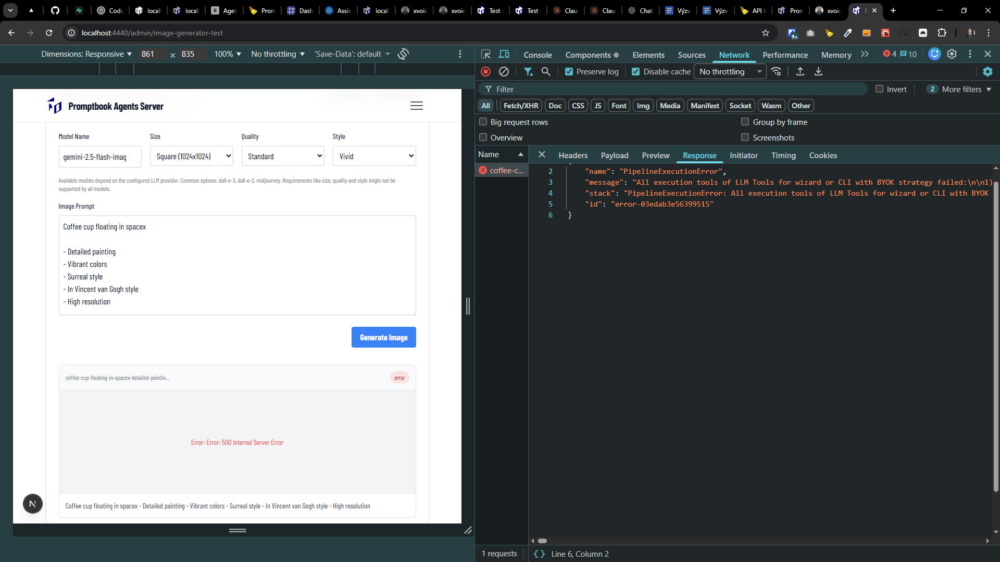

[ ]

[✨🆎] qux @@@

-   ...
-   You are working with the `Agents Server` application `/apps/agents-server`
-   Keep in mind the DRY _(don't repeat yourself)_ principle.
-   Add the changes into the `/changelog/_current-preversion.md`

```json
{
    "name": "PipelineExecutionError",
    "message": "All execution tools of LLM Tools for wizard or CLI with BYOK strategy failed:\n\n1) **Google (through Vercel)** thrown **TypeError:** googleGeminiVercelProvider.image is not a function\n2) **OpenAI** thrown **Error:** 400 Invalid value: 'gemini-2.5-flash-image'. Supported values are: 'gpt-image-1', 'gpt-image-1-mini', 'gpt-image-1.5', 'chatgpt-image-latest', 'dall-e-2', and 'dall-e-3'.",
    "stack": "PipelineExecutionError: All execution tools of LLM Tools for wizard or CLI with BYOK strategy failed:\n\n1) **Google (through Vercel)** thrown **TypeError:** googleGeminiVercelProvider.image is not a function\n2) **OpenAI** thrown **Error:** 400 Invalid value: 'gemini-2.5-flash-image'. Supported values are: 'gpt-image-1', 'gpt-image-1-mini', 'gpt-image-1.5', 'chatgpt-image-latest', 'dall-e-2', and 'dall-e-3'.\n    at MultipleLlmExecutionTools.callCommonModel (webpack-internal:///(rsc)/../../src/llm-providers/_multiple/MultipleLlmExecutionTools.ts:135:19)\n    at async Proxy.eval (webpack-internal:///(rsc)/../../src/llm-providers/_common/utils/count-total-usage/countUsage.ts:87:42)\n    at async callCommonModel (webpack-internal:///(rsc)/../../src/llm-providers/_common/utils/cache/cacheLlmTools.ts:90:32)\n    at async callCommonModel (webpack-internal:///(rsc)/../../src/llm-providers/_common/utils/cache/cacheLlmTools.ts:90:32)\n    at async GET (webpack-internal:///(rsc)/./src/app/api/images/[filename]/route.ts:64:29)\n    at async AppRouteRouteModule.do (C:\\Users\\me\\work\\ai\\promptbook\\node_modules\\next\\dist\\compiled\\next-server\\app-route.runtime.dev.js:5:38782)\n    at async AppRouteRouteModule.handle (C:\\Users\\me\\work\\ai\\promptbook\\node_modules\\next\\dist\\compiled\\next-server\\app-route.runtime.dev.js:5:45984)\n    at async responseGenerator (webpack-internal:///(rsc)/../../node_modules/next/dist/build/webpack/loaders/next-app-loader/index.js?name=app%2Fapi%2Fimages%2F%5Bfilename%5D%2Froute&page=%2Fapi%2Fimages%2F%5Bfilename%5D%2Froute&appPaths=&pagePath=private-next-app-dir%2Fapi%2Fimages%2F%5Bfilename%5D%2Froute.ts&appDir=C%3A%5CUsers%5Cme%5Cwork%5Cai%5Cpromptbook%5Capps%5Cagents-server%5Csrc%5Capp&pageExtensions=tsx&pageExtensions=ts&pageExtensions=jsx&pageExtensions=js&rootDir=C%3A%5CUsers%5Cme%5Cwork%5Cai%5Cpromptbook%5Capps%5Cagents-server&isDev=true&tsconfigPath=tsconfig.json&basePath=&assetPrefix=&nextConfigOutput=&preferredRegion=&middlewareConfig=e30%3D&isGlobalNotFoundEnabled=!:203:38)\n    at async AppRouteRouteModule.handleResponse (C:\\Users\\me\\work\\ai\\promptbook\\node_modules\\next\\dist\\compiled\\next-server\\app-route.runtime.dev.js:1:183692)\n    at async handleResponse (webpack-internal:///(rsc)/../../node_modules/next/dist/build/webpack/loaders/next-app-loader/index.js?name=app%2Fapi%2Fimages%2F%5Bfilename%5D%2Froute&page=%2Fapi%2Fimages%2F%5Bfilename%5D%2Froute&appPaths=&pagePath=private-next-app-dir%2Fapi%2Fimages%2F%5Bfilename%5D%2Froute.ts&appDir=C%3A%5CUsers%5Cme%5Cwork%5Cai%5Cpromptbook%5Capps%5Cagents-server%5Csrc%5Capp&pageExtensions=tsx&pageExtensions=ts&pageExtensions=jsx&pageExtensions=js&rootDir=C%3A%5CUsers%5Cme%5Cwork%5Cai%5Cpromptbook%5Capps%5Cagents-server&isDev=true&tsconfigPath=tsconfig.json&basePath=&assetPrefix=&nextConfigOutput=&preferredRegion=&middlewareConfig=e30%3D&isGlobalNotFoundEnabled=!:265:32)\n    at async handler (webpack-internal:///(rsc)/../../node_modules/next/dist/build/webpack/loaders/next-app-loader/index.js?name=app%2Fapi%2Fimages%2F%5Bfilename%5D%2Froute&page=%2Fapi%2Fimages%2F%5Bfilename%5D%2Froute&appPaths=&pagePath=private-next-app-dir%2Fapi%2Fimages%2F%5Bfilename%5D%2Froute.ts&appDir=C%3A%5CUsers%5Cme%5Cwork%5Cai%5Cpromptbook%5Capps%5Cagents-server%5Csrc%5Capp&pageExtensions=tsx&pageExtensions=ts&pageExtensions=jsx&pageExtensions=js&rootDir=C%3A%5CUsers%5Cme%5Cwork%5Cai%5Cpromptbook%5Capps%5Cagents-server&isDev=true&tsconfigPath=tsconfig.json&basePath=&assetPrefix=&nextConfigOutput=&preferredRegion=&middlewareConfig=e30%3D&isGlobalNotFoundEnabled=!:317:13)\n    at async doRender (C:\\Users\\me\\work\\ai\\promptbook\\node_modules\\next\\dist\\server\\base-server.js:1592:34)\n    at async DevServer.renderToResponseWithComponentsImpl (C:\\Users\\me\\work\\ai\\promptbook\\node_modules\\next\\dist\\server\\base-server.js:1934:13)\n    at async DevServer.renderPageComponent (C:\\Users\\me\\work\\ai\\promptbook\\node_modules\\next\\dist\\server\\base-server.js:2400:24)\n    at async DevServer.renderToResponseImpl (C:\\Users\\me\\work\\ai\\promptbook\\node_modules\\next\\dist\\server\\base-server.js:2440:32)\n    at async DevServer.pipeImpl (C:\\Users\\me\\work\\ai\\promptbook\\node_modules\\next\\dist\\server\\base-server.js:1035:25)\n    at async NextNodeServer.handleCatchallRenderRequest (C:\\Users\\me\\work\\ai\\promptbook\\node_modules\\next\\dist\\server\\next-server.js:393:17)\n    at async DevServer.handleRequestImpl (C:\\Users\\me\\work\\ai\\promptbook\\node_modules\\next\\dist\\server\\base-server.js:925:17)\n    at async C:\\Users\\me\\work\\ai\\promptbook\\node_modules\\next\\dist\\server\\dev\\next-dev-server.js:398:20\n    at async Span.traceAsyncFn (C:\\Users\\me\\work\\ai\\promptbook\\node_modules\\next\\dist\\trace\\trace.js:157:20)\n    at async DevServer.handleRequest (C:\\Users\\me\\work\\ai\\promptbook\\node_modules\\next\\dist\\server\\dev\\next-dev-server.js:394:24)\n    at async invokeRender (C:\\Users\\me\\work\\ai\\promptbook\\node_modules\\next\\dist\\server\\lib\\router-server.js:239:21)\n    at async handleRequest (C:\\Users\\me\\work\\ai\\promptbook\\node_modules\\next\\dist\\server\\lib\\router-server.js:436:24)\n    at async requestHandlerImpl (C:\\Users\\me\\work\\ai\\promptbook\\node_modules\\next\\dist\\server\\lib\\router-server.js:464:13)\n    at async Server.requestListener (C:\\Users\\me\\work\\ai\\promptbook\\node_modules\\next\\dist\\server\\lib\\start-server.js:218:13)",
    "id": "error-03edab3e56399515"
}
```



---

[-]

[✨🆎] qux

-   ...
-   You are working with the `Agents Server` application `/apps/agents-server`
-   Keep in mind the DRY _(don't repeat yourself)_ principle.
-   Add the changes into the `/changelog/_current-preversion.md`

---

[-]

[✨🆎] qux

-   ...
-   You are working with the `Agents Server` application `/apps/agents-server`
-   Keep in mind the DRY _(don't repeat yourself)_ principle.
-   Add the changes into the `/changelog/_current-preversion.md`

---

[-]

[✨🆎] qux

-   ...
-   You are working with the `Agents Server` application `/apps/agents-server`
-   Keep in mind the DRY _(don't repeat yourself)_ principle.
-   Add the changes into the `/changelog/_current-preversion.md`
