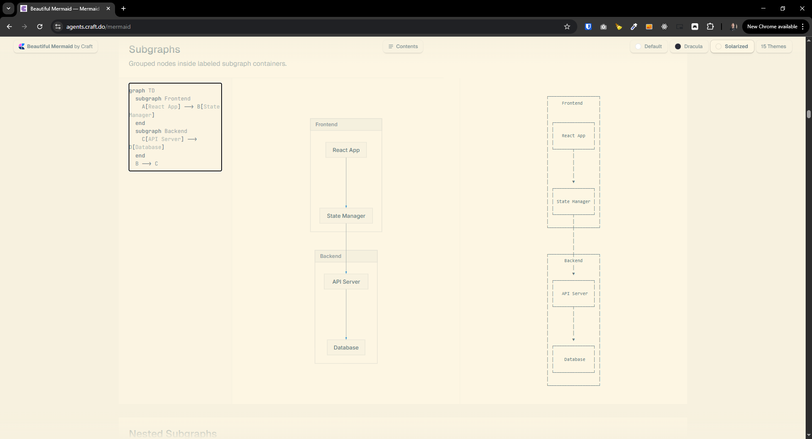

[x] ~$0.00

[✨♿️] Agents graph on home page should be redesigned using d3.js library

-   Keep in mind UI and UX best practices for graph visualization.
-   Implement interactive features such as zooming, panning, and node highlighting on hover.
-   Ensure the graph is responsive and works well on different screen sizes.
-   Keep in mind that all features of the current graph should be preserved, such as
    -   Displaying agent image with name
    -   Working both with default and explicit agent images
    -   Working with current agent server and federated servers
    -   Grouping agents by server
    -   Displaying relationships between agents
    -   Filtering
    -   All other existing features
-   Cleanup the unused code related to the old graph implementation.
-   You are working with the `Agents Server` application `/apps/agents-server`
-   Keep in mind the DRY _(don't repeat yourself)_ principle.
-   Add the changes into the `/changelog/_current-preversion.md`

---

[x] ~$1.35

[✨♿️] Agents graph on home page should be redesigned using [beautiful-mermaid](https://github.com/lukilabs/beautiful-mermaid?tab=readme-ov-file) library

-   Keep in mind UI and UX best practices for graph visualization.
-   Ensure the graph is responsive and works well on different screen sizes.
-   Keep in mind that all features of the current graph should be preserved, such as
    -   Displaying agent image with name
    -   Working both with default and explicit agent images
    -   Working with current agent server and federated servers
    -   Grouping agents by server
    -   Displaying relationships between agents
    -   Filtering
    -   All other existing features
-   Cleanup the unused code related to the old graph implementation.
-   In Mermaid you maybe wont be able to preserve interactive features such as zooming, panning, and node highlighting on hover, if so, do not worry about it.
-   You are working with the `Agents Server` application `/apps/agents-server`
-   Keep in mind the DRY _(don't repeat yourself)_ principle.
-   Add the changes into the `/changelog/_current-preversion.md`

---

[x] ~$0.84

[✨♿️] Agents graph on home page should look like graph showing relationships between the agents.

It shouldn't look like something for the programmers. It should look more like the social graph visualization.
Try to replicate this as close as possible in the beautiful Mermaid.

---

[x] ~$0.51

[✨♿️] Agents graph on home page should have better filtering

-   When you have selected/filtered some agent _(for example https://s6.ptbk.io/?view=graph&selectedServer=https%3A%2F%2Fs6.ptbk.io&selectedAgent=pasu-v2)_, show also the agents which are connected to or from this agent.
-   This should work for both current server and federated servers.

---

[x] ~$1.10

[✨♿️] Agents graph on home page should be visually improved.

-   Use Subgraphs Grouped nodes inside labeled subgraph containers.
-   Use different shapes for different types of nodes
-   Use colors to differentiate between various categories or statuses of agents.
-   Ensure that the layout is clean and uncluttered, with sufficient spacing between nodes and edges.

---

[ ]

[✨♿️] Agents graph on home page should show agent as nice, visually appealing chips.

-   The agent chip should contain
    -   Agent image (either custom or default)
    -   Agent name
    -   Be colored in the color of the agent
-   When clicking on the agent chip, it should lead to the agent profile _(for example `http://localhost:4440/agents/7ZEA1J4MuyeFLG`)_
-   Be aware of great UI and UX.
-   Reuse the existing components.

---

[ ]

[✨♿️] Agents graph on home page should be downloadable

-   Add buttons for downloading the graph as PNG and SVG or ASCII
-   For the download button, inspire how the chat can be downloaded, or use the design patterns and components.
-   Ensure the downloaded images maintain high quality and clarity.
-   Use `beautiful-mermaid` capabilities for exporting the graph.

---

[ ]

[✨♿️] Agents graph on home page should be redesigned using vis.js / vis-network library

(@@@ Which graph technology to use?)

-   Keep in mind UI and UX best practices for graph visualization.
-   Implement interactive features such as zooming, panning, and node highlighting on hover.
-   Ensure the graph is responsive and works well on different screen sizes.
-   Keep in mind that all features of the current graph should be preserved, such as
    -   Displaying agent image with name
    -   Working both with default and explicit agent images
    -   Working with current agent server and federated servers
    -   Grouping agents by server
    -   Displaying relationships between agents
    -   Filtering
    -   All other existing features
-   Cleanup the unused code related to the old graph implementation.
-   You are working with the `Agents Server` application `/apps/agents-server`
-   Keep in mind the DRY _(don't repeat yourself)_ principle.
-   Add the changes into the `/changelog/_current-preversion.md`

---

[-]

[✨♿️] foo

-   ...
-   You are working with the `Agents Server` application `/apps/agents-server`
-   Keep in mind the DRY _(don't repeat yourself)_ principle.
-   Add the changes into the `/changelog/_current-preversion.md`

---

[-]

[✨♿️] foo

-   ...
-   You are working with the `Agents Server` application `/apps/agents-server`
-   Keep in mind the DRY _(don't repeat yourself)_ principle.
-   Add the changes into the `/changelog/_current-preversion.md`

