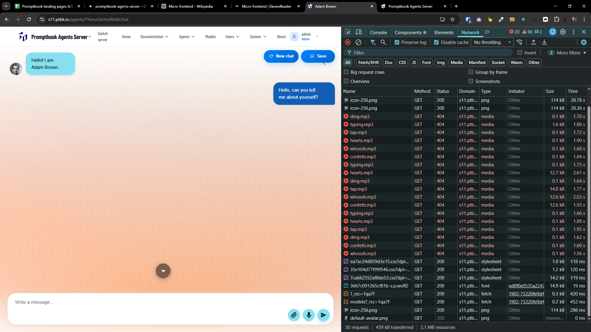

[x] !!!

[✨❓] Fix the sounds on agent server.

-   Agent server has a sound system which is using sounds, but the files aren't there.
-   Look for some great sounding sounds for the chat and add the files to the public directory of the agents server.
-   You are working with the `Agents Server` application `/apps/agents-server`

---

[-]

[✨❓] foo

-   ...
-   You are working with the `Agents Server` application `/apps/agents-server`
-   Keep in mind the DRY _(don't repeat yourself)_ principle.
-   Add the changes into the `/changelog/_current-preversion.md`

---

[-]

[✨❓] foo

-   ...
-   You are working with the `Agents Server` application `/apps/agents-server`
-   Keep in mind the DRY _(don't repeat yourself)_ principle.
-   Add the changes into the `/changelog/_current-preversion.md`

---

[-]

[✨❓] foo

-   ...
-   You are working with the `Agents Server` application `/apps/agents-server`
-   Keep in mind the DRY _(don't repeat yourself)_ principle.
-   Add the changes into the `/changelog/_current-preversion.md`
