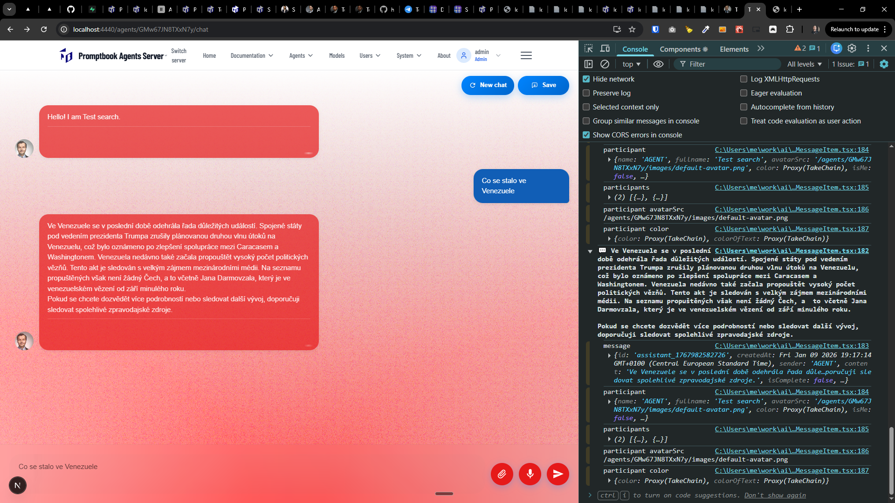

[x][x]

[✨🗾] Make `USE SEARCH` commitment work

-   When using the `USE SEARCH` commitment in the agent source, the AI agent Should have full definition of the search function in his tools.
-   This should create tool into model requirements with the ability to perform web search using the defined search engine.
-   For the search engines use `SerpSearchEngine`
-   There is already a working [playground for the search](http://localhost:4440/admin/search-engine-test).
-   It should work with the `Agents Server` application `/apps/agents-server`
-   **For the reference, look how `USE TIME` commitment is implemented, implement/review entire vertical from commitment to agents server .**
-   Keep in mind the DRY _(don't repeat yourself)_ principle.
-   Add the changes into the `/changelog/_current-preversion.md`

---

[x]

[✨🗾] When using search, show the sources.

-   Show some good-looking chiplet with the information that search was used and also link to the search.
-   For example "[🔎 Venezuela]"
-   When clicked on the searching chiplet, it should open the pop-up modal with all the information of the tool call.
-   The extra information About the function call which will be in the pop-up modal should be contained in the `ChatMessage` object.
-   How models are implemented across the agent server, keeping my DRY principle.
-   In future, this will be used for all sorts of asking for the external information.
-   You are working with the `Agents Server` application `/apps/agents-server`
-   Keep in mind the DRY _(don't repeat yourself)_ principle.
-   Try to reuse existing components where possible, for example there are existing chiplet when the tool call is in progress for showing tool calls.
-   Add the changes into the `/changelog/_current-preversion.md`

---

[x]

[✨🗾] Allow AI to leverage all the options and possibilities of SERP search engine.

-   The common interface, the `SearchEngine`, just allows to pass raw text search query into the search engine.
-   But the SERP search engine itself can handle much more like locationLocalization, pagination, advanced filters, underlying search engine, advanced parameters, geographic locations, and much, much, much more.
-   All of these options should be available in the tool call for the AI agent.
-   Update the enter vertical from the `SearchEngine` object to the [testing page](http://localhost:4440/admin/search-engine-test) to the AI agent tool calling and `USE SEARCH` commitment.
-   You are working with [SerpSearchEngine](/src/search-engines/serp/SerpSearchEngine.ts)
-   It should work with the `Agents Server` application `/apps/agents-server`
-   Show full search input and output when clicking on the search chiplet in the chat, look how search input and output is shown in the [testing page](http://localhost:4440/admin/search-engine-test).
-   Keep in mind the DRY _(don't repeat yourself)_ principle.
-   Add the changes into the `/changelog/_current-preversion.md`

---

[ ]

[✨🗾] Sources chips should work better

-   When external tools are used for example via commitment `USE SEARCH ENGINE`, there is shown a source chiplet under the agent response message in the chat.
-   Ship looks extremely technical, like "[web_search]", which is not user-friendly.
-   The chiplet should look more user-friendly, for example "[🔎 Venezuela]"
-   When clicking on the chiplet, it opens a modal with detailed information about the tool call, including the arguments passed to the tool and the results returned by the tool.
-   The detailed information in the modal should be also formatted in a user-friendly way, making it easy to understand what the tool call entailed.
-   You are working with the `Agents Server` application `/apps/agents-server`
-   Keep in mind the DRY _(don't repeat yourself)_ principle.
-   Add the changes into the `/changelog/_current-preversion.md`

---

[-]

[✨🗾] bar

-   Keep in mind the DRY _(don't repeat yourself)_ principle.
-   Add the changes into the `/changelog/_current-preversion.md`
