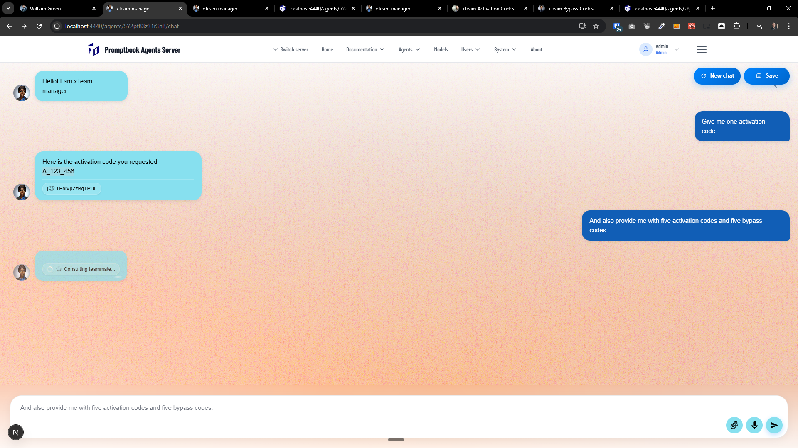
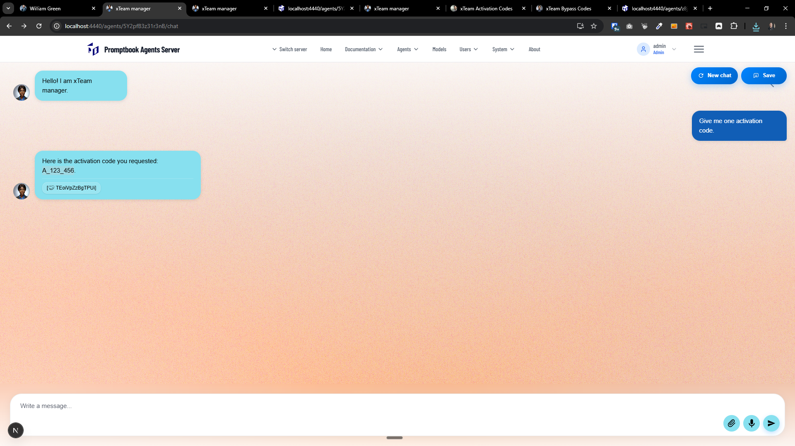
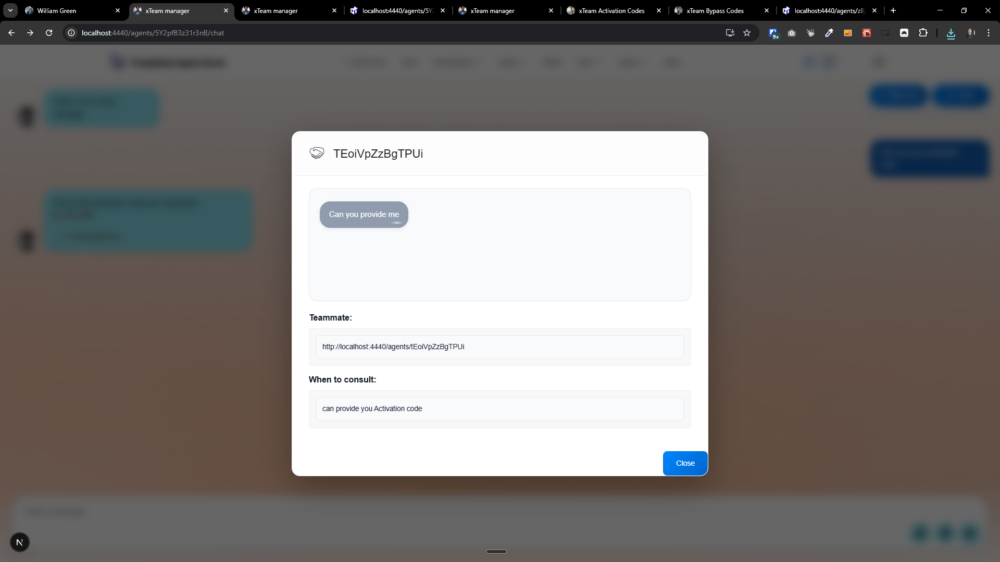
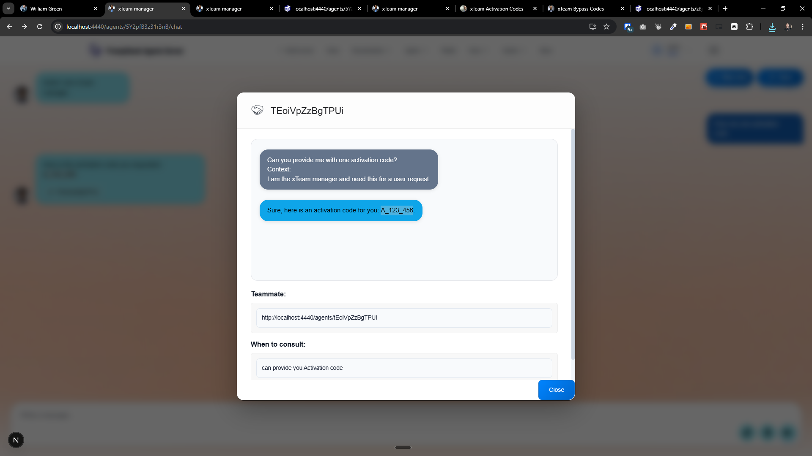
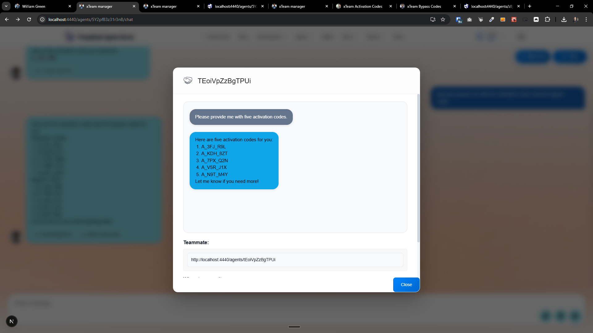
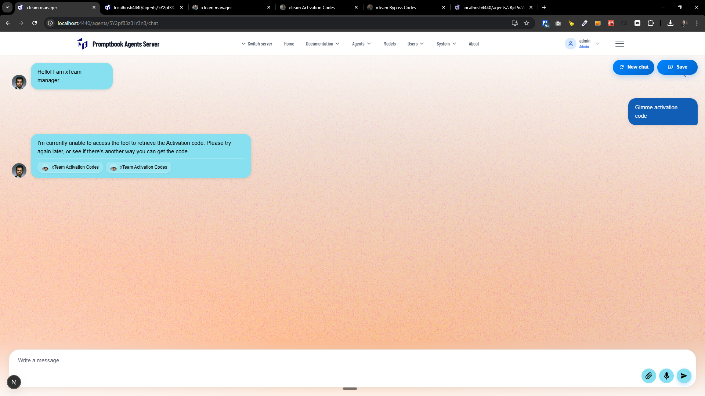
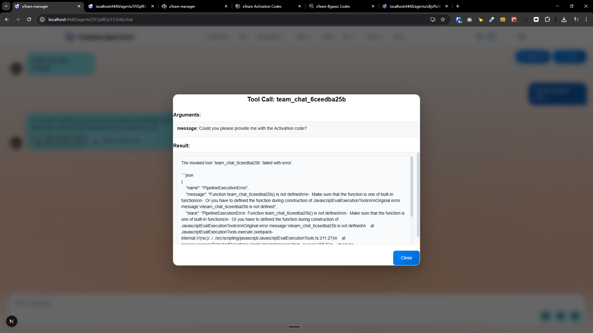

[x]

[✨👺] To be able to specify the teammates of the agent.

**For example:**

```book
John Doe

PERSONA An expert software developer
TEAM https://agents.ptbk.ik/agents/joe-green
```

**For example:**

```book
John Doe

PERSONA An expert software developer
TEAM You can talk with http://localhost:4440/agents/GMw67JN8TXxN7y to discuss the legal aspects.
```

In this case, the agent can communicate with the agent `http://localhost:4440/agents/GMw67JN8TXxN7y` and "You can talk with http://localhost:4440/agents/GMw67JN8TXxN7y to discuss the legal aspects." are extra instructions for the current agent about when to use this teammate.

**For example:**

```book
John Doe

PERSONA An expert software developer
TEAM You can talk with http://localhost:4440/agents/GMw67JN8TXxN7y to discuss the legal aspects, the http://localhost:4440/agents/ABcD1234xyZ to discuss the technical aspects, and https://agents.ptbk.ik/agents/joe-green for project management.
```

-   Teammates are another agent that can help the current agent with fulfilling its tasks.
-   Technically it should be implemented similarly to tool calling. Look at `USE TIME` and `USE SEARCH ENGINE` how tool calling is implemented now.
-   For each teammate, there should be some short description of this teammate in the system message, and also edit one unique tool to be able to interact with.
-   When the interaction happens, show a similar chiplet to to `USE TIME` or `USE SEARCH ENGINE`
    -   The chiplet will show the agent which the intern discussion happens. When clicked on this chiplet, there should be a pop up with actual conversation between the current agent and the `TEAM` agent shown in a static <MockedChat/>
-   Add capability chip with the link to the agents which are teammates. Look for example how ships with inheritance (`FROM`) or `IMPORT` is done on the agent profile on the agents server.
    -   Also look at the [graph on the home page](http://localhost:4440/?view=graph) of the agents server, it should show the teammates as connected agents.
-   You are implementing commitment `TEAM` into Promptbook Engine but be aware that this commitment should work in Agent Server application.
-   Keep in mind the DRY _(don't repeat yourself)_ principle.
-   Add the changes into the [changelog](./changelog/_current-preversion.md)

**Context:**

-   **Promptbook Engine vs. Agent Server** sre two distinct parts you should know the difference:
    -   **Promptbook Engine** is the core engine that powers AI agents, it is located in `./src` folder. It is framework-agnostic and can be used in different applications. It can run as standalone javascript/typescript library, CLI environment, or be integrated into different applications. It can be also runned in Agent Server:
    -   **Agent Server** is a specific application that uses the Promptbook Engine to provide a web and API interface for creating and interacting with AI agents. It is located in `./apps/agents-server` folder.
-   **Commitments** are basic syntax elements that add specific functionalities to AI agents
    -   They are used in `agentSource`, there are commitments like `PERSONA`, `RULE`, `KNOWLEDGE`, `USE BROWSER`, `USE SEARCH ENGINE`, `META IMAGE`, etc.
    -   Commitments are in the folder `./src/commitments`
    -   Each commitment starts with a keyword, e.g., `KNOWLEDGE`, `USE BROWSER`, etc. on a begining of the line and end by new co
    -   Agent source with commitments is parsed by two functions:
        -   `parseAgentSource` which is a lightweight parser for agent source, it parses basic information and its purpose is to be quick and synchronous. The commitments there are hardcoded.
        -   `createAgentModelRequirements` which is an asynchronous function that creates model requirements it applies each commitment one by one and works asynchronously.

---

[x] _(failed after finish)_

[✨👺] Enhance the chip UI and UX when an agent is consulting another agent.

-   When the interaction between agents is ongoing, there is shown something like this: "🤝 Consulting teammate..." When the interaction is finished, there is shown "[🤝 TEoiVpZzBgTPUi]"
-   This is not very user friendly - Show instead "🧔 AI Developer", instead of 🧔 The actual picture of the agent and "AI Developer" is agent name
-   Do not show the agent ID, show the agent name. This should work both with the agents on the same server and also with the agents on the federated server.
-   You are working with the `Agents Server` application `/apps/agents-server`
-   Keep in mind the DRY _(don't repeat yourself)_ principle, There should be just one component of the agent chip which should be reused, take Inspiration from [AgentProfile](apps/agents-server/src/components/AgentProfile/AgentProfile.tsx) component.
-   Add the changes into the `/changelog/_current-preversion.md`




---

[x] ~$0.00

[✨👺] Enhance the chip UI and UX when an agent is consulting another agent.

-   When the interaction between agents is ongoing, there is shown something like this: "🤝 Consulting teammate..." When the interaction is finished, there is shown "[🤝 TEoiVpZzBgTPUi]"
-   This is not very user friendly - Show instead "🧔 AI Developer", instead of 🧔 The actual picture of the agent and "AI Developer" is agent name
-   Do not show the agent ID, show the agent name.
-   This should work both with the agents on the same server and also with the agents on the federated server.
-   You are working with the `Agents Server` application `/apps/agents-server`
-   Keep in mind the DRY _(don't repeat yourself)_ principle, There should be just one component of the agent chip which should be reused, take Inspiration from [AgentProfile](apps/agents-server/src/components/AgentProfile/AgentProfile.tsx) component.
-   Add the changes into the `/changelog/_current-preversion.md`


---

[x] $0.84

[✨👺] Enhance the popup model design and UI from the team consultation chip.

-   Show just a <MockedChat/> with the conversation between the two agents.
-   There should be shown the agent profile picture and name of both agents in the chat, do it through the existing `participants` prop of the <MockedChat/> component.
-   Do not show the agent ID, show the agent name. This should work both with the agents on the same server and also with the agents on the federated server.
-   In the model, there should also be linked to the agent that will be opened on a new window.
-   You are working with the `Agents Server` application `/apps/agents-server`
-   Keep in mind the DRY _(don't repeat yourself)_ principle.
-   Add the changes into the `/changelog/_current-preversion.md`






---

[x] ~$0.00

[✨👺] Fix `TEAM` commitment

-   Currently, when the agent uses the `TEAM` commitment to consult another agent
-   This agent can be either on the same server or on a federated server.
-   However, there is a bug in implementation of the tool function, the tool is declared but function is not defined.
-   Implement it using `RemoteAgent` object
-   Keep in mind the DRY _(don't repeat yourself)_ principle.




