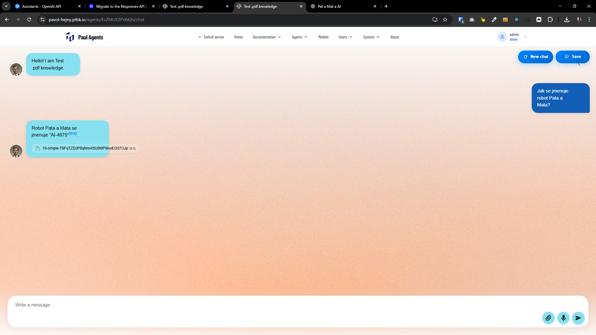
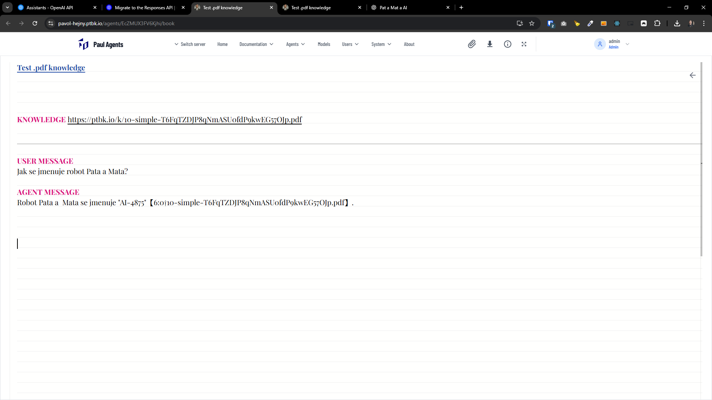
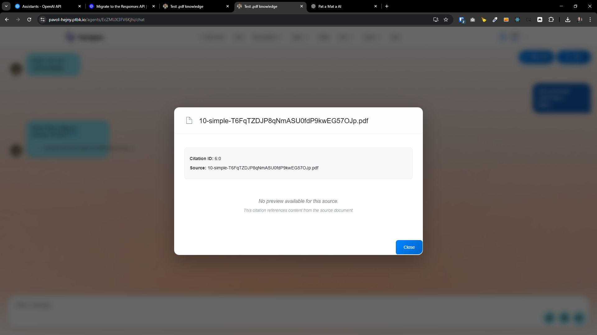
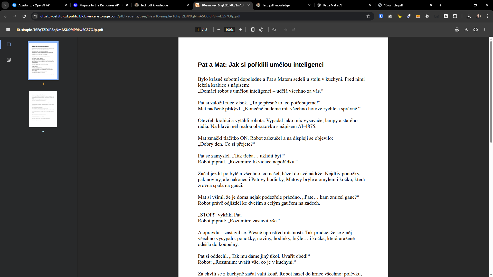

-   _(manually)_ Timeout a rychlost
    _(manually)_ Error from first message is different from error from later messages
-   Error messages
-   Sourcing a RAG
    -   Chiplets with entire documents
-   Enforce message structure, create special TEMPLATE commitments
-   _(? Should we do this?)_ Send initial message into the messages in the completions
-   Monitoring of AI agents

---

[x] $1.14

[✨🤳] Enhance the error messages when something fails when chatting with agents in agent server.

-   When something fails when chatting with agents in agent server, the error messages are not very user friendly.
-   Improve the error messages to be more descriptive and user friendly.
-   The raw error message should be logged via `console.error`, but the user should see a more friendly message.
-   Add retry button to the error message popup to allow the user to retry the last message if something fails.
-   Keep in mind the DRY _(don't repeat yourself)_ principle.
-   Add the changes into the `/changelog/_current-preversion.md`

---

[x] $2.28

[✨🤳] Translate the OpenAI Assistant GPT sources to the Promptbook native chips.

-   Now ugly chips like 【5:13†document.pdf】 are shown in the chat when the agent uses RAG (retrieval augmented generation) to answer the user question.
-   Translate these ugly chips to the Promptbook native chips like ones used in `USE SEARCH ENGINE` commitment.
-   When you click on the source chip. It should show a pop-up with the preview of the source document.
-   You are working with the `Agents Server` application `/apps/agents-server`
-   Keep in mind the DRY _(don't repeat yourself)_ principle.
-   Add the changes into the `/changelog/_current-preversion.md`

---

[ ] !!!

[✨🤳] Show Document preview after clicking on source chip.

-   When agent used `KNOWLEDGE` the chip with the source document is shown in the chat.
-   When clicking on the chip, show a pop-up with the preview of the document.
-   But the preview isn't working now, fix it.
-   Use iframe to show the document preview.
-   Also add ability to download the document from the pop-up.
-   Keep in mind the DRY _(don't repeat yourself)_ principle.
-   You are working with the `Agents Server` application `/apps/agents-server`
-   Add the changes into the `/changelog/_current-preversion.md`

---

[-]

[✨🤳] brr

-   Keep in mind the DRY _(don't repeat yourself)_ principle.
-   Add the changes into the `/changelog/_current-preversion.md`
